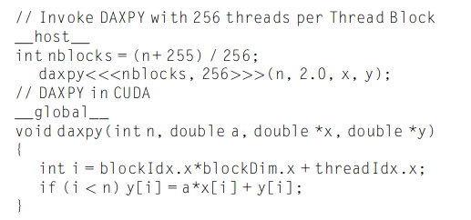
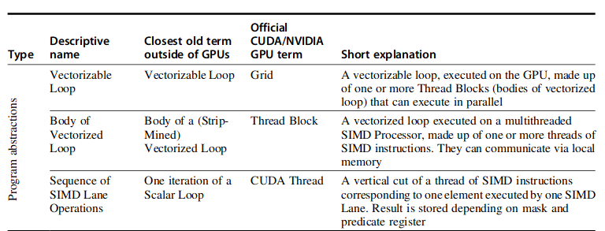
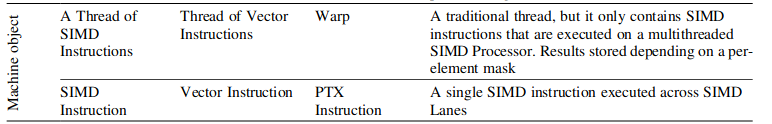
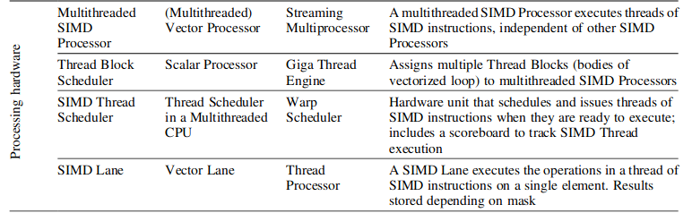
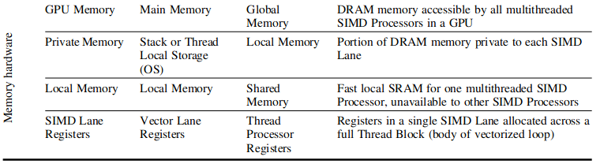
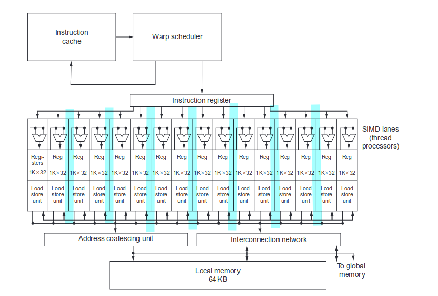
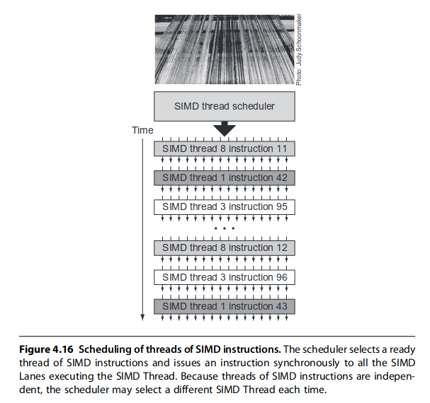

# Data-Level Parallelism

这一部分讲的主要是支持数据级并行的体系结构，包括向量机和 gpu 等等。在发掘指令级并行之后，cpu 由标量进化到超标量，吞吐量已经得到了很大的提升，在充分发掘指令并行的同时对于数据的处理仍然是单个单个进行的，每次处理单个数据之前都需要进行 ld 操作，实际上造成了真依赖，计算资源闲置。如果能提前 ld，同事引入多个计算单元，数据的处理就能够并行处理，这就是数据级并行的思想，具体可以表示为下图。

这样的思想对后续对于数据并行的思考起到重要作用。

## 简介

想并行化数据的处理，最直接的想法就是把多个串行的、相互之间没有依赖关系的数据操作分配到多个 cpu 上去做执行，也就是所谓的 mimd 模式。这种模式编程的难度大，比较复杂。simd 想要解决这个问题，想要在一个 cpu 上解决这个问题，通过将多个标量部件组成向量部件来解决这个问题。simd 的形式包括向量机、多媒体向量指令集拓展、gpu等等。

这种 simd 架构提供的计算单元肯定是足够且高效的，这种架构的效率问题还是很大来源于带宽的供给。面对不同的内存访问地址（可能是数组这样的连续地址，也可能是其他非连续的访问），怎么更快的将数据加载到 simd 寄存器中决定了 simd 的效率。

## 向量(向量机)体系结构

向量体系结构的设计最初想要解决的就是上面图中的问题。简单的来讲就是不停加载、不停使用，这种时空上的重叠看起来就像是只需要支付一次内存访问的延迟就能得到多个结果。

可以看到向量体系结构的硬件由以下几个关键的部分组成：

- 向量寄存器：存储向量的寄存器。这个向量寄存器实现的难点是需要支持多端口的访问，毕竟有多个计算单元可能发起对向量寄存器的访问。对向量寄存器做像内存一样的多端口实现可能能进一步提高带宽(类似于r[0-3],r[4-7]分配到不同的 bank 上)。
- 向量化的功能单元： 必然是高度流水线化的。
- 向量的 ld/st 单元：也是流水化实现的，在完全填充之后能够实现一个周期一个字的吞吐。
- 标量寄存器：数据的来源不一定都是内存，也有可能来自标量寄存器。

对于 RISC-V 而言，单个向量寄存器的大小是固定的，可以通过设置相关的寄存器来配置寄存器的视图。简单的理解，假设寄存器的大小为 4，可以通过配置相关的寄存器将向量寄存器的视图表示为 (1 \* 4)、(2 \* 2) 来充分的利用寄存器空间对多种数据类型进行计算。RISC-V 通过配置的方式实现对不同数据类型的向量计算，不同于 X86 的 AVX 指令通过指令的方式区别不同数据类型的计算，本质上还是 RISC-V 不想加入这么多指令，导致指令空间的膨胀，通过寄存器配置的方式更加的灵活。

这种动态的寄存器视图还有以下优点：

1. 能够确定哪些寄存器是没有使用的，对于不使用的寄存器可以被设置为 disable，在上下文恢复的时候这些寄存器就不需要被恢复，降低了上下文恢复的量。
2. 在进行计算的时候能够隐含的包含类型转换。

向量体系结构中还会用到一些特殊的控制寄存器：

- 向量长度寄存器：当前配置下的向量寄存器长度，就是说一个向量由几个标量组成。
- 向量类型寄存器：记录当前向量寄存器中的数据类型。
- 谓词寄存器(predicate register)：主要用来控制IF的条件下最后需要哪些结果。

### 从 daxpy 实例进行的比较

daxpy 进行的操作实际上就是 $Y = a \times X + Y$，再不同的处理器架构下具有不同的汇编语言表示，在标量处理器(超标量处理器)上汇编表示如下：

程序的执行过程和最开始的数据并行原理方面很相似，下面从几个方面分析向量处理器的优势和标量处理器的劣势。

1. 指令数：从汇编指令数来看，标量处理器的汇编指令数和向量处理器差不多，但是考虑到标量处理器在不断的进行循环，设处理数据的长度为 32 位，那标量处理器中实际运行的指令数是向量处理器中指令数的 32 倍，超标量处理器运行的指令数等同于标量处理器的指令数。
2. 执行效率：执行效率可以参考[标量流水线和向量体系结构的时空图](./other_pipeline_diagram.md)，从这之中可以看出效率的极大差异。效率的差距来源是普通的标量流水线没办法进行这种流式的操作。由于下一条指令对于内存的访问必须在本条指令的执行部分之后，导致这个 ld 的延迟无法被隐藏，即使时间缩到再短，每次执行之前必然有 ld 的一个周期开销。更不必说执行乘法还需要三个时钟周期，这部分延时完全无法隐藏。
3. 指令带宽：标量处理器和向量处理器单时钟周期的指令宽度为1。但是对于超标量的情况下，指令带宽等同于发射宽度。超标量处理器某种情况下执行的指令流更像本文最开始中优化过的指令排序，他能提高效率去接近向量处理器，但是即使这样，其指令带宽还是远大于向量体系结构，要保证其执行效率还要保证取指的时候的贷带宽。

::: details 向量体系结构与标量处理器
向量处理器更多的展现出流式的特性，对于数据级并行的大量数据情况具有很大的优势。标量处理器对于通用的情况和更为复杂混合多种指令的指令流情况有较好的效果。现在处理器应当是两种的结合，超标量的处理器配合上向量体系结构的流式处理能够达到很高的性能。
:::

## 向量架构计算执行时间

向量计算的执行时间取决于三个因素：

1. 向量的长度。
2. 各个操作之间的结构冒险。
3. 数据依赖。

从上文对于向量是流式操作的理解来说，流失操作的时间依赖于向量的长度很正常。后面两点实际上会导致流式操作的断流，所以也会影响到时间。

为了简化对于向量执行时间的分析，给定了以下的概念，指定 convey 为最大能够进行流式操作的组。后续会尝试通过 convey 来分析向量的执行事件。此处假定两个 convey 之间是不能并行执行的，那是肯定的，要是能并行执行还会被分成两个 convey 吗？同时不同的 convey 之间如果存在写后读这样的依赖，convey 之间也能通过 forwarding 来进行前递，这种操作称为 chain 操作，也就是所谓的链式操作。

设每个 convey 的执行时间为 chime，则一个 chime 的大小依赖于向量的长度，也就是说 $chime = f(vector-length)$，在本节中假设了功能单元的完全流水化，也就是说一个时钟周期能出一个结果，那在此处可以近似的认为 $chime = n$（忽略掉了一次内存访问的时间，我觉得不应该，作者在此处应该是想让我们更加简单的理解）。如果一段向量程序由 m 个 convey 组成，那么这段向量程序的执行时间为 m * n.

基于以上的背景，并继续假设功能单元的流水线深度为：浮点加法 6 个时钟周期、浮点乘法 7 个时钟周期、浮点除法 20 个时钟周期、向量加载 12 个时钟周期。来讨论一下的问题：

1. 向量为什么比标量快
2. 长度不对齐情况
3. 遇到 if 的情况
4. 向量体系结构对存储系统的需求
5. 如何面对多维度的数组
6. 如何面对稀疏矩阵
7. 如何对向量机编程

### 多通道的处理方式

在向量体系结构下往往会引入多个通道(lane)，来使一个始终周期能够处理多个元素，对于 lane 的概念简单的来讲就是功能单元，多个 lane 就是多个功能单元？功能单元的数目设置应当还是与从 cache 中一个周期能够读出多少个字相关，还是经典的前端产生后端吃掉的问题。

即使是没有多通道的情况下，对于向量的流式处理都能取得极大的效率，更不必谈现在引入多个通道。

### 利用向量长度寄存器控制长度不对齐情况

很多时候向量的长度可能会不是 lane 数的倍数，这时候就需要这个向量长度寄存器来处理长度没有对齐时候的情况。其实比较典型的场景也就是最后一个循环的时候设置下这个寄存器为剩余长度（前几个循环这个寄存器中的数值为 lane 的长度），告诉机器剩余向量长度的大小，保证最后一个循环的向量指令正确执行。

### 利用谓词寄存器处理 if 情况

在循环中出现 if 的情况还是相对常见的，这种情况实际上就是我想要对向量中的一部分进行处理，另一部分不想处理。向量体系结构处理这个问题的方法是设置谓词寄存器，简单的来说就是掩码，在对向量进行操作的时候进行掩码的检查，没设置掩码的就不进行操作。从这之中可以看到，即使是向量中出现了很多不用执行的操作，也并没有带来时间上的节省。向量体系结构不喜欢出现 if 的情况，这会降低机器的 GLOPS。

### 向量体系结构对带宽的需求

对带宽的需求必然是大，必要的时候引入多个 bank 来解决带宽问题。

### 如何面对多维度的数组

面对多维度的数组的时候，有时候访问的内存地址就不是连续的，可能是间隔 8 个字等等的，对于这样的访问模式也就是所谓的 stride。对于固定的硬件情况，对于编写的应用程序，我们需要尽量去优化 stride。先前的一维数组顺序访问为什么高效，因为地址是连续的，这种访问模式对于多 bank 的 cache 或者 dram 能够在一个时钟周期读取多个字，提供给后续的功能单元进行使用。但是一旦出现了 stride，访问的地址不再连续，如果产生的两个访问地址落在一个 bank 上，就会导致带宽的不足。

出现冲突的情况可以被表示为：

等于说我们在编程的时候希望尽量去避免冲突，是在没办法避免也没办法。

### 聚散访问模式

面对稀疏矩阵的时候，往往就是想要挑出矩阵中的某几个元素去做访问，等于访问的方式更加不规律，等于是上面 stride 情况中最坏最复杂的情况，面对的问题更多还是带宽的问题。RISC-V 架构对这种访问模式有特殊的指令，比如有一个指令可以把所有的 stride 先放到一个向量寄存器里面，在一次性对这些 stride 进行访问，实际上这就是简化了编程而已。

同样的，对于这种访问模式，向量机的硬件是不会去做任何优化的，更多的还是依靠编程人员的优化。但是 gpu 不同，gpu 的访问模式默认都是这种聚散模式，因此 gpu 硬件会做某些程度的优化。

### 面对向量体系结构的编程

程序员辅助编译器进行向量化能够得到更好的优化效果。

## 指令集的多媒体 simd 拓展

不认为这个东西和向量机有什么区别，我认为这个东西就是向量机的一个轻量化的版本。在现代的 cpu 中，不认为还需要把这两者区别开来。文中提到这个概念的时候更加强调的是其轻量性。比如说某些情况下，cpu 无法引入更加复杂的向量机架构，那就采取这种 simd 的轻量级模式。这种 simd 的轻量级模式，只需要引入假条拓展的指令和几个少许的寄存器，还有几个计算单元就行了。

## GPU

主要针对英伟达的 gpu 和 cuda，先谈 cuda 概念，再谈 cuda 架构。

### GPU 上的编程

GPU 程序员所面临的挑战不仅仅是在 GPU 上获得良好的性能，还要协调系统处理器和 GPU 的计算调度，以及系统内存和 GPU 内存之间的数据传输。cuda 是英伟达提出的一种架构，也可以吧说是编程规范。CUDA 为系统处理器（主机）生成 C/C++ 语言，为 GPU（设备，即 CUDA 中的 D）生成 C 和 C++ 方言。

cuda 线程(cuda thread)是在英伟达 gpu 上的最小编程单位。实际上的 cude 编程就是利用 cuda 合理的分配线程去执行任务，cuda 往往是通过一行代码将任务分配到多个线程上，因此英伟达也称这种模型为 SIMT 模型。多个 cuda 线程组合起来能够称为 cuda 线程组，多个 cuda 线程组又可以组成一个 cuda 网格，能够调度 cuda 线程组执行的处理器称为 cuda simd 处理器，一个网格内可能存在多个 cuda 处理器用来调度线程。

在给出一个基本的 cuda 编程示例之前，先给出如下的概念：

1. 在 cuda 中为了区别主机端和设备端，用 `__host__` 指代主机端，用 `__device__` 和 `__global__` 指代设备端。创建的相关变量会分配到相关的内存上。
2. 函数的声明语法为 `name <<<dimGrid, dimBlock>> > (... parameter list...)`，其中 `dimGrid` 用来指定需要用到**线程组的个数**，`dimBlock` 用来指定需要用到的**线程组内线程**的个数。

典型的 daxpy 在 cuda 中的实现形式为：

gpu 的硬件会对并行的执行和线程进行管理，这部分和主机的操作系统无关，完全由 gpu 硬件来操控。在 cuda 的编程模型下，线程组这个概念更像是任务的不同独立部分，cuda 不希望这两部分之间发生通信。cuda 提供的这些概念和机制需要让编程人员在编程的时候考虑更多的因素以充分发挥 gpu 的功效。

让我们拭目以待 cuda 语言在这场经典的生产力与性能之争中如何发展，以及 cuda 是否会在其他 gpu 甚至其他架构风格中流行起来，毕竟其提供了易用的接口又暴露了足够多的硬件特性。

### GPU 上的计算结构

首先给出 GPU 上更多的相关概念，其中对应的是书中的描述方法和 cuda 官方的描述方法。

1. 网格：作为最大的单位可以理解成是一段可向量化循环的抽象。我更想将其理解成 cuda 线程组的组织者。
2. 线程块：可向量化循环的一小部分。我更想将其理解成 cuda 线程的组织者。
3. 线程：执行的最小单位。线程本身又是 simd 的，等于说线程内部还是有多个功能单元，方便流式处理。

1. Warp，线程束：一个线程组内的线程按照一定数量组成的线程束。
2. PTX Instruction：机器指令。

1. SIMD 处理器：一个网格中可能包含多个，能够用来调度 cuda 线程组执行，在 cuda 的概念里称作流式处理器。
2. 线程组调度器：调度线程组到流式处理器上执行。
3. 线程调度器：管控了流式处理器上的指令发射。
4. simd 通道(lane)： 执行单个线程的硬件。

1. 全局内存：全局内存用于各个网格之间的交互。
2. 私有存储：单个线程私有的存储。
3. 本地存储：线程组内共享的存储。
4. 线程寄存器：单个线程内的寄存器。

单个流式处理器的内部如下图所示：

在流式处理器内部，可以讲不同的线程，比如说两个线程再组成 wrap。同一个 wrap 之内的线程 pc 是相同的，不同的 warp 之间 pc 可能是不同的，这个受到调度器的影响。调度器可以根据指令是否准备就绪调度不同的线程束执行不同的指令。图中我尝试用两个一束来理解，但是书中好像默认一个线程一束。

一个线程束或者线程的调度如上面所示。

### GPU 上的分支

一般情况是两个方向都向下执行，然后从中选择结果。gpu 会根据 if 条件设置掩码，如果设置的掩码全1或者全0,IF-ELSE有一边就会被优化掉不执行。

