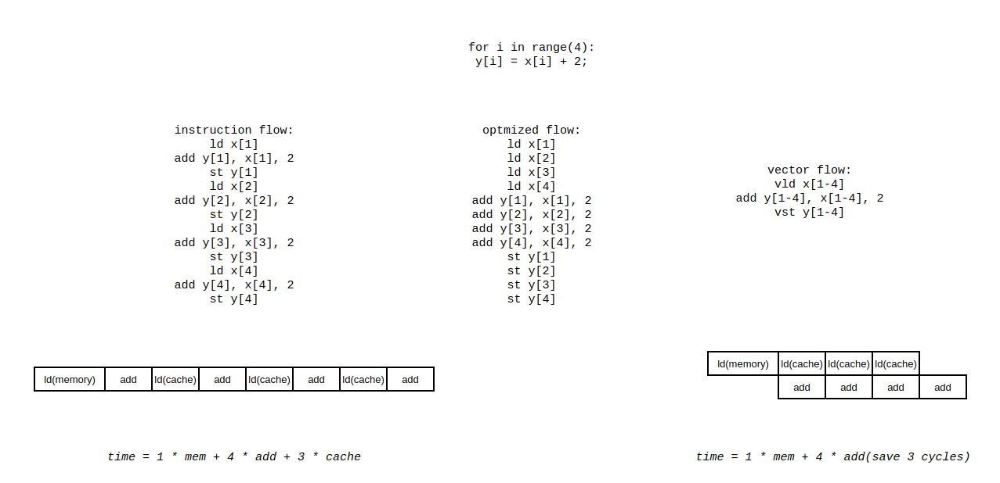

# Data-Level Parallelism

这一部分讲的主要是支持数据级并行的体系结构，包括向量机和 gpu 等等。在发掘指令级并行之后，cpu 由标量进化到超标量，吞吐量已经得到了很大的提升，在充分发掘指令并行的同时对于数据的处理仍然是单个单个进行的，每次处理单个数据之前都需要进行 ld 操作，实际上造成了真依赖，计算资源闲置。如果能提前 ld，同事引入多个计算单元，数据的处理就能够并行处理，这就是数据级并行的思想，具体可以表示为下图。

这样的思想对后续对于数据并行的思考起到重要作用。

## 简介

想并行化数据的处理，最直接的想法就是把多个串行的、相互之间没有依赖关系的数据操作分配到多个 cpu 上去做执行，也就是所谓的 mimd 模式。这种模式编程的难度大，比较复杂。simd 想要解决这个问题，想要在一个 cpu 上解决这个问题，通过将多个标量部件组成向量部件来解决这个问题。simd 的形式包括向量机、多媒体向量指令集拓展、gpu等等。

这种 simd 架构提供的计算单元肯定是足够且高效的，这种架构的效率问题还是很大来源于带宽的供给。面对不同的内存访问地址（可能是数组这样的连续地址，也可能是其他非连续的访问），怎么更快的将数据加载到 simd 寄存器中决定了 simd 的效率。

## 向量(向量机)体系结构

向量体系结构的设计最初想要解决的就是上面图中的问题。简单的来讲就是不停加载、不停使用，这种时空上的重叠看起来就像是只需要支付一次内存访问的延迟就能得到多个结果。

可以看到向量体系结构的硬件由以下几个关键的部分组成：

- 向量寄存器：存储向量的寄存器。这个向量寄存器实现的难点是需要支持多端口的访问，毕竟有多个计算单元可能发起对向量寄存器的访问。对向量寄存器做像内存一样的多端口实现可能能进一步提高带宽(类似于r[0-3],r[4-7]分配到不同的 bank 上)。
- 向量化的功能单元： 必然是高度流水线化的。
- 向量的 ld/st 单元：也是流水化实现的，在完全填充之后能够实现一个周期一个字的吞吐。
- 标量寄存器：数据的来源不一定都是内存，也有可能来自标量寄存器。

对于 RISC-V 而言，单个向量寄存器的大小是固定的，可以通过设置相关的寄存器来配置寄存器的视图。简单的理解，假设寄存器的大小为 4，可以通过配置相关的寄存器将向量寄存器的视图表示为 (1 \* 4)、(2 \* 2) 来充分的利用寄存器空间对多种数据类型进行计算。RISC-V 通过配置的方式实现对不同数据类型的向量计算，不同于 X86 的 AVX 指令通过指令的方式区别不同数据类型的计算，本质上还是 RISC-V 不想加入这么多指令，导致指令空间的膨胀，通过寄存器配置的方式更加的灵活。

这种动态的寄存器视图还有以下优点：

1. 能够确定哪些寄存器是没有使用的，对于不使用的寄存器可以被设置为 disable，在上下文恢复的时候这些寄存器就不需要被恢复，降低了上下文恢复的量。
2. 在进行计算的时候能够隐含的包含类型转换。

向量体系结构中还会用到一些特殊的控制寄存器：

- 向量长度寄存器：当前配置下的向量寄存器长度，就是说一个向量由几个标量组成。
- 向量类型寄存器：记录当前向量寄存器中的数据类型。
- 谓词寄存器(predicate register)：主要用来控制IF的条件下最后需要哪些结果。

### 从 daxpy 实例进行的比较

daxpy 进行的操作实际上就是 $Y = a \times X + Y$，再不同的处理器架构下具有不同的汇编语言表示，在标量处理器(超标量处理器)上汇编表示如下：

程序的执行过程和最开始的数据并行原理方面很相似，下面从几个方面分析向量处理器的优势和标量处理器的劣势。

1. 指令数：从汇编指令数来看，标量处理器的汇编指令数和向量处理器差不多，但是考虑到标量处理器在不断的进行循环，设处理数据的长度为 32 位，那标量处理器中实际运行的指令数是向量处理器中指令数的 32 倍，超标量处理器运行的指令数等同于标量处理器的指令数。
2. 执行效率：
   1. 标量处理器
3. 指令带宽：标量处理器和向量处理器单时钟周期的指令宽度为1。但是对于超标量的情况下，指令带宽等同于发射宽度。、
