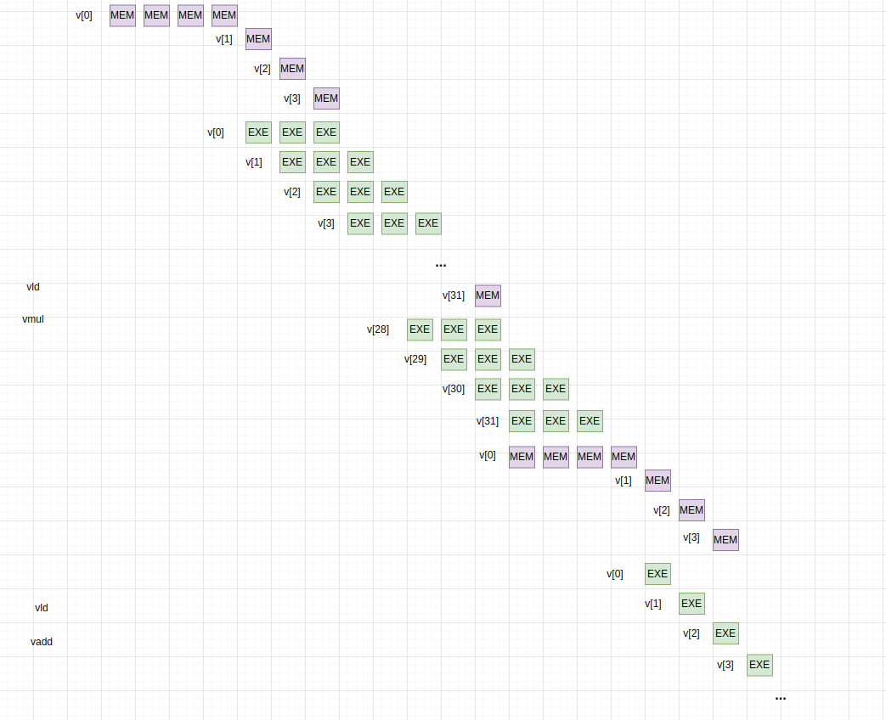

# Pipeline time diagrams and bottleneck analysis

这部分主要想弄清楚各种架构下指令的执行，分析其瓶颈，由于流水线的情况时空的交叠使指令的执行过程很难弄明白，这里借助时空图分析这个过程，一是希望能够弄清楚指令的过程，二是希望能够正确画出时空图。

参考的示例程序是 daxpy，具体的汇编如下：

## 标量流水线

假设内存访问需要 4 个时钟周期，在 cache 中的访问需要一个时钟周期，乘法指令 3 个时钟周期，加法指令 1 个时钟周期。标量流水线采用五级流水线的架构，五级流水线中的其他阶段没有特殊说明都只有 1 个时钟周期。

考虑前两次的循环，得到如下的时空图：

如果只考虑第一循环，并提取第一次循环中的主要耗时阶段：

可以看到第一次循环的耗时主要在两次 ld 和一次 mul 计算。

可以看到第二次循环的耗时主要在 mul 计算。

现在将这些合起来，估计整体的运行时间。

简单的来讲，标量流水线上时间都消耗在乘法计算上，同时加法运算和乘法运算之前都至少需要等待一个时钟周期的内存访问。

## 向量体系结构

向量体系结构的过程多个连着取，取一个用一个，很像流式的处理。

可以看到，得益于流式的操作和高度流水线的功能单元，向量指令的执行能够隐藏对于内存的访问，执行指令所消耗的时间像是完全使用在数据处理上，所用的时间是一次内存访问的时间加上后续所有数据处理的时间，其速度远远快于标量流水线。
