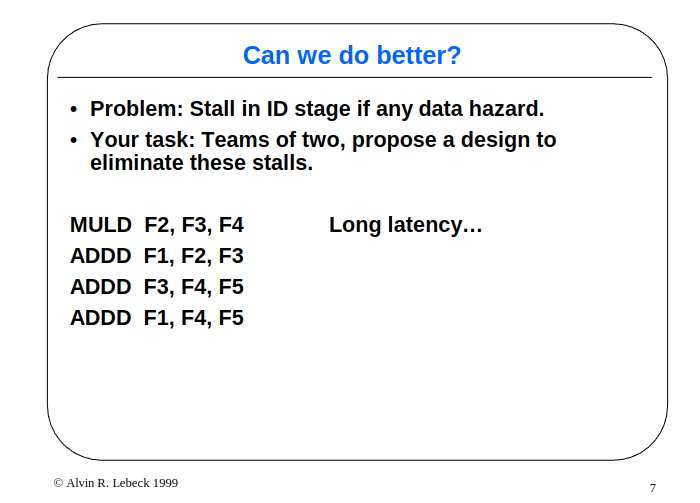
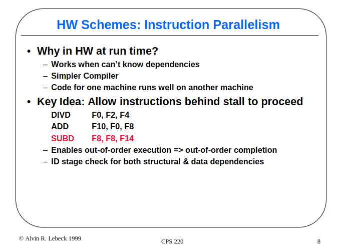
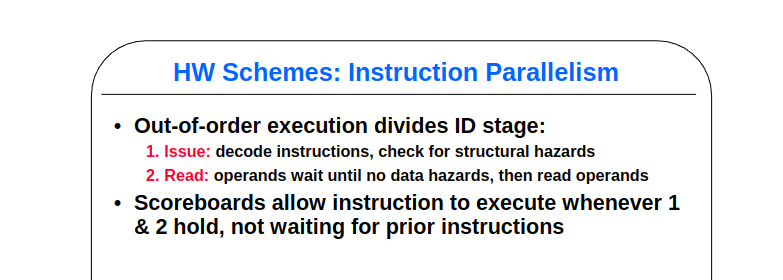
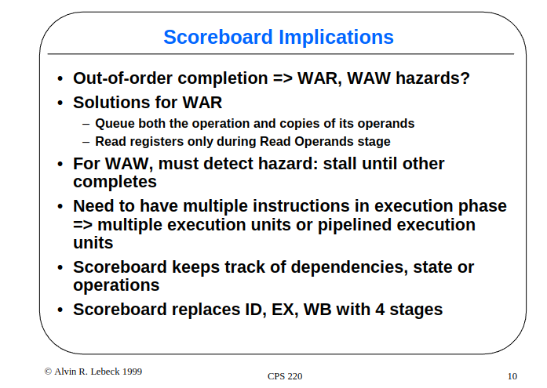
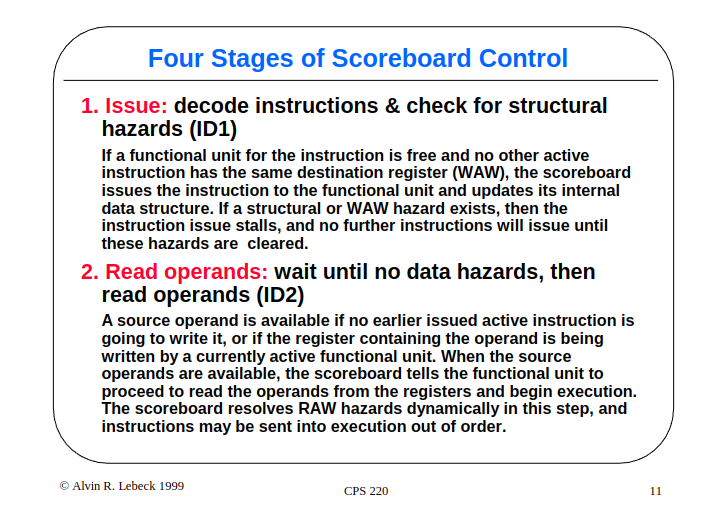
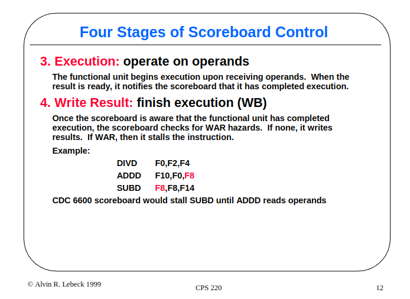
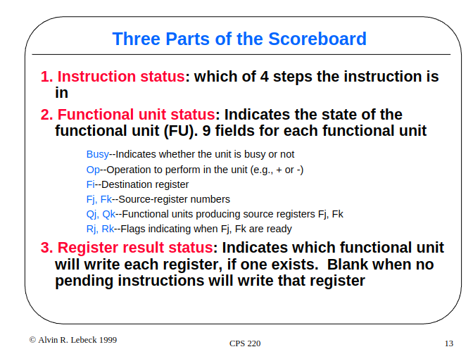
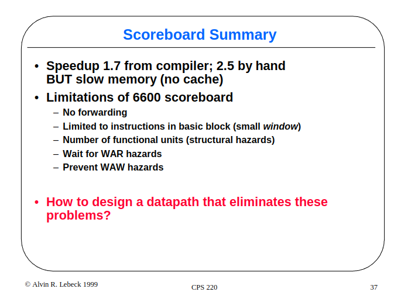

# Other: CDC 6600 Scoreboard

based on: [duke cps220 fall01](https://courses.cs.duke.edu/cps220/fall01/lectures/lect06-2up.pdf#page=5.54)

这里主要介绍 CDC 6600 的记分牌技术，是先于 tomasulo 出现的乱序发射乱序执行的模型，其思想和设计对后续有深刻的意义。全篇文章基于 duke 大学的 ppt 进行整理讲解，图片全部源于 ppt。

## 核心问题和解决方案

核心问题还是顺序执行的问题，很多后面的指令明明和前面的指令没关系，但是还是被堵住了，想要想一个办法把这些指令提前到前面执行。最终想要采取硬件方案。

采取硬件设计的原因是主要还是想简化编译器的设计。

决定了硬件方案之后就决定要乱序发射和乱序执行，为了实现这样的方案简单的约定，就是上述的两点完成之后指令才能被送出去执行。

## 记分牌实现

在确定了这样的方案了之后有许多要思考的问题：

1. 乱序执行带来的数据依赖的问题：
   1. RAW：真依赖，遇到真依赖必然被阻塞在某个流水线阶段。
   2. WAR：由于并没有想到重排序缓冲，因此乱序执行的写必须在前面的读之后生效，WAR依赖的存在在后面的写必须等待前面的读之后才能完成。
   3. WAW：在不考虑任何特殊机制的情况下，后面的写不能先于前面的写完成，如果先于前面的写完成必然导致错误。但是另一个问题是后面的写能不能先于前面的写进入流水线先做部分的执行？这决定了遇到WAW依赖的时候，相关指令是在发射阶段阻塞还是在执行阶段阻塞。如果在没有前递机制的情况下，唯一的选择就是发射阶段就阻塞掉。假设两条写指令按照先后顺序分别是 $I_1$、$I_2$，$I_1$ 的写有可能是有消费者的，等于说在 $I_1$ 的后面可能有很多指令等待 $I_1$ 写下这一个结果。但是由于没有前递的机制，后续的消费指令必须等待下个时钟周期才能读到结果，但是等到下个时钟周期，在假如允许部分先执行的情况下 $I_2$ 也发现前面的 $I_1$ 写完成了，在这个周期，它也会在这个周期更新相关的寄存器数值，这样一来先前的消费者指令可能取读到的就有可能是 $I_1$、$I_2$ 其中的一个数值，这样会造成错误。因此在没有前递机制的作用下，WAW依赖的解决只能依靠在发射的时候就阻塞后续的写。
2. 允许执行阶段多条指令的执行：乱序执行需要引入多个功能单元。
3. 依赖的记录：设置记分牌记录依赖的更新状况。

由以上的一系列思考形成了记分牌硬件实现的4个阶段：

1. 发射：译码分析依赖。不存在WAW和结构冲突，就发射到功能单元中。记分牌记录相关的依赖。
2. 读取操作数：从寄存器中读取操作数，或者根据记分牌上记录的依赖到相关的地方读取操作数。
3. 执行阶段：进行执行，执行完成之后通知记分牌。
4. 写回阶段：没有WAR依赖就写回。

记分牌中的状态如图所示。Register result status 这部分是专门为 WAW 分析做准备的。

## 执行过程

不做具体分析，全靠给定条件进行理解。

## 不足和与 tomasulo 对比

1. 没有前递(tomasulo CDB解决)
2. 局限性的发射窗口(保留站)
3. 功能单元数量少（扩展的功能单元）
4. WAR停顿（寄存器重命名）
5. WAW阻塞（寄存器重命名） 

