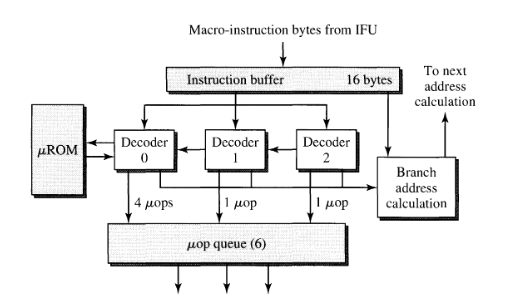
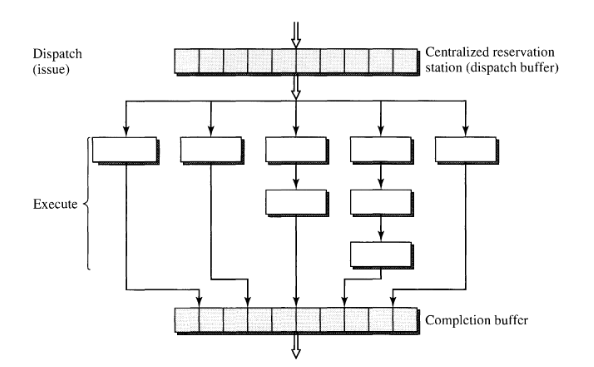
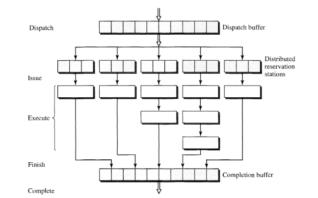
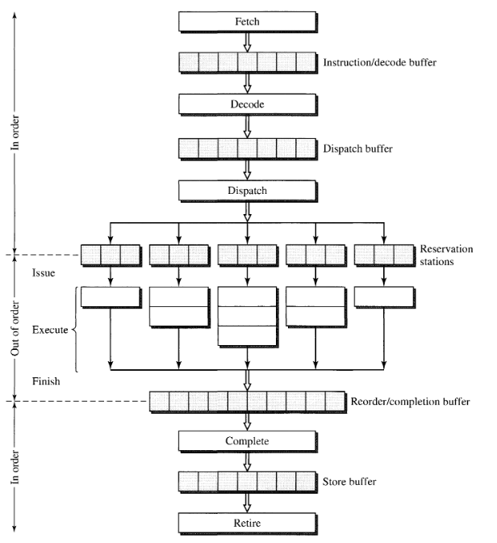

# Review of SuperScalar Organization

超标量处理器，主要用来改进标量处理器的限制，在扩展硬件和引入新的机制的情况下，增强处理器的吞吐量。

## 标量处理器的局限性

标量处理器是顺序发射顺序完成的，有如下的特性：

1. 发射宽度为1。
2. 各个流水线阶段非常均匀。
3. 某一个流水线阶段的阻塞会带来先前阶段的共同阻塞，导致流水线无法往下执行。

这三个特性局限了标量流水线。

### 有限的吞吐量

对于 cpu，有公式：

$$
\begin{align*}
    cputime = instructions \cdot CPI \cdot time\_per\_cycle
\end{align*}
$$

据此定义性能：

$$
\begin{align*}
    performance &= \frac{1}{cputime} \\
                &= \frac{IPC \cdot frequency}{instructions}
\end{align*}
$$

在发射宽度为 1 的标量处理器的情况下，根据性能公式，指令总数在给定的程序的情况下不能再降低，IPC在发射宽度为 1 的情况下受到限制，我们能够着手提高的只有时钟频率。提高时钟频率意味着要降低时钟周期，降低时钟周期意味着要增加流水线的级数。增加流水线的级数听起来简单，但是实际上会带来以下的问题：

1. 流水线的级数增加，多条指令时间并行在流水线上，流水线上的指令产生依赖的可能性变大，同时一旦产生了依赖，流水线停顿产生的惩罚就会变大。
2. 流水线级数的增加就表示着分支预测错误和中断的惩罚增大，进而导致IPC的降低。
3. 设计变得复杂，能耗开销变大。

因此在标量流水线上，性能的提升遇到了重大问题，需要从别的方面下手。因此需要尝试放开指令发射条数的限制，尝试增加IPC。发射宽度的增加，导致一个流水级上会驻留多条的指令，这就是**并行流水线**。

### 流水线阶段的均匀

本身标量流水线的设计宗旨就是均匀，或者说是统一性(unification)。一个是流水线本身的统一，一个是流水线阶段的统一。流水线本身的统一是指这一条流水线能执行指令集中定义的每一条指令，每一条指令都被送到流水线上经过流水线上的各个阶段；流水线阶段的统一，是指流水线阶段各司其职，每个流水线阶段都消耗相同的时间（短时间要向长时间看齐），这个时间也决定了时钟周期的大小。

但是指令执行的时候，很可能只需要所有流水线阶段中的一小部分，而不是全部的流水线阶段，拿简单的五级流水举例，计算指令并不需要 mem 阶段。同时为了维护统一性，流水线在支持简单的整数类计算指令之外还需要支持浮点，浮点运算会比整数的运算消耗更多的时间，让浮点运算加到整数流水线的后端？降低了流水线的效率，不仅整数计算不需要这一部分，整个流水线阶段的时钟周期还因此变长。总而言之，要去维护这种统一性，代价是很大的。

要想提高流水线的性能，完全的统一显然不可持续。因此必然的要在一些流水线阶段消除这种统一性，变得更加多样性。取指、译码、访问寄存器，这些阶段统一是可以的，但是计算阶段再去维持统一就是低效的。在上文提出并行流水线的背景下，考虑让并行流水线在执行部分不再统一，设置各个多种多样的功能单元，将不同的计算类型分派到不同功能单元上执行，达到较高的效率。这样的并行流水线称之为多样的(diversified)流水线。

### 流水线阻塞带来的效率低下

标量流水线严格规定了指令的执行序，指令在流水线上是严格的按序执行的，一个流水线阶段的阻塞会导致前序的流水线阶段全部停滞。但是对一些不依赖于停滞指令的指令，这样的阻塞是没有意义的。比如 `ld r1` 导致了流水线阻塞，在这个流水线阶段之前还有 `add r2, r3, r4` 这样的指令，这样的指令阻塞是毫无意义的，但是因为流水线的严格按序执行，这样的指令必然被阻塞在流水线上。

如果能尝试绕过阻塞，效率将会获得极大的提升。允许这种绕过操作的流水线称之为乱序指令的流水线，并行且允许乱序执行的流水线称为动态流水线。

## 标量流水线到超标量流水线的演进

超标量流水线是一种**并行**的流水线，这不仅仅意味着硬件的增加也意味着流水线结构的改变。同时超标量流水线也是**多样**的流水线，引入了多种功能单元。以上是超标量流水线的最低要求。超标量流水线支不支持**动态**流水线是可供选择的，支持动态流水线的超标量流水线是**乱序执行**的，不支持动态流水线的超标量流水线是**顺序执行**的。

### 并行的流水线

标量流水线本身是一种时间并行，现在并行流水线在这个基础上进行了空间的并行。空间并行意味着在各个流水线阶段会存在多条指令，多条指令可能都需要访问相同的功能部件。这意味着取指阶段 ICache 需要支持多端口，读取寄存器阶段寄存器文件需要支持多端口，如果流水线上并行的指令是 ld/st 指令，可能还需要 DCache 支持多端口。但是多端口在物理实现上实际上是非常困难的。

::: info 多端口硬件
多端口的寄存器或Cache难以实现主要是因为设计上的复杂性和成本的增加。每增加一个端口，都需要额外的硬件资源来支持并行的读取和写入操作，这会增加电路的复杂性和功耗。此外，多端口的设计还需要考虑数据一致性和访问冲突等问题，增加了设计和验证的难度。

在现代超标量的环境下，通常会使用多端口的Cache，但并不是所有情况都会采用多端口的寄存器。多端口的Cache可以提高并行访问内存的效率，从而更好地支持超标量处理器的并行执行。例如，Intel和AMD的一些高端处理器产品中都使用了多端口的Cache，以提高性能和吞吐量。
:::

### 多样的流水线

超标量流水线必然是多样的，超标量流水线引入了多种功能单元，在执行指令的时候，不同类型的指令能够被分派到不同的单元上，比如整数有专用的整数单元，浮点有专门的浮点单元。这些功能单元的数量组合是流水线执行效率的关键因素，需要根据执行时候需要用到的功能，来决定功能单元数目的设置。

### 动态的流水线

动态的流水线对于超标量流水线是可选的，但是大多数的超标量流水线都是动态的。随着流水线上需要支持动态的调度，这必然导致各个流水级之间的寄存器（下称之为缓冲，buffer）设置变得复杂。原先的标量流水 buffer 非常的简单，只需要把前一阶段的结果和产生的一些信息向后一级传递就行了。一旦流水线只支持了动态的特性，对于取值译码这些仍然保持顺序的阶段，buffer 仍然可以使用简单的设计。但是到了执行阶段，设计必须改变，如果仍然这么简单的前递数据，那依赖仍然存在，乱序的执行无法实现，因此在进入到乱序执行的部分，buffer 必须被重新设计，同时在乱序执行之前，依赖还需要在前阶段被正确的分析。这时候 buffer 的形态可能会变得复杂：

1. 允许一些指令先走？一些指令驻留在 buffer 中？
2. 允许缓冲区中的条目有一些交互？

总之动态的流水线带来了 buffer 实现的复杂。指令以顺序进入 buffer，被允许乱序离开 buffer 以支持动态流水。这种乱序执行理论上能到达计算性能的极限。乱序执行的最后，超标量流水线仍然要保证指令对于机器状态的改变是同顺序相同的。因此在超标量流水线最后，还会有新的完成缓冲区引入，来保证对机器状态更新的“顺序性”。

## 总览超标量流水线

这部分总览超标量流水线的设计，主要将超标量流水线分为六个阶段总览其结构。主要考虑的阶段为 fetch(取指)、decode(译码)、dispatch(指派)、execute(执行)、complete(完成)、retire(退役)。

### 取指阶段

针对发射宽度为 $s$ 的流水线，取值阶段的最低要求是一个周期内能取出 $s$ 条指令并用于向后传递，只有保证了这个基本的需求，才能保证流水线的后端能够有足够的指令用于执行，而不至于大部分的时间空闲。当然，取值的带宽我们希望自然是高点好，取指阶段的主要目标是最大限度地提高指令取指带宽。取指阶段实现的持续吞吐量将影响超标量流水线的整体吞吐量，因为所有子级的吞吐量都取决于取指阶段的吞吐量，而且不可能超过取指阶段的吞吐量。

如果 $s$ 条指令都在一个 Cache 行内，那只需要一个周期内取出这个 Cache 行中的数据，这是可以满足的。但是如果这 $s$ 条指令不在一个 Cache 行内：

1. 分布在不同的 CaChe 行内，说明需要跨 Cache 行的访问，这可能在一个周期内是做不到的。
2. 这 $s$ 条指令中存在分支指令，如果分支发生，则 $s$ 条指令中必然有一部分不在同一个 Cache中。

以上给一个时钟周期内发射出 $s$ 条指令带来了难度，同时产生了一些解决方案。

1. 将分支的开始地址对其到 Cache 行的开始，这是某种程度上的编译优化。这样的做法显然会导致代码大小一定程度的膨胀，一定程度上会增大 Cache 的 miss 率。
2. 向内存一样，将 Cache 也组成一个阵列，就跟内存能够处理并发的访问一样，让 Cache 也能够处理并发的访问。

总之这部分的问题是要保证取指的带宽，更多的方法会在本书的后续介绍。

### 译码阶段

译码阶段需要完成的任务包括，识别指令之间的界限(RISC 一般指令定长，这步就很简单；但是对于 CISC 这种不定长的指令来说，这非常的困难)、确定指令的类型、分析指令之间的依赖关系。

#### 对 RISC 而言

对 RISC 而言，识别指令之间的界限不消耗时间，消耗时间的是确定类型和分析依赖关系，由于第一步不消耗时间，因此对于 RISC 而言，读取寄存器的操作也在这个阶段完成。针对 RISC 架构的超标量来说，在这个阶段重要的是：

1. 分析出指令类型中的分支类型，早点为前阶段的取指提供指令流变化的消息。
2. 实现寄存器的同时读取，不管是多端口读取还是流水线读取也好，反正要在这个阶段提供出指令需要的寄存器信息。

#### 对 CISC 而言

对 CISC 而言，译码阶段的任务就很重，不定长的指令给识别指令之间的边界带来了巨大的困难。

> 英特尔奔腾和 AMD K5 都采用两级流水线来解码 IA32 指令。在流水线更深的英特尔奔腾 Pro 上，访问 ICache 和解码 IA32 指令总共需要**五个机器周期**。使用可变指令长度给指令解码任务带来了不理想的顺序性；必须先解码前导指令并确定其长度，然后才能确定下一条指令的开始。因此，同时对多条指令进行并行解码就变得相当具有挑战性。在最坏的情况下，必须假设新指令可以从取指组中的任何位置开始，并使用大量解码器同时 "推测性 "地解码指令，从每个字节边界开始。这样做极其复杂，而且效率很低。

在识别清除边界和类型时候，CISC 还需要把 CISC 指令翻译成一系列的微指令，对于这一系列的微指令进行依赖分析的完成应该才算 CISC 机器的译码阶段的完成。

> 上图展示的三个并行解码器同时解码指令队列中的指令字节。位于队列前部的第一个解码器能够解码所有 IA32 指令，而另外两个解码器的解码能力较为有限，只能解码简单的 IA32 指令，如寄存器到寄存器指令。

由于这部分译码阶段过于复杂，因此这部分译码阶段也被流水线化了，这就意味着分支错误等带来的流水线惩罚进一步加大了。

#### 指令预译码

为了缓解译码阶段的压力，在超标量处理器中提出了一种指令预译码的方法，实际上也就是尝试能不能把译码阶段的一部分任务分派到先前的取指阶段。这个办法是在指令从内存被缓存到 ICache 的时候对指令进行译码，这里预译码产生的信息包括指令的位置信息、操作码位置信息（都是对于CISC），这些信息会被保存在几个预译码位里面，然后同时保存在 ICache 中。这样等于对于每个指令而言，其在 Cache 中的占用空间会大出几个预编码的位，导致 ICache 空间的膨胀，这是这个技术的一个缺陷。

### 分派阶段

简单而言，分派阶段所做的事就是要将指令派发到具体的功能单元上进行执行。谁提供指令给这个阶段做分派？

1. 来自前面译码阶段的缓冲。译码阶段完成了指令的译码和寄存器的读取，这些数据都被放到了缓冲中，等待被分派阶段分派。
2. 来自保留站（集中式）的指令。保留站中的指令是更早时期译码阶段发现由于依赖没有被满足而放置在保留站中的，一旦依赖被满足，保留站中的数据就能够被分派。

所谓的保留站有三种管理形式：集中式的保留站、分布式的保留站还有混合的保留站。

集中式的保留站形式很简单，所有没满足依赖条件的指令被保存在这里，直到满足了条件被分派。

分布式的保留站理解起来也很简单，就是即使你依赖条件没满足，也先指定你后面使用哪个功能单元，等条件满足了，直接发射到先前指定的功能单元中去就行了。

还有混合了这两种方式的保留站。

对于保留站的权衡设计，书中如是说道：

> 预留站的设计需要进行一定的权衡。集中式预留站允许所有指令类型共享同一个预留站，并有可能实现所有预留站条目的最佳整体利用率。然而，集中式实施可能会导致硬件设计的最大复杂性。它需要集中控制和高度多路传输的缓冲区，以允许多路并发访问。分布式预约站可以是单端口缓冲区，每个缓冲区只有少量条目。但是，每个预留站的空闲条目不能被其他功能单元执行的指令使用。所有预留站条目的总体利用率都会降低。此外，当一个预留站的所有条目都被占用时，该预留站也可能达到饱和状态，从而导致指令调度停滞。

最后是对分派(dispatch)和发射(issue)两个概念的澄清，分派是指决定了由哪个功能单元调度，发射是指指令真正进入了这个单元并开始执行。对于集中式的保留站，分派和发射是几乎相同的概念，因为指令被分派之后就进入到具体的功能单元做执行了。但是分布式的保留站则不同，指令经过分派进入到了分布式的保留站，直到从分布式的保留站中离开，进入到了具体的执行单元，才进行发射。

### 执行阶段

执行阶段就比较简单，重要的点在于的是执行单元的设计和个数分配。

首先用于执行的功能单元设计是要全面的，能够涵盖流水线上的各种计算的。比如 ld/st 现在就有专用的单元，整数计算有整数计算的单元，浮点计算有浮点计算的单元。

同时个数分配是要均匀的，要合理根据需要来决定。这里比较需要关注的一个点是 ld/st 专用的单元设置的个数，流水线上可能会出现多条 ld/st 指令，很简单的想法就是为其设置多个单元。但是实际上这是不现实的，因为这样又要去实现多端口的 Cache 了。解决方案往往就是将 DCache 的实现做流水线化，来实现吞吐量的提高。

### 完成和退役阶段

就是这个阶段引入了大量容易混淆的表示流水线阶段的术语。

指令的**完成**(complete)是指指令对机器状态进行了更新，所谓的机器状态是指 cpu 之内的一系列的寄存器状态，而不是包括内存在内的状态。一条指令的**执行完成**(finish)是指指令离开了功能单元，进入到了**完成缓冲**(complete buffer)中。因此 finish 阶段是 complete 阶段前的一个阶段，finish更多的就是代表执行完成的意思(可能还没写回,finish but not complete)。

一条指令在 complete 之后，代表着在体系结构寄存器上这条指令已经执行完成了，但是其功能可能还没完成，比如他还要写内存，这步操作就是还没完成的。在这里，由引入了新的**退役**(retire)状态来代表指令相关的内存状态也已经更新。对于不更新内存的指令，完成和退役是同步的。

由此开始，超标量的流水线阶段完全确定，现在分为取指(fetch)、译码(decode)、分派(dispatch)、发射(issue)、执行(execute)、执行完成(finish)、完成(complete)、退役(retire)。

完成和退役阶段的实现和处理器对中断和异常的处理息息相关。处理器对于和中断和异常的处理比较相似，对于处理的方式有精确中断和非精确中断。

::: details 精确异常
精确异常是指：

- 程序计数器的值保存在已知位置。
- 程序计数器所指向的指令之前的所有指令已执行完毕。
- 程序计数器所指向的指令之后的所有指令不可执行。如果中断信号到来后而转入处理前发生了任何针对寄存器／内存的更改，都必须予以还原。
- 程序计数器所指向的指令地执行状态已知。

:::

由于流水线在进入执行阶段之后变成了乱序，精确异常又要保证在他之前的指令执行完成，而在他之后的指令都不能执行，因此需要在完成退役阶段引入一些机制，从乱序的执行完成中提取出原先的执行序，来支持精确中断。

在完成和退役阶段之间引入了重排序缓冲(reordered buffer)来保证按序的完成。当指令退出重排序缓冲的时候，表明指令已经完成了。发生异常的指令会被标记，重排序缓冲在指令离开的时候都会检查这个标记，没有这个标记的指令能够离开，当遇到这个标记的指令时，表示异常指令先前的指令已经完成，后续指令都没有完成，因此从这时开始机器的状态被保存做后续的恢复，流水线上后续吧指令的状态都被清空，异常处理器开始，这就是对精确异常的处理。

## 总结

在总览完超标量流水线之后，形成了这样一张总览图：

