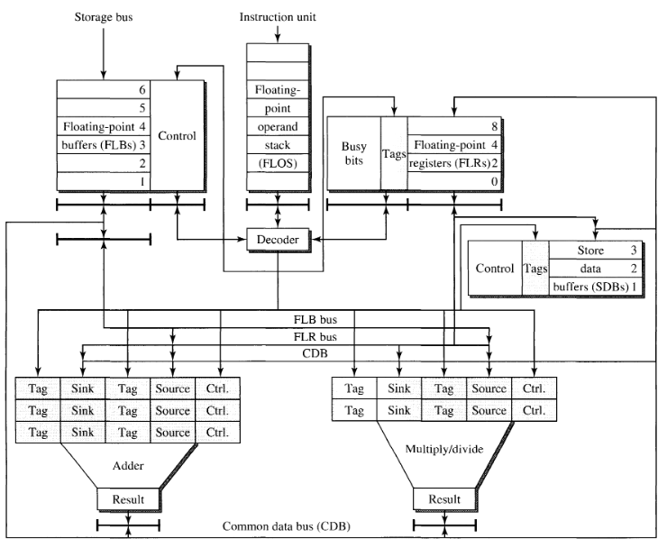

# Review of SuperScalar Technology

## 总览

本章讲述的是流水线为了支持超标量的一些技术，为了打成超标量的流水线和和保证流水线上超高的效率，流水线的前端和后端都需要采用相关的手段进行优化。所谓对于前端的优化是保证指令能够源源不断的填充到流水线上，所谓对于后端的优化是保证高效的执行单元能够将前端产生的指令消耗掉。

超标量流水线上采取的技术大体可以如下分类：

- 针对指令流的优化技术
  - 分支预测
- 针对寄存器数据流的优化技术
  - 寄存器重命名
  - 特定的功能单元
  - 融汇贯通：Tomasulo
- 针对内存数据流的优化技术
  - 专用的存储器单元
  - 旁路与前递

## 针对指令流的优化技术

这部分的技术工作在取指/译码阶段，这部分技术的目标就是最大限度的向超标量流水线提供指令。

### 程序控制流和控制依赖

程序的执行并不是一帆风顺的，在遇到分支的时候总是会带来程序下一步取指的不确定性。放任不管存在以下两种情况：

1. 在分支没出结果之前停滞，等到分支出了结果继续取指。这带来了流水线上的**停顿**，但是实际上对于流水线技术而言，能够消除的停顿都要尽量的消除。
2. 在分支没出结果之前假定程序执行流不改变，默认程序继续往下。虽然不会带来取指的停止，但是如果最终发生了分支，流水线上就需要全部被清空，带来的损失依旧不小。

::: details 停顿 vs 清空
清空带来的开销更大于停顿，清空表示流水线上前几个阶段都被放弃了，就跟什么都没做一样，在这点上已经持平了停顿带来的开销。在流水线清空之前：

1. 错误的指令很可能已经被分派到保留站之中了，还要去保留站中找出具体的指令来清除。
2. 分支预测错误时，分支指令离开重排序缓冲的时候，重排序缓冲后续的条目都要被丢弃。

就这两点的开销而言就已经大于停顿。
:::

### 分支带来的性能下降

在不执行分支预测的情况下，分支的开销主要来源于停顿。分支的延迟主要包括两个部分，一部分是计算目的跳转地址，另一部分是分支条件是否满足的解析。对于第一部分的延迟，分支根据寻址方式（pc相对、寄存器相对、寄存器相对偏移）的不同主要产生 1-3 个时钟周期的延迟。对于条件解析，这部分延迟时间至少都要为 2 个周期（至少需要访问控制状态寄存器）。

### 分支预测技术

分支预测技术主要由对于目的地址的预测和对于分支条件的预测（预测是否进行跳转）组成。

对于目的地址的预测，引入的是 BTB 这种 kv-cache，将分支指令的 pc 作为 key，将分支指令的预测目标地址作为 value。在取指阶段的时候，就能够通过访问 BTB 来得到预测的分支目标地址。分支指令第一次访问 BTB 的时候，BTB 可能还是空的，这就需要在本次分支完成之后进行填充。BTB 怎么去做功能上的实现应该依具体的算法不同而异，重要的是知道有这么个东西来实现对于分支目标地址的查找。

对于分支预测而言更为重要的是对分支条件判断的预测，也就是到底分支不分支，对于这部分的技术其实是逐步演进的。

最简单的是对单条指令的静态分支预测，可以有如下的方案：

1. 直接根据指令中的 offset 字段判断分支是否发生。offset为正分支不跳转，offset为负分支跳转。这种方案非常的简单，但是简单的方案预测的精准度肯定还是不太够。
2. ISA 中为分支指令加一个 bit，让编译器编译的时候设置这个 bit 来预测分支是否发生。这增加了编译器设计的难度并且要修改 ISA。

静态的分支预测并不能满足要求。在超标量流水线的环境下，基于历史的分支预测是更加受欢迎的选择。

基于历史的分支预测，简单而言就是根据这条指令先前的分支结果，来预测未来的分支是否发生，这就需要考虑两个问题：

1. 考虑多久之前的历史？太多的历史导致记录的信息多，太少的历史预测精准度不高。
2. 根据历史怎么产生预测结果。这直接影响了分支预测的精准度。

对于这种分支预测的实现是使用有限确定性状态机（FSM）实现的。考虑该分支之前前 $n$ 条分支的历史，前 $n$ 分支的历史根据先前的分支跳转(Taken)与否(Not Taken)，会生成 $2^n$ 种可能，这些可能组成了 FSM 的所有状态。每种状态都会有一种先前规定好的预测结果（这是分支预测算法规定的），在取到分支指令之后，就能快速的根据这个分析结果预测是否跳转。在分支指令完成了之后，还需要将最终的分支结果与原先预测的结果进行比对，不管预测结果正确与否都会**产生状态机的状态转移**，如果预测错误还会导致流水线的清空。分支预测也就是通过这种不断的访问状态机、更新状态机完成的。

如上图所示，可以将分支历史这 $n$ bits 放到 BTB 中，在取指阶段取到指令之后，立即访问 FSM 中的这 $n$ bits 状态来预测分支是否发生。通过实验数据表明，仅使用 1 位历史数据，基于历史数据的动态分支预测就达到了 $79.7\%$ 的预测精度；使用 2 个历史位时，六种工作负载的准确率从 $83.4\%$ 到 $97.5\%$ 不等。但是这并不意味着参考越多的历史就能够获得越高的精准度，后续的实验也表明增加位数到 3 位相对于 2 位而言就不再有明显的精度提升。

这之中还有另一项研究就是确定 2 bits 的预测器比较优秀的情况下，该如何设计这个 2 bits 预测器的问题。即使是两个 bits 的预测器，设计的可能性有 $2^20$ 种，这么多种选择中哪一种是最优的是一个研究的问题。相关的研究针对不同的 benchmark 对最优的 2 bits 分支预测期展开研究，结果显示，找到的最优的预测器预测成功率从 $87.1\%$ 到 $97.2\%$ 不等。

另一方面思考的是引入分支历史之后硬件上的开销。最简单的来想，硬件上的开销也就是多出了这 2 bits 的分支历史表示，具体的大小应该是 $BTB Table Size * 2$ bits。

### 分支预测失败时候的恢复

分支预测失败时候的恢复简单的来说就是对流水线进行清空，这是通过重排序缓存来实现的。在重排序缓存中，排在当前预测指令之后的指令都需要被清空。可能出现的特殊情况是，一条分支指令进行跳转之后，后续仍然带来了一系列的分支指令，这时候重排序缓冲上可能就分布着一系列的分支指令，这时候非常重要的是确定哪条分支指令预测错误，这条错误指令以及之后的指令被清空。进行区别的方式包括为分支指令加上 tag 等等的方式。

### 更先进的分支预测技术

更先进的分支预测技术是考虑了更多程序运行时上下文的预测技术。这里首先先引入的是两个概念，分别是静态指令预测(static instruction prediction)和动态指令预测(dynamic instruction prediction)，这不同于静态分支预测和动态分支预测。静态指令预测表示预测的时候只考虑当前这条指令，而不考虑程序的其他信息；动态指令预测指的是在预测的时候不止考虑当前这条分支指令，还会考虑到之前其他分支指令的执行结果，也就是说包含了更多有关程序上下文的信息。

首先介绍的是 Yeh and Patt 在 1991 年提出的两级适应性的方案，在这个方案中引入了新的硬件结构 branch history shift register (BHSR) 和 pattern history table (PHT)，BHSR 实际上直接保存了最近分支是否发生的信息，利用这个寄存器中的数值作为 key，取出在 PHT 中的 value，这个 value 是 FSM 的一个状态，通过这个状态访问 FSM 能够取得分支预测的结果。

这种分支预测方案如图所示，取得了优于 $95\%$ 的精准度。这套方案也成为了一种基座，衍生出了后续的其他分支预测方案。

基于这一个基座，可以这样去描述分支预测的设计空间：

- BHSR 实现
  - global(G)：设置容量为 k 位的**单** BHSR 来跟踪 1-k 条指令的前 k 次历史。
  - individual(P)：设置容量为 k位的**一组** BHSR，BHSR 的选取是由分支指令的 pc 地址决定的。
- PHT 实现
  - global(g)：设置**单** PHT 来处理分支预测。
  - individual(p)：设置**一组** PHT 来处理分支预测。
  - shared(s):设置**一组** PHT 来处理分支预测，多个 BHSR 可能映射到一个 PHT。
- FSM 实现
  - adaptive(A)：是否采用自适应(Adaptive)的 FSM，即 FSM 能够根据分支预测的历史来改变自身的形态(即从一种状态机变成另一种不同的状态机)。

以上是一些表示法的示例，在实际的设计中，可以选择不同的方案进行试验，得到最后的实行方案。

## 针对寄存器数据流的优化

这部分主要是针对寄存器数据流的优化，包括执行单元合理的分配和对于假依赖的消除。

ALU 的计算过程可以被描述为，$R_i \leftarrow F_n(R_j, R_k)$。在这个过程中如果 $F_n$ 不可用，那就造成了所谓的结构冲突；若 $R_j$ 和 $R_k$ 不可用，则造成了真依赖；若 $R_i$ 不可用，则造成了反依赖和输出依赖，也就是所谓的假依赖。

### 寄存器的重用和假依赖

程序还在编译的中间过程的时候，也就是还是 IR 表示的时候，采取的都是静态单赋值的形式，在这个阶段的 IR 表示下还没真正的进行寄存器的分配，拥有无限的寄存器可以用，所以在这种静态单赋值的情况下并不会产生任何的假依赖。

但是实际上体系结构的寄存器并不是无限的，每个体系结构会规定自己有限的寄存器。因此在编译的过程中，在从 IR 到具体的目标机器代码的时候，必须要吧无限的寄存器压缩到一个小的寄存器的子集上，在这个压缩的过程中难免导致了同一寄存器之间的重用，这就是假依赖。

在乱序执行的过程中，一定要保证好真依赖和假依赖的关系，只有保证了依赖的关系才能保证程序执行语义的正确性。因此在超标量乱序执行中，在消除假依赖的同时正确的维护假依赖的关系是非常重要的。

假依赖的产生本质是编译器不够用的问题导致的，而不是程序的语义中就包含假依赖。而编译期工作在静态编译阶段，它对程序的上下文感知是有限的，因此也很难优化掉假依赖。但是一旦程序在处理器上运行到了运行时阶段，这个阶段能够获取到更多的寄存器是否可用的信息，因此在运行时阶段能够进行相关的方法判断来消除假依赖。

### 寄存器重命名技术

寄存器重命名技术就是利用运行时的动态信息解决假依赖问题的一种方法。寄存器重命名级数有多种多样的实现，但是其核心就是期望找到运行时候空闲的寄存器，并使用空闲的寄存器替代产生假依赖的寄存器。实际上这个过程就是编译时候寄存器分配的逆过程。

上图描述的就是一个简单的寄存器重命名的架构。这种简单的寄存器重命名方法就是在体系结构规定的寄存器之外(ARF)之外增加一些只有在处理器内部可用的寄存器(RRF)来提供对寄存器重命名的支持。RRF 可以是对 ARF 的多份复制，也可以是其他形式，总之关键的是寄存器数量的添加以及维护的方法。

对于这种架构而言，整体的重命名过程应该如下：

重命名的开始发生在译码阶段，即开始读取寄存器的时候，假定执行的执行是读取源操作数进行计算得到目的操作数的指令。

在读取源操作数寄存器时：

- 读取的寄存器 busy 位没有设置，表示当前寄存器是空闲的，没有前序的指令对寄存器写，这个寄存器数值可以直接读取。
- 读取的寄存器 busy 位被设置，表示先前的寄存器需要写这个寄存器，这是真依赖。
  - 根据 Tag 查找 RRF，如果 RRF 中对应的寄存器 valid 等于 1，表示这个重命名寄存器的计算已经完成，只是还没更新到物理寄存器，这部分的数值可以直接拿过来用，这可以说是一种前递。
  - 根据 Tag 查找 RRF，如果 RRF 中对应的寄存器 valid 等于 0，表示这个重命名寄存器的计算还没完成。这条指令被放置到保留站中，并时刻监听 RRF 中对应寄存器的计算是否完成，完成了就拿过来使用。

在译码目的操作数寄存器时：

- 目的寄存器的 busy 位没有被设置，表示当前寄存器是空闲的，将 busy 位设置为 1，表示当前指令占用了这个寄存器，会对这个寄存器进行写操作。选取 RRF 中一个可用的寄存器，将原先指令中的目的寄存器重写为这个寄存器，将 RRF 中分配出的寄存器号作为 Tag 记录在 ARF 中，并将 RRF 中相应字段的 busy 位设置为 1。
- 目的寄存器的 busy 位已经被设置了，表示先前的寄存器需要写这个寄存器，这是 WAW 假依赖，可以通过重命名解决。如果 RRF 中有寄存器可用，选取 RRF 中一个可用的寄存器，将原先指令中的目的寄存器重写为这个寄存器，将 RRF 中分配出的寄存器号作为 Tag 记录在 ARF 中(ARF中maptable 应该能记录多个 Tag)，并将 RRF 中相应字段的 busy 位设置为 1。

在上述两部分完成之后，指令开始执行，在执行完成之后，如果发生了重命名，结果都是被写入到重命名寄存器中的，在这之后指令进入到重排序缓冲中。等到指令出了重排序缓冲，如果当前的指令进行过重命名，那就将重命名寄存器的数据更新到 ARF 中，同时清除 RRF 的 busy 状态。一条指令的执行算是完成了。

无论采取何种方法，在这个过程中非常重要的一部分就是维护好从重命名寄存器到体系结构寄存器的映射，只有维护好了这种映射，才能保证整个过程的正确性。同时只有维护好了这部分的映射，才能够进行对精确中断的支持。

### 真依赖与数据流中的限制

真依赖是无法消除的，因此真依赖构成了程序执行的关键路径，无论如何优化，程序的性能都不可能超过真依赖这个关键路径上所消耗的时间。所有的现有的寄存器数据流技术都是为了接近数据流极限而进行的尝试。

### Tomasulo 算法

Tomasulo 非常重要，是现代乱序执行的基础，是非常值得研究的。Tomasulo 在 IBM360/91 中正式实现，IBM 360/91 属于是 IBM360 系列中的机型。

IBM 360 系列中大致的浮点架构如下：

总体的结构非常的清晰。FLB 和 SDB 的设计非常像现在的 ICache 和 DCache，FLB 和 SDB 的地址生成和内存访问都需要一定的延迟，但是由于图中的这一部分只表示浮点处理单元，这一部分就没有画在图中。这个时候的浮点单元还是非流水化的，浮点的加法需要消耗 2 个时钟周期，浮点的乘除法需要消耗 3/12 个时钟周期。

在上世纪 60 年代开始，IBM 开发出这个系列的 91 机型。在这个过程中 IBM 希望做到的点就是能够保证一个时钟周期能够产生一条指令的吞吐率。这对于上面的设计来首肯定不是不行的，就一个非流水的浮点单元就导致这一点很难做到。

91 机型的架构图如下：

在 91 机型中引入了三个新的硬件特性，分别是：

- 保留站(reservation station)：防止寄存器依赖不满足的时候对前序流水线产生的阻塞。
- 通用数据总线(common data bus,CDB)：在计算得到结果的时候快速前递数据。让保留站中的数据更快满足依赖条件。
- 寄存器重命名机制(Tag)：通过对 FLB/FLR 进行 Tag 编号以及 CDB 的机制，让 FLB/FLR 两者者联合起来像一个 RRF(重命名寄存器文件)。

在引入这些新的特性之后，一个重要的问题是，Tag 的含义， 谁是 Tag 的产生者，谁是 Tag 的消费者：

- Tag 的含义：Tag 为 0 时表示没有监听的对象，Tag 非 0 时代表监听对象。
- Tag 产生者：由于 FLB/FLR 两者都能作为寄存器重命名的对象，因此 Tag 编码的地址范围要涵盖这两者，这两者的数量总共加起来有 11 个，编码这个 Tag 至少需要 4 位。SDB 不作为数据的产生者，这是因为数据都在被处理完成之后才向 SDB 去写，写入 SDB 的数据短期不会在被拿来使用。
- Tag 消费者：Tag 消费者主要包括保留站中的指令， TLR 和 SDB。

::: details 所谓的寄存器重命名
另一个角度对寄存器重命名的理解是重命名寄存器先一步于体系结构寄存器的更新。对应于这种情况，在 tomasulo 中，Tag 应当作为重命名寄存器，Tag 消费者作为实际的体系结构寄存器。
:::

自然的去想这个算法的工作过程：

1. 指令从 FLOS 中发出，进行译码。
   - 对于要读的寄存器，进行监测，看看能不能直接读到，能直接读到就直接读取，读不到就记录Tag(RAW 相关)，后续进行监听。
   - 对于要写的寄存器或者说是内存地址，在指定 TLR 寄存器 或者 TLB 中的指定字段将 Tag 设置为即将放置到保留站的 Tag。
2. 指令很快发送到保留站中。
   - 对于依赖不满足的指令，保持在保留站中等待。等待的过程中监听 CDB，时刻做好依赖被满足的准备。
   - 对于依赖满足的指令，将其发射到执行单元中。
3. 指令执行完成之后。
   - 将数据传输到 CDB 总线上。Tag 的消费者在监听总线上的数据。
4. 相关单元监听到 CDB 上需要的数据后。
   - 依赖被满足。将自己的 Tag 字段修改为0。特殊的，对于 TLR，还要将相关的 busy 字段设置为 0。

::: details 91 机型上的一些不足？

1. 取指宽度为1，其实可以更高。
2. 具体的浮点单元可以进行流水化。

:::

### 动态执行核心

主要将为了满足流水线上的乱序执行需要注意哪些点：

1. 指令调度阶段的任务：重命名目标寄存器(寄存器重命名的分析可能在译码阶段已经完成，但是相关的信息可能需要在这个阶段做记录)、分配保留站和重排序缓存的空间。将指令调度到合适的保留站。
2. 从保留站中发射的选择：多个指令存在在保留站之中时，应当先发射哪条指令进行执行是一个可以研究的问题。
3. 执行过程中不复存在的依赖：一旦指令进入到执行单元中，他将不会再因为任何依赖的问题而停滞在执行单元中。

### 更多针对于寄存器数据流的优化

在这一部分中提到了对于值的预测技术，这种技术希望一定程度上解决真依赖的问题，再度推进高速的执行。

## 针对内存数据流的优化

针对内存数据流的优化特别是对 load 的优化是很有必要的，大量预留站中的指令可能在等待内存来的数据，因此对这个过程进行优化很重要。编译器对于编译出的代码内存优化等级是未知的，因此如果不对 load 指令做调度等额外的调度，按照原来的指令序列很可能导致执行的低效。

### 访问内存的指令

访问内存的指令包括 load(ld) 和 store(st)，其在执行单元中的实现如下：

- ld：三段流水线的实现，地址生成-地址翻译-内存访问。
- st：两段流水线的实现，地址生成-地址翻译。内存访问是在指令完成之后进行的，指令完成之后，对于内存的写请求会进入到 store buffer中，等待退役。

在出现异常时，为了支持精确异常：

- ld：ld 指令并不改变内存的状态，在异常的前后内存状态都是一样的，不需要做特别的动作。ld 指令只改变寄存器的状态，但是在异常发生后，所有的寄存器都会被清空，天然的不需要任何操作去对这些改变的寄存器做恢复。
- st：st 指令会改变内存的状态，在发生异常的时候。在异常之前进入到 store buffer 中的写请求必须都被完成，这才能保证内存的正确。

### 内存序

跟寄存器一样，内存之间也会存在和寄存器一样的依赖关系，对于给定指令的顺序执行天然保证了这种内存序。

但是为了优化程序的执行和内存的访问，必须尝试对内存中的依赖进行消除。消除依赖的过程中，仍需要注意的就是保持这种内存序，这样才能保证程序语义的正确。

### ld 时旁路和前递

有充足的理由表明 ld 操作需要被优化。ld 操作是一次对内存读的操作，但实际上也是一次对寄存器写的操作，等于说是对寄存器进行定义的操作，这就说明在 ld 操作之后会有别的指令对 ld 定义的寄存器进行使用，为了不让别的指令进行等待，我们希望这个寄存器定义的操作能够尽早完成。因此在保持内存序的情况下，我们尽可能的想让 ld 提早完成，这就带来了两种优化技术。

第一种技术称为旁路(或者说是绕过的技术)，由于 ld 指令与前面的 st 不产生相关，因此 ld 指令能够提到这几个 st 指令的前面去。第二种技术称为前递技术，即先前对某个地址的写刚好是后续 ld 的读地址，产生了 RAW 依赖，可以做前递节省时间。

在超标量流水线中，专用于 ld/st 的执行单元可能如下：

这里需要注意的是，ld/st 的发射仍然是顺序的。

上图显示的是两种技术的结合。在执行单元中的 ld 进行并行的依赖检查和数据访问，如果依赖检查生效了，也就是和前序的 st 产生了 RAW 依赖，这个时候可以直接进行前递；如果依赖检查没有生效，也就是说没有产生依赖关系，那从内存中取到的数据会被 ld 在后续写入寄存器。最好情况在指令 ld 的时候，还有两条 st 在执行单元中，等于说前提了 2 个单位，最换情况没有任何的前提。

上述的情况仍然基于的是 ld 和 st 从保留站中发射到执行单元的时候是顺序的，但是可能某些时候 st 指令把保留站的出口堵住了，导致后面的 ld 没办法发射出去，但是实际上后面的 ld 和前面的 st 没有任何的关系，是可以先去做执行的。这就表示了 ld/st 指令是有乱序执行的可能的。

上述的方法允许 ls/st 的乱序执行。只不过在 ld 指令出重排序缓存的时候，要进行前序依赖的检测，如果产生了依赖，则表示之前的提前执行是错误的。这条 ld 指令和后续的其他指令都会被清空，流水线会被重新填充。是否采取这项策略需要进行权衡，因为产生的惩罚实在是太大。

### 其他针对内存数据流的优化技术

非阻塞缓存、多个 ld/st 单元、预取。
