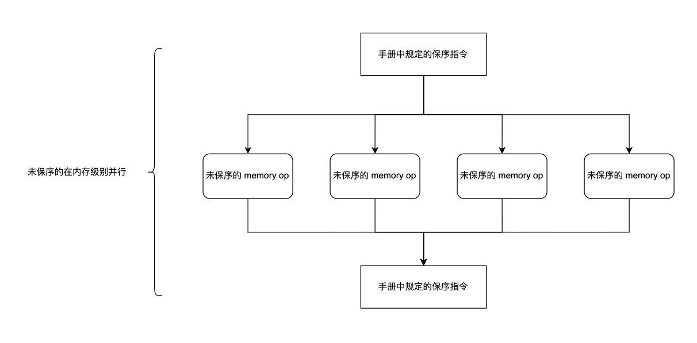

# riscv 内存序

收回以前的想法，以前的想法是单核内部虽然乱序访存，但是对外还是保证顺序的。现在才发现，即使是单核检测的内存序违反等等，也是按照 risc-v 的内存模型来的。在符合 risc-v 内存的模型的情况下，可能尽一切可能的乱序。

## risc-v 内存序模型

risc-v 的内存模型定义是先定义每个核内的 ppo。这里的 ppo 是一种受限的程序序，如果单核内的某种情况是符合 ppo 定义的，risc-v 的实现必须保证 ppo 的序在全局上仍然存在。也就是说单核内出现的这个受限的序，再全局上仍然保证，全局上一定会抽出这样一个序的子集。

risc-v 的内存序定义为只要保证 ppo 在全局序上顺序不变，其他任何情况都能够进行自由的内存排序，单核的场景可以认为是一个特殊的多核场景，单个核内的顺序就代表了多核的顺序。

受保护的 ppo 符合的情况在文档中的定义如下：

> 保留的程序顺序的完整定义如下（注意，AMO 同时是加载和存储）：如果内存操作 a 在程序顺序上先于内存操作 b，a 和 b 都访问常规主存（而非 I/O 区域），且以下任一条件成立，则内存操作 a 在保留的程序顺序上先于内存操作 b（因此也在全局内存顺序上先于内存操作 b）

> 1. b is a store, and a and b access overlapping memory addresses  
> 2. a and b are loads, x is a byte read by both a and b, there is no store to x between a and b in program order, and a and b return values for x written by different memory operations  
> 3. a is generated by an AMO or SC instruction, b is a load, and b returns a value written by a

1. a 和 b 重叠了内存访问的地址。不管 a 是 load 还是 store 都需要保证在 b 之前。gem5 中对于 load 违反的检测应该也是依据这一条规定。
2. a 和 b 都是 load，且在单核的程序序内部他们的中间没有load。但是这个 a 和 b 进入到全局序的时候，加入他们的中间有来自别的核的 store，那这两个 load 不能进行顺序的调整。
3. b 之前的 a 是一个 amo，b 访问的还是 amo 的地址，那不能越过。

注意上面这里指的是地址重叠的场景。

> 4. There is a FENCE instruction that orders a before b  
> 5. a has an acquire annotation  
> 6. b has a release annotation  
> 7. a and b both have RCsc annotations  
> 8. a is paired with b

上面指的是会显式触发 ppo 保序的场景。4 是屏障引发的保序。5678 分别是 amo ll sc 相关。

> 9. b has a syntactic address dependency on a  
> 10. b has a syntactic data dependency on a  
> 11. b is a store, and b has a syntactic control dependency on a

上面指的是依赖关系保 ppo 的场景。9 指的是 b 用到的地址可能是 a load 到某个寄存器里面计算得到的，这个顺序需要保住。10 指的是 b store 的数据是 a load 到某个寄存器计算得到的。11 涉及到控制路径的相关：

```asm
1: lw t0, x         # ← a：load cond
2: bgtz t0, label   # 分支，控制依赖成立
3: ...              # fall-through: 不写 y
4: sw t1, y         # ← b：store y = 1
```
1: lw t0, x         # ← a：load cond
2: bgtz t0, label   # 分支，控制依赖成立
3: ...              # fall-through: 不写 y
4: sw t1, y         # ← b：store y = 1
即 b 处在由 a 导致的依赖路径上，需要保序。

> 12. b is a load, and there exists some store m between a and b in program order such that m has an address or data dependency on a, and b returns a value written by m  
> 13. b is a store, and there exists some instruction m between a and b in program order such that m has an address dependency on a

上面指的是依赖链的情况，等于是 9 10 依赖形成链的情况下的拓展。

以上就是 risc-v 弱内存序的定义。

## 语义

load 和 store 执行的意思是什么，也就是说 load 和 store 在进行到什么程度才进入到全局序里？load 当值被加载到寄存器的时候称其进入到全局序中了。store 当值写回到 memory subsystem 的时候称其进入到全局序中了。以上都是全局序的定义，指的是对其他核可见。

而 program order 应该不同，当 store 进入到 store buffer 的时候，其在单核内部也已经是可见的了，store 进入到 store buffer 的时候应该也已经算 program order了。

### load 语义

> Each byte of each load i returns the value written to that byte by the store that is the latest in global memory order among the following stores:  
> 1. Stores that write that byte and that precede i in the global memory order  
> 2. Stores that write that byte and that precede i in program order  
> Preserved program order is not required to respect the ordering of a store followed by a load to an overlapping address. This complexity arises due to the ubiquity of store buffers in nearly all implementations. Informally, the load may perform (return a value) by forwarding from the store while the store is still in the store buffer, and hence before the store itself performs (writes back to globally visible memory). Any other hart will therefore observe the load as performing before the store.

这里指的是 load 的语义，也就是说 load 能获取到的值是离这个 load 最近的程序序的值或者全局序的值。这并不和 ppo 的第一条冲突，其第一条规定的是 store 前的 load 不能跑到后面。这个指的是 load 的值是从哪里来的。

## 一个访存指令拆成多个的情形

像向量浮点这样的一个可以拆成多个的，可以到相关的拓展里面去找。

还有的就是非对其的内存访问触发的异常往往需要拆成多个进行模拟：

> A misaligned load or store instruction may be decomposed into a set of component memory operations of any granularity. An FLD or FSD instruction for which XLEN<64 may also be decomposed into a set of component memory operations of any granularity. The memory operations generated by such instructions are not ordered with respect to each other in program order, but they are ordered normally with respect to the memory operations generated by preceding and subsequent instructions in program order. The atomics extension "A" does not require execution environments to support misaligned atomic instructions at all. However, if misaligned atomics are supported via the misaligned atomicity granule PMA, then AMOs within an atomicity granule are not decomposed, nor are loads and stores defined in the base ISAs, nor are loads and stores of no more than XLEN bits defined in the F, D, and Q extensions.

这里简单的讲就是非对其的模拟在拆分之后各个小单元之间不再有严格的顺序。但是所有小单元模拟出的大指令要符合原先定义的序。

## 图形化的理解



原理已经在上面描述，只要是符合保序规定之外的，都不用保留顺序。

同时对于单个核内的内存访问，如果 hit 在自己的核，那就从自己的核读取，如果是 invalid，那就要进入全局的一致性控制单元，由一致性控制单元来定顺序，然后才走一致性协议发起各种请求。

当请求到达，定完顺序，才正式的执行请求。如图所示，两个强制保序的指令中间的内存操作，都是可以乱序的，这是一种 MLP 的提升。

强内存序的好处：用户编写程序方便，全局的内存访问显得更加的规则。

弱内存序的好处：MLP 更高，编译器的优化能够更加的激进。

就从这点看来，弱内存序的好处似乎高于了强内存序。但是 x86 服务器在性能上表现的仍然十分出色。我觉得可能是这样，首先 x86 本身可能引入了内存消歧机制，这个我们无从得知。其次 x86 从全局层面，访存行为更加的固定，比较适合 L3 prefetch 的设计。

然后就是弱内存序虽然提升了 MLP，但是 L3 或者 memory 能不能抗住大量的乱序内存请求？如果 handle 不了这么多的乱序请求，那 MLP 的提升也是没有意义的。所以我认为弱内存序的机器需要把内存带宽做大，强内存序的机器对这个要求可能没有弱内存序的高，但是 prefetch 要做的更好。
