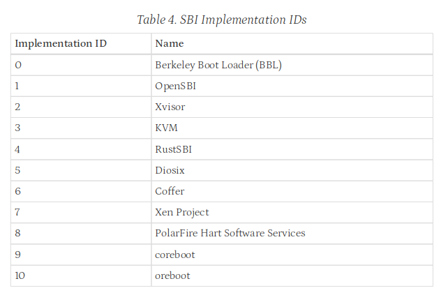

# sbi 和 opensbi

## sbi

sbi 的全称应该是 system binary interface，是操作系统和裸机交互的接口，或者在虚拟化的情况下是虚拟机操作系统和虚拟机管理软件的接口。


正如上面这张图的中间部分所示，sbi 是操作系统向裸机环境的管理软件请求的二进制接口。就像 u 态的应用程序能够通过 abi 向向操作系统提起 ecall 请求操作系统的服务并向 s 态转换一样，操作系统也能通过 sbi 向裸机上运行的管理软件通过 ecall 请求服务，将自身向 m 态进行转换。而 opensbi 是 sbi 的一种实现。

sbi 的实现毕竟要工作在 m 态，属于完全裸机的环境，因此 sbi 管理的是真正的硬件，因此在 sbi 的文档中可以看到 sbi 的功能包括获取机器的硬件信息，向机器发送记时中断等等，管理硬件线程。因此可以猜测，sbi 能够为操作系统提供一些对硬件操作的接口，让操作系统想要使用硬件或者获取硬件相关的信息的时候能够有一个抽象的接口。

sbi 的定义引出四个问题：

1. 谁是 sbi 的实现，工作在 m 态的软件在做什么。

毕竟工作在 m 态，这个状态下的指令是能够直接访问裸机的，可以把操作系统想象成应用程序，那 sbi 的实现就是这个应用程序的操作系统，也就是说 sbi 是操作系统的操作系统。那从我们平常的应用程序的视角来看，我们的应用程序需要被加载到操作系统上，同样的，对于 sbi 的实现，他需要把操作系统加载到裸机上，因此 sbi 的实现需要实现操作系统的 bootloader，负责将操作系统加载到裸机上。应用程序需要通过系统调用向操作系统获取服务，因此 sbi 的实现也需要向操作系统提供调用的接口，让操作系统能够通过某种方式调用 sbi 实现的服务。通过这样，我们能够理解，sbi 的实现应该就是一个 bootloader 加上一段能够调用的程序。

2. 能不能不要 sbi？

当然可以不要，应用程序都可以不要操作系统工作在裸机上，操作系统当然也可以不需要 sbi 的实现来工作在裸机上，sbi 的实现不过是方便操作系统的设计，让操作系统有接口可以调而已。如果不要 sbi 的实现，操作系统就需要自己承担 sbi 的职责，自己把 abi 的功能都干了。

3. 调用规范是什么？

sbi 文档中定义了自己的调用规范。


调用规范就是如图所示，简单的来讲就是使用 ecall 的调用，在定义一堆传参的规则，然后通过 `[eid, fid]` 这种二元组的形式向下调用。eid 称为 extension id，简单的来讲就是实现某一类功能的函数的集合比如和定时器相关的函数，比如和 pmu 相关的函数；fid 即 function id，即在 extension 函数族中的某一个函数。extension id 和 function id 都是在 sbi 文档中规定好的。

4. sbi 的实现有哪些？



上面的图中就列出了 sbi 的实现，可以看到 bbl 就是 sbi 的一种实现，opensbi 就是序号为 1 的 sbi 实现。

## opensbi

opensbi 是 sbi 的一种开源实现，其主要包含了一个 bootloader(firmware目录下) 还有 sbi规范的实现(lib目录下)，平台相关的实现被放在 platform 下。

这里主要记录对 opensbi 中的 bootloader 代码进行简单的分析，理解操作系统被引导的过程，同时以 qemu平台为例。如果要启动操作系统内核，主要的 bootloader 写在 `fw_jump.S` 这个汇编代码文件下。分析这些代码的时候需要注意，变量可能是能够被多处定义的，可能是在命令行中，可能是在链接脚本中，可能是在汇编语言的源文件中，可能也在 c 语言的源文件中，因此要善用查找功能。

`fw_jump.S` 这个文件并没有实现的太复杂，可以看到其包含了 `fw_base.S` 这个文件，这个文件才是主要的实现。

```asm
	.section .entry, "ax", %progbits
	.align 3
	.globl _start
	.globl _start_warm
_start:
```

首先最开始指定了一个 .entry 节，显然 bootloader 的入口点就在这里，同时全局导出了 `_start` 和 `_start_warm` 函数。

由于暂时不确定在多核的情况下是不是多核同时启动，这里认为是多核同时启动的。

```asm
_start:
	/* Find preferred boot HART id */
	MOV_3R	s0, a0, s1, a1, s2, a2
	call	fw_boot_hart
	add	a6, a0, zero
	MOV_3R	a0, s0, a1, s1, a2, s2
	li	a7, -1
	beq	a6, a7, _try_lottery
	/* Jump to relocation wait loop if we are not boot hart */
	bne	a0, a6, _wait_for_boot_hart
_try_lottery:
	/* Jump to relocation wait loop if we don't get relocation lottery */
	lla	a6, _boot_status
	li	a7, BOOT_STATUS_LOTTERY_DONE
	amoswap.w a6, a7, (a6)
	bnez	a6, _wait_for_boot_hart

	/* relocate the global table content */
	li	t0, FW_TEXT_START	/* link start */
	lla	t1, _fw_start		/* load start */
	sub	t2, t1, t0		/* load offset */
	lla	t0, __rel_dyn_start
	lla	t1, __rel_dyn_end
	beq	t0, t1, _relocate_done

```

在多核启动的情况下，多个核会同时争抢一个锁，来决定谁先进行启动，其中一个核会抢到锁，剩下的就是直接停住等待。

```asm
	li	ra, 0
	call	_reset_regs

	/* Zero-out BSS */
	lla	s4, _bss_start
	lla	s5, _bss_end
_bss_zero:
	REG_S	zero, (s4)
	add	s4, s4, __SIZEOF_POINTER__
	blt	s4, s5, _bss_zero

	/* Setup temporary trap handler */
	lla	s4, _start_hang
	csrw	CSR_MTVEC, s4

	/* Setup temporary stack */
  /* allocate some space to mark message */
	lla	s4, _fw_end
	li	s5, (SBI_SCRATCH_SIZE * 2)
	add	sp, s4, s5

```

抢到资源的核随后会重置寄存器，读取 bss 段的信息记录并将 bss 段指向的变量初始化为 0。随后写了 MTVEC 这个 csr 寄存器，这个寄存器是 m 态的中断向量寄存器，他将这个中断向量寄存器指向了一个死循环的函数，在这种初始状态下出现中断，应该是无法处理的。

```asm
	MOV_5R	s0, a0, s1, a1, s2, a2, s3, a3, s4, a4
  /* parse ftb, in this step cpu core have been found! */
	call	fw_platform_init
	add	t0, a0, zero
	MOV_5R	a0, s0, a1, s1, a2, s2, a3, s3, a4, s4
	add	a1, t0, zero
```

然后接着就开始调用了 `fw_platform_init` 函数了，这个函数中简单的解析了设备数，并将设备树的信息记录到内存的一个结构体中。

```asm
#else
	lw	s7, SBI_PLATFORM_HART_COUNT_OFFSET(a4)
	lw	s8, SBI_PLATFORM_HART_STACK_SIZE_OFFSET(a4)
	lw	s9, SBI_PLATFORM_HEAP_SIZE_OFFSET(a4)
#endif

	/* Setup scratch space for all the HARTs*/
	lla	tp, _fw_end
	mul	a5, s7, s8
  /* tp is hard thread local pointer */
	add	tp, tp, a5
	/* Setup heap base address */
	lla	s10, _fw_start
	sub	s10, tp, s10
  /* tp = end + stack + heap */
	add	tp, tp, s9
	/* Keep a copy of tp */
	add	t3, tp, zero
	/* Counter */
	li	t2, 1
	/* hartid 0 is mandated by ISA */
	li	t1, 0
```

接下来这堆都是寄存器之间计算的操作，主要设置了 tp 指针的值，这里实际上是在为硬件线程的初始化分配栈的空间，硬件线程也就是 cpu 核的初始化需要用到这些内存空间。

```asm
_scratch_init:
	/*
	 * The following registers hold values that are computed before
	 * entering this block, and should remain unchanged.
	 *
	 * t3 -> the firmware end address
	 * s7 -> HART count
	 * s8 -> HART stack size
	 * s9 -> Heap Size
	 * s10 -> Heap Offset
	 */
	add	tp, t3, zero
	sub	tp, tp, s9
	mul	a5, s8, t1
	sub	tp, tp, a5
	li	a5, SBI_SCRATCH_SIZE
	sub	tp, tp, a5

	/* Initialize scratch space */
	/* Store fw_start and fw_size in scratch space */
	lla	a4, _fw_start
	sub	a5, t3, a4
	REG_S	a4, SBI_SCRATCH_FW_START_OFFSET(tp)
	REG_S	a5, SBI_SCRATCH_FW_SIZE_OFFSET(tp)

	/* Store R/W section's offset in scratch space */
	lla	a5, _fw_rw_start
	sub	a5, a5, a4
	REG_S	a5, SBI_SCRATCH_FW_RW_OFFSET(tp)

	/* Store fw_heap_offset and fw_heap_size in scratch space */
	REG_S	s10, SBI_SCRATCH_FW_HEAP_OFFSET(tp)
	REG_S	s9, SBI_SCRATCH_FW_HEAP_SIZE_OFFSET(tp)

	/* Store next arg1 in scratch space */
	MOV_3R	s0, a0, s1, a1, s2, a2
	call	fw_next_arg1
	REG_S	a0, SBI_SCRATCH_NEXT_ARG1_OFFSET(tp)
	MOV_3R	a0, s0, a1, s1, a2, s2
	/* Store next address in scratch space */
	MOV_3R	s0, a0, s1, a1, s2, a2
	call	fw_next_addr
	REG_S	a0, SBI_SCRATCH_NEXT_ADDR_OFFSET(tp)
	MOV_3R	a0, s0, a1, s1, a2, s2
	/* Store next mode in scratch space */
	MOV_3R	s0, a0, s1, a1, s2, a2
	call	fw_next_mode
	REG_S	a0, SBI_SCRATCH_NEXT_MODE_OFFSET(tp)
	MOV_3R	a0, s0, a1, s1, a2, s2
	/* Store warm_boot address in scratch space */
	lla	a4, _start_warm
	REG_S	a4, SBI_SCRATCH_WARMBOOT_ADDR_OFFSET(tp)
	/* Store platform address in scratch space */
	lla	a4, platform
	REG_S	a4, SBI_SCRATCH_PLATFORM_ADDR_OFFSET(tp)
	/* Store hartid-to-scratch function address in scratch space */
	lla	a4, _hartid_to_scratch
	REG_S	a4, SBI_SCRATCH_HARTID_TO_SCRATCH_OFFSET(tp)
	/* Clear trap_context and tmp0 in scratch space */
	REG_S	zero, SBI_SCRATCH_TRAP_CONTEXT_OFFSET(tp)
	REG_S	zero, SBI_SCRATCH_TMP0_OFFSET(tp)

```

剩下的这一波操作非常的长，实际上就是在初始化硬件线程相关的结构体的信息，这里实际上一个核把多个核的信息都初始化了。反正上面的过程大多在内存中进行元数据的记录，在信息初始化完成之后会调用一个 sbi_init 正式初始化 sbi 的运行时。

```c
void __noreturn sbi_init(struct sbi_scratch *scratch)
{
	bool next_mode_supported	= false;
	bool coldboot			= false;
	u32 hartid			= current_hartid();
	const struct sbi_platform *plat = sbi_platform_ptr(scratch);

	switch (scratch->next_mode) {
	case PRV_M:
		next_mode_supported = true;
		break;
	case PRV_S:
		if (misa_extension('S'))
			next_mode_supported = true;
		break;
	case PRV_U:
		if (misa_extension('U'))
			next_mode_supported = true;
		break;
	default:
		sbi_hart_hang();
	}

	/*
	 * Only the HART supporting privilege mode specified in the
	 * scratch->next_mode should be allowed to become the coldboot
	 * HART because the coldboot HART will be directly jumping to
	 * the next booting stage.
	 *
	 * We use a lottery mechanism to select coldboot HART among
	 * HARTs which satisfy above condition.
	 */

	if (sbi_platform_cold_boot_allowed(plat, hartid)) {
		if (next_mode_supported &&
		    atomic_xchg(&coldboot_lottery, 1) == 0)
			coldboot = true;
	}

	/*
	 * Do platform specific nascent (very early) initialization so
	 * that platform can initialize platform specific per-HART CSRs
	 * or per-HART devices.
	 */
	if (sbi_platform_nascent_init(plat))
		sbi_hart_hang();

	if (coldboot)
		init_coldboot(scratch, hartid);
	else
		init_warmboot(scratch, hartid);
}

```

可以看到这个 init 实际上是拿到了一个记录硬件线程信息的指针，然后进行操作。比较关键的是其确定了接下来要切换的状态，是否要进行冷启动等等，对于第一个核而言，其显然是冷启动的，因此可以从冷启动的代码继续向下跟踪。

```c
static void __noreturn init_coldboot(struct sbi_scratch *scratch, u32 hartid)
{
	int rc;
	unsigned long *count;
	const struct sbi_platform *plat = sbi_platform_ptr(scratch);

	/* Note: This has to be first thing in coldboot init sequence */
	rc = sbi_scratch_init(scratch);
	if (rc)
		sbi_hart_hang();

	/* Note: This has to be second thing in coldboot init sequence */
	rc = sbi_heap_init(scratch);
	if (rc)
		sbi_hart_hang();

	/* Note: This has to be the third thing in coldboot init sequence */
	rc = sbi_domain_init(scratch, hartid);
	if (rc)
		sbi_hart_hang();

	entry_count_offset = sbi_scratch_alloc_offset(__SIZEOF_POINTER__);
	if (!entry_count_offset)
		sbi_hart_hang();

	init_count_offset = sbi_scratch_alloc_offset(__SIZEOF_POINTER__);
	if (!init_count_offset)
		sbi_hart_hang();

	count = sbi_scratch_offset_ptr(scratch, entry_count_offset);
	(*count)++;

	rc = sbi_hsm_init(scratch, hartid, true);
	if (rc)
		sbi_hart_hang();

	/*
	 * All non-coldboot HARTs do HSM initialization (i.e. enter HSM state
	 * machine) at the start of the warmboot path so it is wasteful to
	 * have these HARTs busy spin in wait_for_coldboot() until coldboot
	 * path is completed.
	 */
	wake_coldboot_harts(scratch, hartid);

	rc = sbi_platform_early_init(plat, true);
	if (rc)
		sbi_hart_hang();

	rc = sbi_hart_init(scratch, true);
	if (rc)
		sbi_hart_hang();

	rc = sbi_sse_init(scratch, true);
	if (rc) {
		sbi_printf("%s: sse init failed (error %d)\n", __func__, rc);
		sbi_hart_hang();
	}

	rc = sbi_pmu_init(scratch, true);
	if (rc) {
		sbi_printf("%s: pmu init failed (error %d)\n",
			   __func__, rc);
		sbi_hart_hang();
	}

	rc = sbi_dbtr_init(scratch, true);
	if (rc)
		sbi_hart_hang();

	sbi_boot_print_banner(scratch);

	rc = sbi_irqchip_init(scratch, true);
	if (rc) {
		sbi_printf("%s: irqchip init failed (error %d)\n",
			   __func__, rc);
		sbi_hart_hang();
	}

	rc = sbi_ipi_init(scratch, true);
	if (rc) {
		sbi_printf("%s: ipi init failed (error %d)\n", __func__, rc);
		sbi_hart_hang();
	}

	rc = sbi_tlb_init(scratch, true);
	if (rc) {
		sbi_printf("%s: tlb init failed (error %d)\n", __func__, rc);
		sbi_hart_hang();
	}

	rc = sbi_timer_init(scratch, true);
	if (rc) {
		sbi_printf("%s: timer init failed (error %d)\n", __func__, rc);
		sbi_hart_hang();
	}

	rc = sbi_fwft_init(scratch, true);
	if (rc) {
		sbi_printf("%s: fwft init failed (error %d)\n", __func__, rc);
		sbi_hart_hang();
	}

	/*
	 * Note: Finalize domains after HSM initialization so that we
	 * can startup non-root domains.
	 * Note: Finalize domains before HART PMP configuration so
	 * that we use correct domain for configuring PMP.
	 */
	rc = sbi_domain_finalize(scratch, hartid);
	if (rc) {
		sbi_printf("%s: domain finalize failed (error %d)\n",
			   __func__, rc);
		sbi_hart_hang();
	}

	/*
	 * Note: Platform final initialization should be after finalizing
	 * domains so that it sees correct domain assignment and PMP
	 * configuration for FDT fixups.
	 */
	rc = sbi_platform_final_init(plat, true);
	if (rc) {
		sbi_printf("%s: platform final init failed (error %d)\n",
			   __func__, rc);
		sbi_hart_hang();
	}

	/*
	 * Note: Ecall initialization should be after platform final
	 * initialization so that all available platform devices are
	 * already registered.
	 */
	rc = sbi_ecall_init();
	if (rc) {
		sbi_printf("%s: ecall init failed (error %d)\n", __func__, rc);
		sbi_hart_hang();
	}

	sbi_boot_print_general(scratch);

	sbi_boot_print_domains(scratch);

	sbi_boot_print_hart(scratch, hartid);

	run_all_tests();

	/*
	 * Configure PMP at last because if SMEPMP is detected,
	 * M-mode access to the S/U space will be rescinded.
	 */
	rc = sbi_hart_pmp_configure(scratch);
	if (rc) {
		sbi_printf("%s: PMP configure failed (error %d)\n",
			   __func__, rc);
		sbi_hart_hang();
	}

	count = sbi_scratch_offset_ptr(scratch, init_count_offset);
	(*count)++;

	sbi_hsm_hart_start_finish(scratch, hartid);
}

```

这个函数非常的长，其对分析可以发现，这个函数初始化了裸机上的所有硬件相关的状态，包括 tlb、中断控制器硬件等等，如果初始化失败，就直接死循环。这个函数之中还初始化了 sbi 的中断向量：

```c
int sbi_ecall_init(void)
{
	int ret;
	struct sbi_ecall_extension *ext;
	unsigned long i;

	for (i = 0; i < sbi_ecall_exts_size; i++) {
		ext = sbi_ecall_exts[i];
		ret = SBI_ENODEV;

		if (ext->register_extensions)
			ret = ext->register_extensions();
		if (ret)
			return ret;
	}

	return 0;
}
```

这就是 sbi 的中断向量表的初始化。

在上面执行完之后，会进入到 finish 函数：

```c
void __noreturn sbi_hsm_hart_start_finish(struct sbi_scratch *scratch,
					  u32 hartid)
{
	unsigned long next_arg1;
	unsigned long next_addr;
	unsigned long next_mode;
	struct sbi_hsm_data *hdata = sbi_scratch_offset_ptr(scratch,
							    hart_data_offset);

	if (!__sbi_hsm_hart_change_state(hdata, SBI_HSM_STATE_START_PENDING,
					 SBI_HSM_STATE_STARTED))
		sbi_hart_hang();

	next_arg1 = scratch->next_arg1;
	next_addr = scratch->next_addr;
	next_mode = scratch->next_mode;
	hsm_start_ticket_release(hdata);

	sbi_hart_switch_mode(hartid, next_arg1, next_addr, next_mode, false);
}

```

这个函数中像是释放掉了相关的锁。最后调用了硬件线程的状态切换函数：

```c
void __attribute__((noreturn))
sbi_hart_switch_mode(unsigned long arg0, unsigned long arg1,
		     unsigned long next_addr, unsigned long next_mode,
		     bool next_virt)
{
#if __riscv_xlen == 32
	unsigned long val, valH;
#else
	unsigned long val;
#endif

	switch (next_mode) {
	case PRV_M:
		break;
	case PRV_S:
		if (!misa_extension('S'))
			sbi_hart_hang();
		break;
	case PRV_U:
		if (!misa_extension('U'))
			sbi_hart_hang();
		break;
	default:
		sbi_hart_hang();
	}

	val = csr_read(CSR_MSTATUS);
	val = INSERT_FIELD(val, MSTATUS_MPP, next_mode);
	val = INSERT_FIELD(val, MSTATUS_MPIE, 0);
#if __riscv_xlen == 32
	if (misa_extension('H')) {
		valH = csr_read(CSR_MSTATUSH);
		valH = INSERT_FIELD(valH, MSTATUSH_MPV, next_virt);
		csr_write(CSR_MSTATUSH, valH);
	}
#else
	if (misa_extension('H'))
		val = INSERT_FIELD(val, MSTATUS_MPV, next_virt);
#endif
	csr_write(CSR_MSTATUS, val);
	csr_write(CSR_MEPC, next_addr);

	if (next_mode == PRV_S) {
		if (next_virt) {
			csr_write(CSR_VSTVEC, next_addr);
			csr_write(CSR_VSSCRATCH, 0);
			csr_write(CSR_VSIE, 0);
			csr_write(CSR_VSATP, 0);
		} else {
			csr_write(CSR_STVEC, next_addr);
			csr_write(CSR_SSCRATCH, 0);
			csr_write(CSR_SIE, 0);
			csr_write(CSR_SATP, 0);
		}
	} else if (next_mode == PRV_U) {
		if (misa_extension('N')) {
			csr_write(CSR_UTVEC, next_addr);
			csr_write(CSR_USCRATCH, 0);
			csr_write(CSR_UIE, 0);
		}
	}

	register unsigned long a0 asm("a0") = arg0;
	register unsigned long a1 asm("a1") = arg1;
	__asm__ __volatile__("mret" : : "r"(a0), "r"(a1));
	__builtin_unreachable();
}
```

可以看到这个函数是不会返回的，实际上他就是会跳到操作系统的开始处，进行操作系统的初始化。可以看到这边首先是进行状态的判断，对不同的状态转换做不同的事。然后将 next_addr 写入到 MEPC 寄存器中，同时也设置其他的 csr 寄存器。最后一个 mret 操作，完成了状态的转换加程序的跳转，操作系统就从这里开始了。
