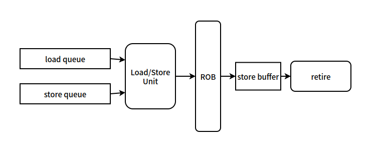
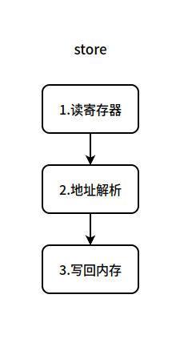
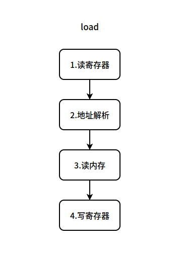
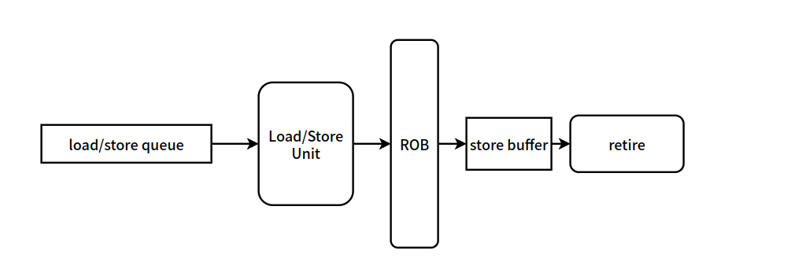

# 单核内的内存序

> “In forwarding, loads search older in-flight stores. In ordering, stores (in some processors loads too) search younger in-flight loads.”
>
> Roth, Amir. "Store vulnerability window (SVW): Re-execution filtering for enhanced load optimization." 32nd International Symposium on Computer Architecture (ISCA'05). IEEE, 2005.
>
> 所谓前递，就是 load 对正在完成过程中（执行过程、提交过程、退役过程）但是尚未更新到存储层次的 store 的查询。所谓排序，就是 store 对正在执行的 load 的查找对比。我认为，更一般的，所谓排序，就是更老的存储指令对更新的存储指令的查找对比。

---

对于单核内的内存序，或者说是乱序访存单元的实现可能是多种多样的，并没有一种固定的说法。所有的实现，只要能保证机器乱序执行的正确，都是可行的，只是效率不一定达标。

---

## 乱序处理器中的单核内存序

SC 顺序一致性的，也就是说程序序等于机器序，简单的来讲，你在汇编程序中按顺序看到的存储指令就是按照看到的顺序在访问存储、更新存储层次。无论多核之间的一致性如何，单核之间的内存序都是顺序一致性的。**单核中的内存序能不能不是顺序一致的**？理论上来说也行，但是这就导致了编程的苦难，即使是单线程的程序，现在也需要在程序中使用同步指令，这是不符合编程直觉的，这种编程模型是不能被人类接收的，因此现在在单核内都是顺序一致的。

对于乱序处理器来说，在乱序发射乱序执行的同时还要保证顺序一致性是非常重要的，这也就导致了乱序超标量处理器中内存访问单元与内存队列的设置是复杂的，且是有多种设计方案的。

## 乱序处理器中的 load 与 store

### 超标量处理器的视图

首先展现乱序处理器的一个视图：

超标量处理器的视图如图所示，load queue 和 store queue 即是 load 和 store 中的保留站，这些保留站的设计是多样的，里面可能保存了各种状态和信息。Load/Store Unit 即 load/store 的执行单元。ROB即重排序缓冲。store 在提交之后会进入 store buffer，后续写回到存储层次的时间是不定的，当其写回存储层次的时间是不定的，当其写回存储层次之后会进行 retire 退役，并从 store buffer 中清除相关的 store 指令。

这是典型的超标量乱序的处理器的视图。但是与内存序或者 load/store queue 设计的相关论文中视图可能不是这个样的，具体情况得看论文中怎么描述。

### 超标量处理器中的 load/store

超标量处理器中 store 的生命周期如图：

超标量处理器中 load 的生命周期如图：

现在要决定各个过程如何分布在超标处理器的各个阶段中。

对于超标量处理器而言，在 commit 阶段之前，在它的眼中只有机器状态，也就是所谓的寄存器的状态，它只进行能够改变寄存器状态的操作，以此来维护处理器的高效，对于不涉及寄存器的操作，在 commit 阶段之前都尽量不执行。对于存储层次相关的操作，根据其对体系结构寄存器状态的影响的不同，超标量处理器对他们有不同的做法。

对于 store 指令的生命，三个过程分别如下：

1. 读寄存器：读取相关的寄存器，其中包括写入内存的寄存器还可能包括用于复杂寻址模式的寄存器。
2. 地址解析：根据指令的寻址模式，计算出即将写入的地址。
3. 写回内存：将相关寄存器中的值写回内存。

对于这三个过程，第 3 个过程并不涉及对于寄存器的更改，因此第三部分可以在指令提交后再去慢慢写回内存。因此对于上面的处理器视图：

1. 发射：在 1 中相关的寄存器值能够读取的时候。
2. 执行：计算即将写回的地址，将 (addr, write_value) 写到 store buffer 中。
3. 提交：提交指令。
4. 退役：在退役阶段完成内存的写回。

在上面这个处理器的视图下，提交阶段之前并没有完成内存的写回，而是在提交之后才进行写回操作。

对于 load 指令的生命，四个过程如下：

1. 发射：在 1 中相关的寄存器值能够读取的时候，在 4 中寄存器的值能够写回的时候。
2. 执行：计算即将读取的地址，访问即将读取的地址，数据来源可能是 cache 也可能是 store buffer 中数值的前递，将读取的数值写回寄存器。
3. 提交：提交指令。

在上面的处理器视图下，提交阶段之前，load 指令所有的工作都完成了。

在看 store，它是寄存器的消费者，内存值的生产者。load，它是寄存器值的生产者和消费者，是内存值得消费者。

## 乱序处理器中单核 SC 的实现

现在来讲对于乱序超标量的处理器，单核中的 SC 应该如何实现。SC 实现的难点在于 load 和 store 能够发射的时机，由于超标量处理器的乱序执行引擎根本不关注内存的值是否更新完成，因此只要 load 和 store 满足发射条件就能够发射执行了，考虑有 $store <_{p} load$，假如 load 先于 store 满足了发射条件，先于 store 将自己要访问的地址解析出来，然后先于 store 进行存储层次的访问，这样 load 读到的就是 store 还没写的值，就会产生程序上的错误，它违反了 $store \rightarrow load$。乱序处理器必须引入相应的机制实现对于这类指令发射执行的顺序规范或是对这类指令的错误纠正措施，来保证 SC，这就是乱序超标量处理器访存单元的实现，这也是为什么访存单元实现逻辑复杂的原因之一。

### 最简单的实现

最简单的实现无非就是将乱序退化成顺序来保证 SC。这种实现方案的架构图如下：

这种方案直接将 load queue 和 store queue 合并到一条队列中，并规定队列中每一个 load / store 的发射条件，只有在他们前面的 load / store 进入到了 ROB 之后，他们才能发射执行。这种规定简单的来讲就是在前面的操作还没有完成的时候，后面的操作是不允许提前进行的，这显然维护了 SC。这种实现方式是最简单的，但是效率是最低的，他完全将乱序发射乱序执行降级成了顺序发射顺序执行，效率显然是降低的。

可能性的优化空间在于对于 load/store queue 中的内存操作，他们访问的并非都是同一个内存地址，他们之间不一定会产生写后读的依赖关系，在上面的实现中，即使 load/store queue 中的操作不存在依赖关系，后面具备发射条件的表项也不能前于前面的表项进行，这是效率低下的点，也是优化的一种可能。

### 最直接的实现-load前提
