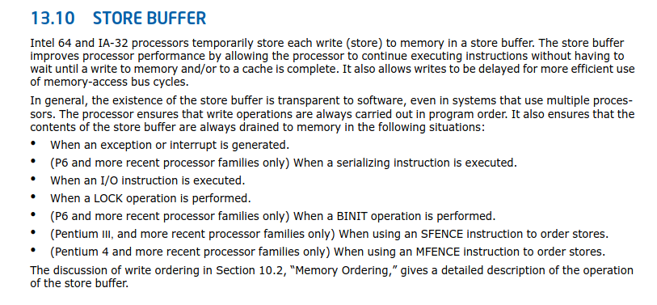
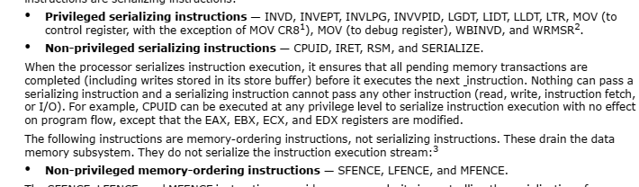

# intel x86 和 ia32 缓存和内存序相关

大量内容来自 intel 手册。

## 内存地址范围和内存地址属性的控制

有特殊的寄存器控制内存地址的范围和属性，主要用来优化内存的访问，有些属性的访问可能导致绕过 cache 等等的。具体看 intel 手册的介绍。

## 隐式刷 TLB 场景

## 刷 store buffer 场景

## 内存序

In a single-processor system for memory regions defined as write-back cacheable, the memory-ordering model
respects the following principles (Note the memory-ordering principles for single-processor and multipleprocessor systems are written from the perspective of software executing on the processor, where the term
“processor” refers to a logical processor. For example, a physical processor supporting multiple cores and/or Intel
Hyper-Threading Technology is treated as a multi-processor systems.):
• Reads are not reordered with other reads.
• Writes are not reordered with older reads.
• Writes to memory are not reordered with other writes, with the following exceptions:
— streaming stores (writes) executed with the non-temporal move instructions (MOVNTI, MOVNTQ,
MOVNTDQ, MOVNTPS, and MOVNTPD); and
— string operations (see Section 10.2.4.1).
• No write to memory may be reordered with an execution of the CLFLUSH instruction; a write may be reordered
with an execution of the CLFLUSHOPT instruction that flushes a cache line other than the one being written.1
Executions of the CLFLUSH instruction are not reordered with each other. Executions of CLFLUSHOPT that
access different cache lines may be reordered with each other. An execution of CLFLUSHOPT may be reordered
with an execution of CLFLUSH that accesses a different cache line.
• Reads may be reordered with older writes to different locations but not with older writes to the same location.
• Reads or writes cannot be reordered with I/O instructions, locked instructions, or serializing instructions.
• Reads cannot pass earlier LFENCE and MFENCE instructions.
• Writes and executions of CLFLUSH and CLFLUSHOPT cannot pass earlier LFENCE, SFENCE, and MFENCE
instructions.
• LFENCE instructions cannot pass earlier reads.
• SFENCE instructions cannot pass earlier writes or executions of CLFLUSH and CLFLUSHOPT.
• MFENCE instructions cannot pass earlier reads, writes, or executions of CLFLUSH and CLFLUSHOPT.

摘自手册，上面定义了单核上的内存序。可以看到还是定的很死的。

In a multiple-processor system, the following ordering principles apply:
• Individual processors use the same ordering principles as in a single-processor system.
• Writes by a single processor are observed in the same order by all processors.
• Writes from an individual processor are NOT ordered with respect to the writes from other processors.
• Memory ordering obeys causality (memory ordering respects transitive visibility).
• Any two stores are seen in a consistent order by processors other than those performing the stores
• Locked instructions have a total order.

摘自手册，上面定义了多核上的内存序。

上面还指出了很多序列化的指令，包括显式的屏障和隐式的 cpuid 导致的序列化。