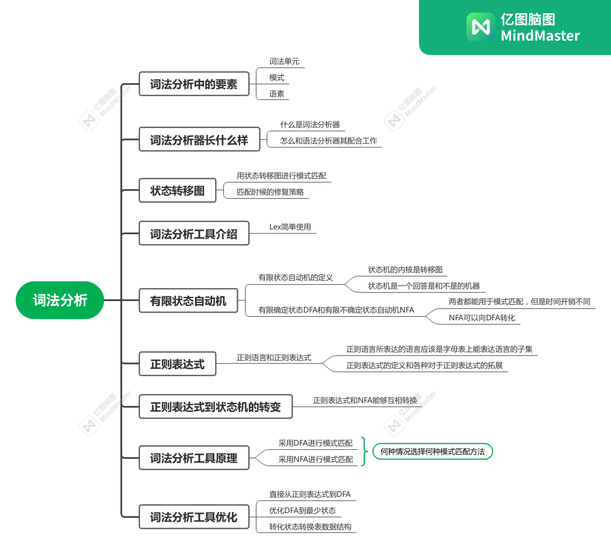

# Lexical Analysis Handout

这篇文章对龙书的词法分析一章进行总结，记录我认为的关键内容，整体的文章组织按龙书的小节来。

## 词法分析器的作用

简单而言词法分析器的作用就是对输入的源文件进行扫描，对匹配的字符串创建有意义的 token 词法单元。其往往是和语法分析器一起使用的，词法分析器得到一个 token 之后就交给语法分析单元做处理，语法分析做完处理之后再一次从词法分析器获得 token，一直重复这个过程直到文件的解析完成。

对于词法分析器引入了三个概念，下面仅对概念做不严谨的解释，供自己理解：

- 词素：词素就是源文件中的一个一个单词、字符串，在词法分析器中称之为词素。
- 模式：指一个词素具有的特征，比如以什么开头以什么结尾。正则表达式就能够描述一个字符串的模式。用一个模式去判断一个字符串是不是符合这个模式提供的特征成为模式匹配。
- 词法单元：词法单元简单的理解就是赋予分类的词素，词素可以是运算符、限定符、数字等等，词法单元就是对这些词素进行分类打上 tag，必要的时候将值写入到词法单元的属性中，比如说运算符到底是哪个运算符、数字到底值是多少。一个词法单元内含有的这个词素可能蕴含的信息过多，它的信息可能都要存到符号表中去，因此词法单元的属性也可能是指向符号表的指针。

词法分析就是一个根据给定文法定义的模式去匹配源文件中的字符串然后生成词法单元的过程，这个过程中模式匹配可能正确也可能失败，在模式匹配失败的时候，词法分析器可能会采取一些恢复情况。

## 输入缓冲

对于词法分析器，完全可以从文件中一个一个词素读入，但是这样往往效率较低。词法分析器往往会设置缓冲，取一块源文件到内存中，然后慢慢读。读取文件的过程是一个一前一后双指针的过程，速度快的指针称为 forward，速度慢的称为 lexemeBegin 指针，词素即 `[lexemeBegin, forward]` 区间内的字符串。有时候 forward 指针跑太快跑到别的词素上就要进行回退。

## 词法单元的规约

介绍串、字母表、正则表达式的概念。特别需要注意正则表达式的概念，正则表达式不只是指代一种标准，正则表达式的标准有很多，要区别使用的是哪种正则表达式标准。

## 词法单元的识别

在进行识别之前，我们一定想好了自己要实现的语言。也就是说，这个语言的文法和这个语言中词法单元的模式都是我们已知的东西。设置词法分析器就是对输入的字符串进行符合词法单元模式的模式匹配，将匹配成功的词素用于生成词法单元。

在模式匹配的过程中，可能会遇到保留字和标识符同时都符合模式匹配的情况，这时候就要判断读入的词素到底是这两种中的哪一种，对于这个冲突有两种解决方案：

1. 直接将保留字放到符号表中，在读取到这个关键字的时候找一下符号表，看看这个读取到的词素是不是已经定义在符号表中的关键字。
2. 为关键字设置特殊的模式匹配规则，同时在进行模式匹配的时候取最长前缀匹配的原则，如果长度相同则取先定义的模式来消除冲突。

在模式匹配的过程中，特别是使用一个模式去匹配一个长字符串的过程中，在匹配失败的时候会采取一些匹配失败的措施，因为如果每次匹配失败都从下一个字符开始会消耗大量的时间。因此 kmp 算法和 Trie 树被提出用于模式匹配，对于这两个算法的解释可以直接参考书上的内容，并且从状态机的角度理解这两个算法会更加容易理解。

## 词法分析生成器工具 Lex

这部分介绍词法分析生成工具 Lex 的主要使用方法和 Yacc 语法分析工具配合使用的概念。具体使用的方式参考龙书，这里值得注意的是，其对于过个模式匹配成功的时候的冲突解决方式同上面提出的方式一样。

## 有穷自动机与正则表达式

这里引入了有限状态自动机的概念，有限状态自动机分为不确定性的有限状态自动机（NFA）和确定性的优先状态自动机（DFA）。不确定性的有限状态自动机在接受一个字符的时候可能会有多条状态转移路径，可能进行多个状态转移；确定性的有限状态自动机在接受一个字符的时候只有一条状态转移路径。NFA 可以通过子集构造法转换成 DFA，这个过程实际上是在并行模拟 NFA 的状态转移过程，因此可以说 NFA 可以和 DFA 划上等号，但是这种方法可能导致最终出现在 DFA 中的状态爆炸式增长。正则表达式能够转化成 NFA，NFA 又能够通过子集构造法转换成 DFA，因此可以说这三个概念是能够画上等号的。

正则表达式、DFA、NFA都能进行模式匹配。正则表达式、NFA 这两者的抽象层次更加高一点，这两者更站在我们人类能够理解的角度去解释整个模式匹配的过程。而DFA的抽象层级更加低一点，状态可能会更多，其代表了一种更加细化的实现，这可能更利于词法分析器一点，是词法分析器更加喜欢的方式。

对正则表达式能够对其解析生成 NFA，这个过程是对正则表达式进行解析生成子表达式，再从子表达式树自底向上构造自动机。

## 字符串处理算法的效率（NFA与DFA的选择）

现在已知的是 NFA 与 DFA 都能够用于字符串解析，剩下的问题是在词法分析器对输入的源文件进行模式匹配的时候到底该选择用 NFA 进行匹配还是 DFA 进行匹配。 _让人害怕的点在于从NFA 到 DFA 的转换可能会引起状态爆炸，导致内存中无法放下这么多状态。实际这种情况在现代的语言中很少发生，因为现代的语言都是文法优良的，其设置的模式匹配规则不会导致状态爆炸，如果从词法解析层面就发现这个语言的状态机状态爆炸了，这也从侧面反应这个语言的模式匹配规则太复杂，不是一门容易编写的语言。_ 下再给出用 NFA 和 DFA 解析的时候所消耗的时间复杂度：

| **自动机** | **初始开销**                                       | **每个串的开销**            |
|:-------:|:----------------------------------------------:|:---------------------:|
| NFA     | $O(\lvert r \rvert)$                           | $O(\lvert r \rvert * \lvert x \rvert)$  |
| DFA 普通  | $O(\lvert r \rvert^{3})$                       | $O(\lvert x \rvert)$  |
| DFA 最坏  | $O(\lvert r \rvert^2 * 2^{\lvert r \rvert})$ | $O(\lvert x \rvert)$ |

其中 $r$ 代表正则表达式的长度，$x$ 代表输入字符串的长度。对于两者的选择问题其实就是权衡创建开销和匹配时开销的问题。NFA 创建速度快（即正则表达式的解析速度，线性复杂度），但是在匹配的时候开销则比较大。NFA 创建速度慢，最正常的情况下都需要三次方的复杂度，最坏情况更是达到指数的复杂度，但是其解析字符串的时候时间与字符串长度线性相关。这两者的优劣势都是十分明显的，因此不同的词法分析器会采取不同的方案。

- DFA 方案：对于语言的解析器往往采取 DFA 方案。一是语言的文法和模式匹配都是静态决定而不是在运行时决定的，这表示可以提前构建出 DFA，构建的开销就被忽略。同时这类词法分析器比较重视解析速度，这是 DFA 的强项。
- NFA 方案：对于 `grep` 这类命令行工具，往往采取的是 NFA 的方案。一是这类情况下模式匹配的规则是在运行时产生的，在运行时构建 DFA 会产生大量的时间开销，而即使构建出的 DFA 也可能不会供后续使用，这时候构建 NFA 就是一种较好的方案。同时对于这类命令，解析的字符串不一定是一个很长的字符串，因此对于每个串的开销不管是 DFA 还是 NFA 都差别不大。因此这种情况采取 NFA 更加合适。

## 模式匹配器的优化

1. 通过正则表达式直接构造 DFA。这种方式节省了一点构造时间，同时 DFA 的状态也会比从 NFA 转化来的状态少。
2. 施以最小化 DFA 状态数的算法，已知有算法能把 DFA 的状态数最小化，这个算法的时间复杂度仅仅 $O(n \log n)$，其中 $n$ 代表被处理 DFA 的状态数。
3. 优化状态转化表。
