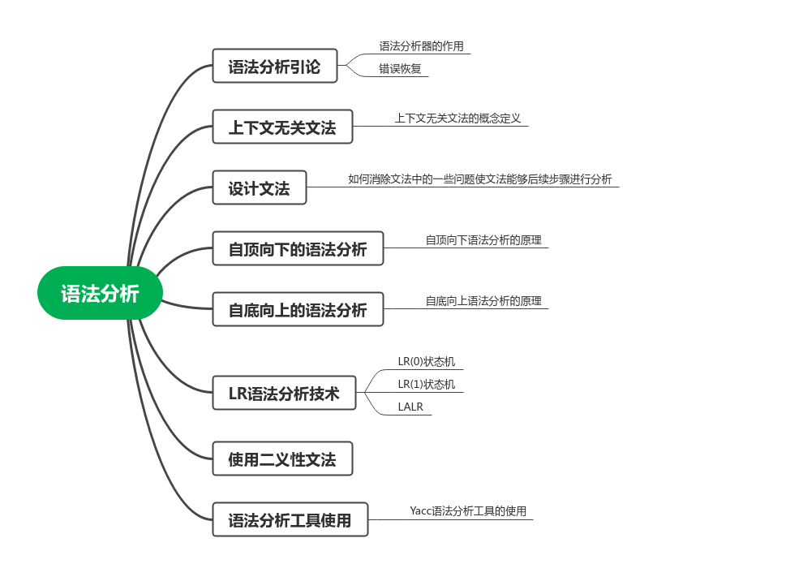

# Syntax Analysis Handout

这篇文章对龙书的词法分析一章进行总结，记录我认为的关键内容，整体的文章组织按龙书的小节来。

## 引论

### 语法分析器的作用

对于语法分析器来讲，其作用有三：

1. 从词法分析器接受词法单元，并判断其是否符合文法。（这是最基本的对于词法分析器的理解）。
2. 尝试进行错误的分析和恢复。（比如说给出错误位置，尝试修复等等）。
3. 指导后续的代码生成。（产生的一颗语法树的模型，能够指导后续的代码生成，语法树这个东西不一定真实存在，但是其能帮助对于语法分析过程的理解）。

处理文法的语法分析器大体可以分为 3 种类型，为：通用型、自顶向下、自底向上。通用型能够用于几乎所有文法，但是自顶向下和自底向上都只能作用于文法的子集。很显然，这种通用型的效率一定不会太高，剩下的自顶向下和自底向上都会产生语法分析树的模型。自顶向下和自底向上只能处理上下文无关文法的子类，但是对于现代的语言来说，这也足够了，即使有处理不了的特性，也能够 __留在后续的语义分析过程来进行，至少你将文法的大部分解析完成就行了。__ 自顶向下往往由LL文法实现，手工实现的编译器常常采用这种方法。自底向上往往通过LR实现，LR的实现中会出现大量的状态机，因此不适合手工实现，往往都是通过语法分析工具实现。

给出现在使用LL文法和LR文法的几个编译器和语法分析工具：

- LL：clang编译器，ANTLR分析工具
- LR：gcc编译器，bison、Yacc语法分析工具

### 语法错误的处理

这一部分总结了各种出错的类型，而不只是包括语法分析部分的，整个编译过程中的错误应该分析为如下 4 种：

- 词法错误：在词法分析时候对词素的模式匹配错误，即输入的词素不符合任何一个词法单元的规则，直接产生了模式匹配的错误，就是词法错误。比如你直接将 `string a` 打成了 `sting a`，`sting` 不符合任何词法单元的模式匹配规则，于是产生了词法错误。
- 语法错误：在语法分析阶段，产生了一个不可能的推导。即输入的词法单元不符合任何一种推导的可能。比如输入 `string a}`，文法中并没有这样的推导规则。
- 语义错误：这种错误一定是符合文法推导的，但是不符合某种更加高级的规则（比如说字符串不能和整数相加）。
- 逻辑错误：这种不能说是错误，因为它完全符合词法、语法、语义，这只能说是使用者对于语言理解的不彻底而产生的编程时候的逻辑错误。比如 c 语言中的典型错误 `c = 0` 和 `c == 0` 的错误。

对于编译器的设计而言，对错误一定是要产生提示的，这对于编程效率是有提升的。没有错误提示的编译器，你会去用？

### 错误恢复的方法

对于错误的恢复和提示是可选项，但是上面说到了，虽然是可选项，但是是不能没有的。首先的一个问题是我该探知几个错误，最简单的情况是我探知 0 个错误，在产生错误的时候我直接退出，这种方法最简单，但是很明显，我们是不可能这么去做的，因为这是用户不友好的。那对于所有的错误都进行处理？这是不现实的，一旦这么做，满屏的报错信息，而且很可能是一个错误导致了多个错误，我得到了全部的信息，但是这也太消耗时间了，一个 1000 行的文件，我在第一行就出错了，但是编译器为了处理错误仍然要把整个文件全部处理了，这消耗了太多的时间。因此将错误修复控制在一定次数是合理的，比如说修复了 10 次还出错，那就退出编译过程，让程序员先去修吧。

下介绍几种错误分析恢复的方法：

- 恐慌模式处理方法：直接进入鸵鸟模式，将输入的词法单元丢掉，直到符合文法推导为止。
- 短语层次的恢复：插入一个字符或者词法单元等等，尝试使出错的部分符合文法的推导。
- 错误产生式：这个处理方法很有意思，在设计文法的时候就直接将错误的推导加入到文法中，这样产生错误的时候，其实这个错误是文法中的一种，文法能够直接识别出这种错误。
- 全局纠正：考虑全局的情况来纠正这个错误，这可能是一个最优化方法，但是从时间和空间考虑都是不现实的。

## 上下文无关文法的定义

### 上下文无关文法的正式定义

- 终结符号：只能出现在推导式右端的符号，词法单元就是终结符号。
- 非终结符号：能够出现在推导式左边或者右边的符号。
- 开始符号：推导从开始符号开始。
- 产生式：简单的来讲就是推导式，描述了终结符和非终结符组合成串的方法。

### 推导和语法分析树

对于式子 $S \underset{\textit{}}{\overset{*}{\Rightarrow}} \alpha$ ，其中 $S$ 是 $G$ 的开始符号，称 $\alpha$ 是 $G$ 的一个句型，称这个过程为推导。文法 $G$ 的句型是不包含非终结符的句子。

如果每次推导的时候都挑最左边的非终结符进行推导，成为最左推导，最左推导得到的句子成为最左句型，即 $S \underset{\textit{lm}}{\overset{*}{\Rightarrow}} \alpha$ 其中 $\alpha$ 为最左句型。

同样的也有最右推导，最右推导得到的句型为最右句型，其中最右推导也被称为规范推导，表示为 $S \underset{\textit{rm}}{\overset{*}{\Rightarrow}} \alpha$ 。

引入最左或者最右推导之后，很自然的会将最左最右推导和语法树关联起来，最左和最右推导等于语法树再向最左和最右开分支。

### 二义性

文法是可以具有二义性的，从推导树的角度来看，二义性指的是一个推导的过程可能产生多个推导树。从推导式的角度来看是一个句子 $\alpha$ 存在 $S \rightarrow B \rightarrow A \rightarrow \alpha$ 和 $S \rightarrow A \rightarrow B \rightarrow \alpha$ 两种推导过程。

可以通过一些方法来消除文法中的二义性。

### 验证文法生成的语言

即证明文法生成的每个串都在语言中，同时证明语言中的每个句子都能由文法生成得到。

### 上下文无关文法和正则表达式

每个正则语言都是上下文无关的语言，但是上下文无关的语言不一定是正则语言，这个可以通过反证法得到。

## 文法设计

### 词法分析和语法分析（编译器前端的设计哲学）

文法能够描述程序设计语言的大部分语法。比如程序中的标识符必须先声明后使用，但是这个要求不能通过上下文无关的文法来描述。因此一个词法分析器接受的语法单元序列构成了程序设计语言的超集；编译器的后续步骤必须对词法分析器的输出进行分析，以确保源程序遵守没有被语法分析的规则。

编译器的前端将编译工作分成词法分析、语法分析、语义分析等等，这种分模块工作是编译器设计的哲学。指导这三部分工作都该做什么，应该是编程语言、文法决定的，因此一个文法的设计是十分重要的，文法的设计决定这三个部分分析哪个部分。按照我的理解，文化定义了词法单元的构成，词法分析对词素进行模式匹配，生成词法单元，语法分析对词法单元进行推导（或者说也是一种模式匹配），生成语法树，再由语义分析处理词法和语法都处理不掉的部分。

词法分析部分为什么大多采用正则表达式进行模式匹配？这其实是文法决定的，文法大可以决定词法分析的过程也采用某种文法的进行匹配，这样就能够支持更加复杂的变量名了，比如用了更加复杂的文法 `if(true) else` 这样一个东西可能就是一个变量名，这样一个变量名你可能回去用吗？意义在哪里？变量名根本就不需要这么复杂，因此，文法规定变量名的规则可以使用正则表达式匹配，以至于让词法分析器压力不要太大。

所以说，一个文法的设计，其实是制定了一种分模块配合的规则，这也是一种设计的哲学。

### 消除二义性

在文法中制定规则可以消除二义性，但是往往不这么做。往往在编程的时候直接通过默认的方法解决二义性。

### 消除左递归

左递归的存在会导致 LL 递归下降的分析无法进行，因此要尝试消除左递归。这个东西可以这么理解，一次 LL 文法的推导导致语法树的生成，在语法树的生成的时候，这个词法单元还没被消耗掉，只有当进入子节点的时候，语法单元才被消耗掉。对于左递归的文法，每一次的推导都会产生一个递归的子节点，即产生这个节点是和父节点一样的终结符，导致一直递归下降，但是词法单元却消耗不掉，因此产生了无限递归的错误。

存在消除左递归的算法进行消除。

### 提取左公因子

左公因子的存在不会导致错误，但是会导致效率的下降。用于提取左公因子的过程可以进行如下的描述：$(1)S \rightarrow Ab$ $(2)S \rightarrow Ac$，提取左公因子后产生的文法为：$(1) S \rightarrow AB$ $(2)B \rightarrow b | c$。如果没有提取左公因子，进行语法分析的过程可能会产生如下的对比：

- 未提取左公因子：按照 1 构造子树，吃掉 A，想吃掉 b，发现不对，恢复到父节点，按照 2 构造子树，吃掉 A，吃掉 c。
- 提取左公因子：按 1 构造子树，吃掉A， 根据下一个词法符号再构造子树，然后吃掉下一个符号。

显而易见的带来效率提升。

### 非上下文无关语言的构造

非上下文无关语言的构造有时候是语法分析器做不到的，比如说检查是否先定义后使用，比如函数传入参数的个数检查，这些需要编译器前端的多个逻辑实现。

## 自顶向下的语法分析

自顶向下的语法分析，简单的来说就是通过递归下降进行建树。这种分析的实现是通过 LL 来实现的。很多实现方法时只往前看一个字符，因此称之为 LL(1) 分析器，能够被这种分析器解析的文法称之为 LL(1) 文法。对于 LL(1) 文法，典型的过程是看一个字符，确定选中哪个推导式进行推导，然后递归下降。

对于 LL(1) 分析器的实现，引入了 first、 follow 集合的定义，根据这两个集合的定义，可以构造出预测跳转表，然后就能进行 LL(1) 的分析。简单的来讲，这两个集合定义如下：

- first(A)：当前非终结符号可以接受的下一个吃什么词法单元集合，即下一个词法单元出现在这个集合中，就能够选择某个推导往下进行。
- follow(A)：定义为某些句型中紧跟在 A 右边的非终结符号的集合。即代表着 A 如果正确的被分析了，那被正确分析后出现的字符应该出现在这个集合中。follow集常常用于错误恢复。

利用 first(A) 和 follow(A) 可以构建 LL(1) 语法分析器。具体方法见龙书。

### 预测分析中的错误恢复

预测分析中的错误恢复还是恐慌模式和短语层次的修复。

#### 恐慌模式

有了 follow 集，就有了同步字符，语法分析器可能会将 follow 集再加上其他字符作为同步字符，在产生错误的时候直接抛弃输入的词法单元直到同步字符为止。这是很简单的控制。

#### 短语层次的恢复

实际上在进行修复，尝试对出现错误的词法单元本身或者前后进行修复，但是由于 LL(1) 是递归下降的，因此一旦错误修复的失败就表示着要进行状态的恢复，这可能是一个复杂的过程。

## 自底向上的语法分析

子底向上建树的过程有点难以想象，可以利用栈将其想想为自顶向下的逆过程，自顶向下非终结符入栈，根据输入的词法单元，经过数次推导，得到的是非终结符组成的串。自底向上其实就是这个过程的逆过程，输入的是终结符序列，一旦终结符队列在栈中组成了某个非终结符的推导，直接将这对终结符队列换成非终结符，在继续这个过程，直到在栈中剩下的只有一个非终结符为止。这个过程实际上是最右推导的逆过程，从栈中恢复出的非终结符构成的是一次推导的左子树，自底向上的时候左子树先于右子树生成，说明自顶向下的时候右子树先于左子树下降，因此这个过程是最右推导的逆过程。

子底向上的语法分析中，引入了“句柄的概念”，句柄是和某个产生式体匹配的子串，对它的规约代表了相应的最右推导的一个反向步骤。

自底向上的分析是会产生冲突的，比如当前在栈中的串已经是某个句柄了，现在归约肯定是可以的，但是现在在栈中的句柄可能是某个句柄的前缀，因此现在暂时先不归约也是可以的，因此这就是冲突。冲突的解决往往需要往前看 k 个字符，这也就定义了所谓的 LR(k)。由于它这种向前看的特性，能够获得很多的未来上下文的信息，这是 LR 的强大之处。

## 简单 LR 技术

简单 LR 技术指 LR(k) 其中 k <= 1 的技术，这里 k 的定义和 LL 有些许不同，LL 中的 k 指的是看了几个字符，这类的 k 指的是进行规约的时候除了当前字符，还向前看了 k 个字符，注意这只是向前看，看了但没有吃。简单 LR 技术也称为 SLR。

LR 技术引入了项集的概念，根据项集构造闭包，进而构造出状态机，也就是说 LR 分析实际上是状态机驱动的，这个状态机是根据文法提前生成的，因此在实际执行 LR 的过程中，就是读取字符然后进行状态机的转换，直到到达结束状态或者出错为止。

## 更强大的 LR 语法分析器

- 规范LR：采用 LR(1) 项集，充分利用向前看的符号，会产生很多状态数。
- LALR：采用 LR(0) 项集，小心的引入向前看字符，支持更多文法，同时产生的状态数可能比 SLR 更少。
