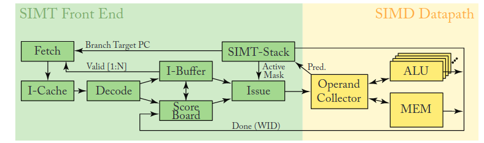

# 基本 GPU 体系结构

架构比 CPU 简单很多，适合处理简单的并行任务，了解基本的架构之后应该就是对着具体的手册看实现了。这篇文章的内容是大概看了下 GPGPU arch 做下总结。

## 执行核心

基本的执行核心架构就是这样，具体的也没细看，主要了解下概念。nvidia 的一个 SM（Streaming Multiprocessor） 中包含了好几个这样的东西，每个这样的东西都能够调度一个 warp 做执行，执行是由调度器决定的，一个 warp 内部包含多个线程，每个线程是标量操作，但是他们组合起来，对于外部来说就像一个向量，这就是 SIMT。

比较值得关注的是内部的分支实现，因为 gpu core 做的比较简单，内部肯定不会有分支预测这样的东西，分支是和 CPU 向量一样的谓词实现，等于有掩码可以 disable 掉一些在不同分支上的 thread。gpu 上没有错误路径这种概念，等分支解析完成之后才向下执行，通过谓词来实现分支。分支的解析需要时间，在这个时间内，调度器可以调度其他 warp 进行计算来掩盖分支的延迟。

早期的 nvidia 架构通过 warp stack 来实现分支和结束分支之后的同步，会造成一些死锁问题。后来采用了线程单独执行的模型，通过 `warp_sync` 来显式同步或者调度器周期扫描来进行同步。

## 存储系统

存储系统分为多层，第一层是 SM 内的。有 L1 和 shared memory，L1 是硬件管理的， shared memory 是程序员自己可以手动操作的，两个共享一个 SRAM 空间，能够在一开始的时候划分 L1 和 shared memory 占据多少。访问这个级别的内存的时候，很多行为都和 CPU 一样的，包括MSHR、bank confliect 等等。

L2 是全局的，memory 也是全局的。

## 一致性

1. **L2 是唯一全局一致性点**  
   - 记录每行的 **拥有者/脏** 状态；  
   - 若另一个 SM 请求已被别人修改的行，L2 先让该 L1 回写，再提供最新数据。

2. **L1 Data Cache** 为 **write-back**  
   - 普通 store 先写 L1 并打脏标记；  
   - 行被驱逐或遇到 *release*／原子 store 时写回 L2。

3. **指令语义触发行写回 / 失效**  
   - `__threadfence()` 或 **release/acquire 原子**：  
     - *release* ⇒ 把本 L1 脏行写回 L2；  
     - *acquire* ⇒ 失效本 L1 对应行，强制从 L2 取最新副本。  
   - 没有 fence 的普通读写不保证跨 SM 可见顺序。

没有 CPU 里面的广播一致性，gpu 里面应该就是请求性的，都是需要了自己去同步。