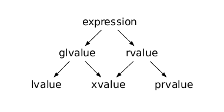
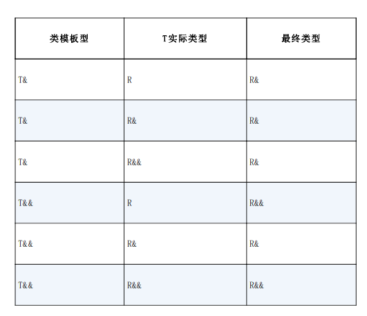

# 右值引用

再次补一下 cpp 的基础，对于一个语言，他可能有更多自己的概念。比如 cpp 中对于对象在内存中的存储和复制，有的地方强求理解其机器实现会变得非常的困惑。

## 区别左值和右值

在 cpp14 中明确对这些值进行了定义：



> A glvalue is an expression whose evaluation determines the identity of an object, bit-field, or function.

gvalue 应该翻译成泛左值，它的求值决定了一个对象、位域或函数的特性。用我的理解来说，它一般是有名称的，是有明确的内存地址的。

> A prvalue is an expression whose evaluation initializes an object or a bit-field, or computes the value of the operand of an operator, as specified by the context in which it appears.

prvalue 是一个表达式，根据其出现的上下文，它的求值可以初始化对象或位字段，或计算操作符操作数的值。用我的理解来说，他就是出现在计算中的可能性比较大。

> An xvalue is a glvalue that denotes an object or bit-field whose resources can be reused (usually because it is near the end of its lifetime).

xvalue 是一个 glvalue，表示其资源可以重复使用（通常是因为其生命周期即将结束）的对象或位字段。这个可以翻译成消亡值，简单的来说就是一个声明周期快要消失的内存。

> An lvalue is a glvalue that is not an xvalue.

左值是除了消亡值之外的泛左值。

> An rvalue is a prvalue or an xvalue.

右值可以消亡值，也可以是绝对的右值。

## 左值引用和常量左值引用

引用就是取别名，这是一个很好的特性。但是常规的引用无法接受右值作为参数，如果要左值引用作用于右值，得使用常量的左值引用：

```cpp
const int &a = 100;
```

这样虽然解决了引用右值的问题，但是在编写函数的时候，函数的参数描述只能是 `const int &`，虽然这个函数能够同时作用于左值和右值，但是其由于是 const，不能进行任何的改动。右值引用就解决了问题。

## 右值引用

右值引用，使程序代码能够对右值进行引用：

```cpp
int &&a = 100;
```

这可以简单的理解成延长一个右值的生命周期，100 是一个右值，a 是一个右值引用的名字，他成为了一个左值。

右值引用的这个特性更多的用于类的移动构造函数上面，由于右值引用的指向的是一个从语意上快要消失的内存，函数的构造函数能够接受这样的一个右值引用作为参数，从右值中拿到一个能够重复利用的数据，减少内存的拷贝开销。

## 将左值转换成右值

左值一般都是具名的对象，从程序的语义上看，他更多的被认为是一个长期存在的对象。但是从编程人员的角度来看，左值是长期存在的这个事实无法否认，但是编程人员在使用完这个对象之后，这个对象对于编写程序而言，他的生命周期是要到头了。但是他在程序中还是以左值存在的，不能像右值一样成为一个从语义上认为是可以被重复利用的内存。

也就是说，在很多时候，我们希望我们自己在使用完左值之后能将其转化成一个右值，使其他场合能够重复利用其资源。`std::move`就是解决这个问题的，`std::move(a)` 可以近似的认为是 `static_cast<Typea &&>(a)`，其将 a 强制转换成一个对应类型的右值引用，来从程序上改变语意，使其在某些场合下能够重复利用。简单的举例如：

```cpp
class B{
    B(A && a){
        // 把 a 中的内存拿过来用
        buffer = a.buffer;
    }
};

int main(){
    A a;
    // 使用 A
    a.doSomething();
    // 在 A 使用完成之后
    B b(std::move(a));
}

```

上面的例子在 A 使用完成之后，可以讲 a 转换成右值供 B 使用。这就是从左值向右值转换的好处。

## 万能引用和完美转发

所谓的万能引用指的是让编译器自己推导到底是一个左值引用还是右值引用，因为这里面一个关键的部分是编译器自动推导，所以万能引用只会出现在类型推导的场合，如模板类型的推导`T&&`和 auto `auto&&` 推导。

cpp 对于这个推导有一套规则：



按照书中的例子：

```cpp
template<class T>
void bar(T &&t){
    // do something
}

int main(){
    int i = 1;
    // case 1
    bar(i);
    // case 2
    bar(6);
}
```

对于这个函数，在 case 1 的情况下，传入的是左值，模板参数T会被解释成对于左值的引用，实际将函数推导为 `bar(int &)`。当传入 6 的时候，传入的是纯纯的右值，模板参数 T 直接推断成 int，根据折叠规则，这个函数被推导成 `bar(int &&)`。

可以看到的是，模板或者说自动推导，在这个时候就完成了。在这个时候变量 t 不管被解析成了左值的引用还是右值的引用，t 本身都成为了一个左值。在解析解析出参数类型之后，bar 就能对 t 有一个很好的应用。但是如果还有别的函数想继续做其他的处理，向下传递参数的时候就会遇到问题，因为自动推导已经完成了，t 无论如何都被作为一个左值了，即使他是一个右值的引用，由于他具有了名字，因此也被认为是一个左值，这种情况下，如果要将参数再往下传递，又要保证模板的灵活性，需要重新引入自动推断，想让于重新将传给 t 的参数用作下一个处理函数的自动推断，用代码举例：

```cpp
template<class T>
void foo(T && t){
    // do something too
}

template<class T>
void bar(T &&t){
    // do something
    foo(std::forward(t));
}

int main(){
    int i = 1;
    // case 1
    bar(6);
}
```

如上面代码所示进行上面这样的 `std::forward` 来重新启用自动推断，其也相当于 `static_cast<T &&>(t)`，总之完美转发和 forward 就是解决这个问题的。
