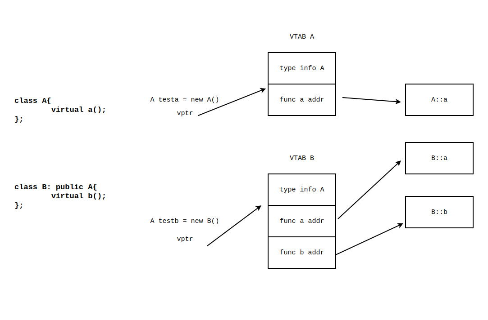
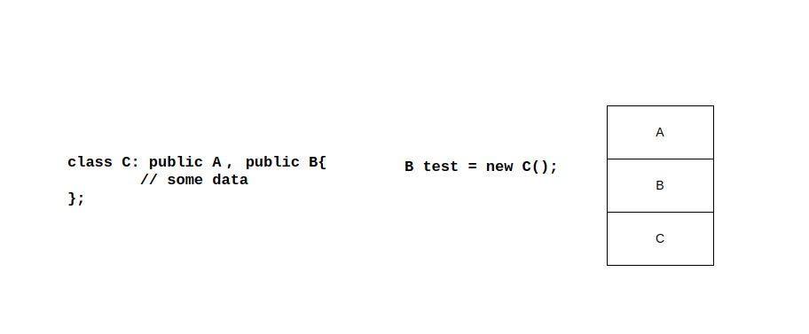

# 对象模型

对象模型，更多的是指 cpp 对象在内存中的布局以及 cpp 对象的行为。这两部分都是与 cpp 这个语言的标准、abi 的规定还有编译器的具体实现相关的。因此给出的总结也只是可能的实现，不同的编译器可能会有不同的实现。因此具体的行为应当是在遇到不确定的回答的时候去看手册，或者是是抽象出比较简单的 demo 去放到编译器里看看，看看编译出来的代码是什么样的。

## 为对象模型提供的工具

g++ 提供了 `-fdump-class-hierarchy` 选项用来导出 cpp 中对象的内存布局等等。同时 objdump 可以使用 `-C` 选项来美化 cpp 的符号。

## 如何理解类，尝试从 c 语言的角度

可以举例出一个最简单的类：

```cpp
class A{
public:
    int a;
    int b;
    void test();
};
```

如果用类似 c 的方式想象这个类，可能的形式应该是下面这样：

```c
struct A{
    int a;
    int b;
};

void test(A *a);
```

这个 test 在实际的 cpp 编译的时候会被编译成一个很长一串的名字。

这个类的形式不是下面这样的：

```c
struct A{
    int a;
    int b;
    void (*test)(void);
};
```

函数并不会作为一个函数指针存在到结构中，占据结构空间。

## 对类中函数体的解析和函数标签的解析

对类中函数体的解析是迟于对于整个类的成员和函数标签的解析之后的：

```cpp
class A{
    void test(){
        a = 1;
    }
    int a;
};
```

在编写 A 中 test 函数体内容的时候，这个 a 还没声明出来，但是编译的时候不会报错，因为函数体的解析是在对整个类的解析之后的。

但是对于类的函数标签的解析是和类的解析同步进行的：

```cpp
class A{
    void test(INT t){
        // do something
    }
    using INT = int;
};
```

这段代码编译不过，因为类中函数标签的解析是和类的解析同步进行的，因此在解析函数标签的时候类型等等都必须已经在前面出现。因此 using 的声明要移到前面去才行。反正在解析的时候编译一定会尽量去找前面定义了没有，如果前面定义了 INT 这个类型，就会把前面的拿过来用，按照最近原则。

## 多态、动态联编、虚函数和虚函数表、RTTI

多态是 cpp 的特性，注意 cpp 的标准规定了 cpp 什么时候会产生多态、多态会展现出什么样的行为，cpp 的编译器去实现多态。

cpp 中的多态分为运行时候的多态和编译时候的多态。想函数重载、模板、运算符的重载都算静态时候的多态，虽然表现出多种行为，但是在编译的时候就已经能够确定展现的行为是什么。通过定义虚函数在通过动态创建对象调用虚函数形式实现的多态称为动态的多态，调用的是哪个函数，产生怎么样的行为是在运行时候才知道的。

程序在编译时期就对函数的地址或者要调用函数的行为进行解析称为静态联编也称为早期绑定，程序在运行的时候才对函数的地址进行解析、才对行为进行确定这称为动态联编也称为延迟绑定。实现动态绑定的唯一方式是类中声明虚函数，然后创建动态的类对象，然后用指针或者引用来访问这个对象。

cpp 标准中只规定了这种动态绑定的行为、虚函数的行为，而没有规定这些虚函数的行为怎么去实现。怎么去实现是编译器和 abi 规定的，因此不同的编译器可以有不同的实现方法。但是对于常见的主流编译器而言，一般都是结合虚函数表和虚函数指针去做具体的实现的，但是相关的实现细节则是不同的。简单而言，对于动态联编的对象调用虚函数，实际上就是通过对象内部指向虚函数的指针得到虚表的地址，再从这个虚表的地址上找到这个函数的具体地址。

需要注意的是，就算是虚方法，在编译的时候也已经知道了有多少虚函数的形式存在，每个类以及其子类中对于虚函数的实现都是已经确定的，因此虚函数表在编译的时候就已经能生成，同时虚表的地址在链接的时候就能够生成，因此虚表指针的指向是在编译期就确定的，只不过是在对象创建的时候才具体为这个指针分配出了 8 字节的地址指向虚函数表。因此虚函数的动态行为就是查表跳转，相对于静态的行为无非就是多了一次查表，类似于 `ld r1, (r2), jmp r1` 和 `jmp r1` 的区别。

至于编译的时候产生多少张虚表、构造出对象之后对象内部有多少个指向虚表的指针，这完全就是编译器的行为，因此实际上只要了解虚表的原理，剩下的我认为不用了解。

注意一个虚函数就代表虚表中的一个条目：



在使用多态特性的时候要注意，虚函数一定要是虚构的，以免对象释放的时候虚构函数调用错。



以免出现上图的情况，存在多重继承的时候，如果虚函数不是虚的，就会调用 B 的析构，导致空间被释放的奇奇怪怪。使用虚析构函数，让析构的时候根据具体的对象类型来调用虚构函数，避免释放内存的时候出现错误。

除了普通的函数是静态绑定之外，还有一个是静态绑定的，那就是默认参数，如果你使用了函数的默认参数，函数的默认参数类型是在静态确定的，也就是说，不管子类中对于虚函数的默认参数如何改变，一旦使用到了默认参数，默认参数还是由最早声明这个虚函数默认参数的父类决定的。

## 数据对齐

多重继承的类对象的内部数据对齐是没有规律的，完全靠编译器实现来的，不同的编译器完全不同。因此要访问类内部的成员，最好应该采用 this 指针的方式，而不是其他的方式。