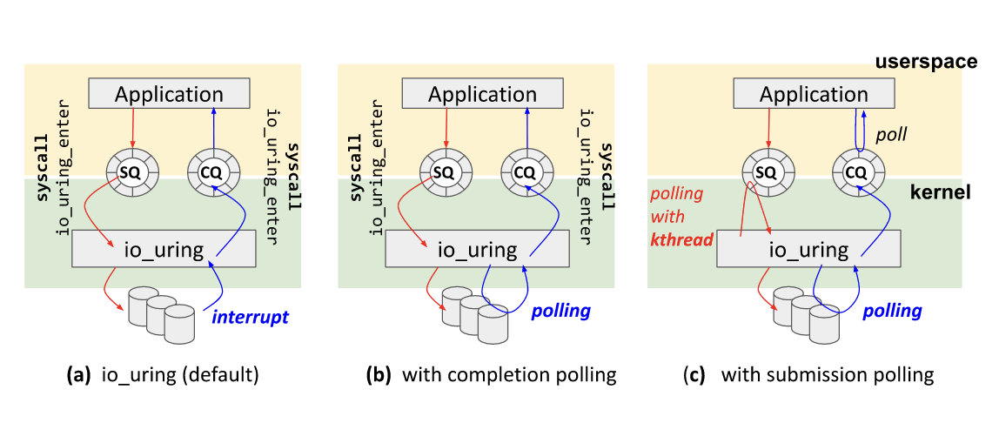
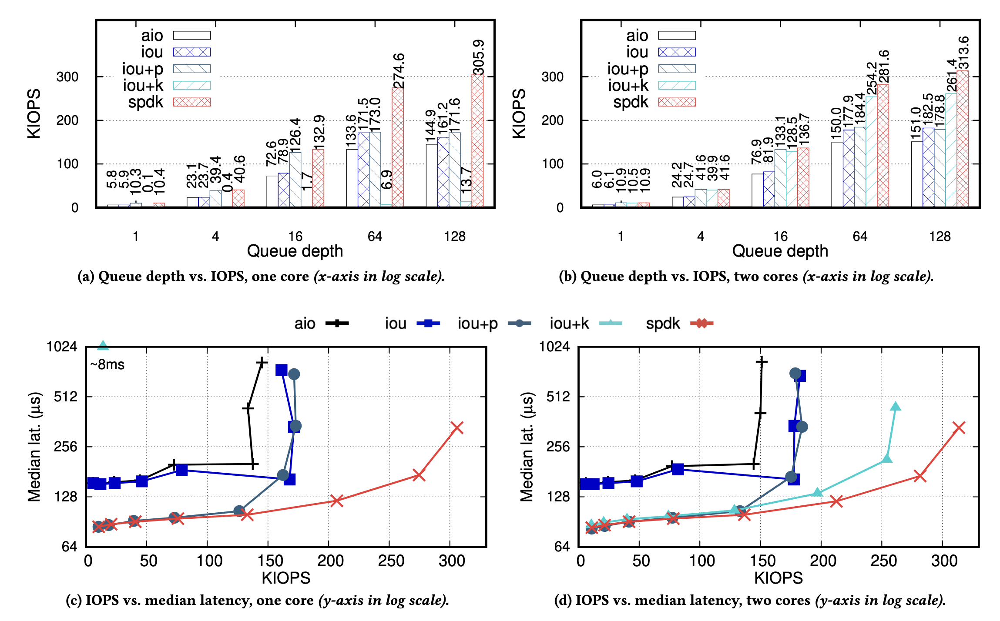

# 现代 io api 的使用和性能对比

是对 systor 22 的总结：

> Understanding Modern Storage APIs:  A systematic study of libaio, SPDK, and io_uring

这篇文章主要分析了 linux 系统上一些处理 io 的 api，主要是 linux aio， iouring 和 SPDK。最后给出了一些使用的建议。

## SPDK

英特尔提出的一套内核 bypass 的api。简单来讲就是直接 bypass 内核的复杂处理，用用户态自己的程序做接管。

## io uring 的几种方式

1. default: 通过 enter 提供系统调用，提交之后可以继续干别的事。等到 io 完成的时候，内核通知CQ。等到用户程序想用的时候，自己也可以enter，有了就拿走，没有继续等。
2. polling: 文章中称 ioup 的方式，enter 提交请求，提交完后等待一个完成的请求，拿到一个完成的请求出内核。看起来像是一种同步的方式，适用于低延迟的场合，因为一次调用既提交也拿。
3. kernel thread：用户在提交请求的时候不用系统调用，操作系统有内核线程查看 SQ，发现有新的请求就添加。完成之后，中断程序会改变 CQ 中的状态。在用户想要获取数据的时候，直接访问 CQ。仍然不需要系统调用。

## ioup vs read

ioup 虽然看起来同步和 read 一样，但是实际上他有好处。read 往往会触发系统调度，调度与切换产生延迟，但是 ioup，ioup 一直等，直到完成为止。另一个是，ioup 可以以 batch 的方式提交请求，而 read 不行。

## 性能分析

只分析了大量读的情况。

### 单核

SPDK 性能最高，其实在各种场合下基本都是最好的，毕竟是用户态的，但是这种东西维护就比较麻烦。单核情况心爱 iouk 性能很差，毕竟有内核线程会和用户线程抢调度。多核，SPDK 性能最优秀，充分利用SSD带宽，相比之下，其他 io 方式还是消耗了很多在 cpu 的时间上，还有提升的空间。ioup 和 iouk 在多核下性能无法进一步提升的原因在于多个核上的用户程序在访问的时候可能会产生竞争。还有就是 iouk 没有系统调用，开销更少点。对于服务延时而言，只有请求过了一定的数目而言，SPDK 才展现出明显的优势。

### 可拓展性

反正核数等于任务数 * 2 的情况下，iouk 的表现比较好，多了就会反复切换了。继续上升的情况下，只有 SPDK 效果好，其他的到了某个点就会bound。
