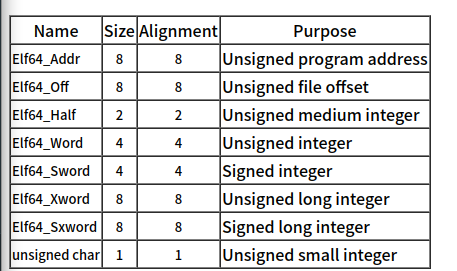

# system-v abi 总结

system-v abi 的官方网址是[这个](https://www.sco.com/developers/devspecs/)。

这篇文章主要总结的是有关目标文件的部分，并且只是简单的总结。看完更新文档之后的部分只能说，abi 基本规定了可执行文件相关以及其生成过程中遵循的大部分规范，很多信息都都可以从 abi 中得到。

## 总览

首先展示目标文件的总览图：

目标文件可以分为好几种，最常见的是可重定位目标文件和可执行目标文件，链接时候用到的一般是可重定位的目标文件，执行时候用到的是可执行的目标文件。从图中可以很清晰的看到这两类文件的构造，首先可以发现的是两者都有 ELF Header，然后 section header 和 program header 基本上为两者特有。另一点就是在链接时候的节称section，在可执行时候的节称 segment 段。

上面这张图则是展示了在后续目标文件一些定义的时候用到的数据类型。

## ELF Header

我比较关注的部分有：

1. e_ident：这部分主要包含了 elf 文件的魔数，当前文件是 32 位的还是 64 位的，当前文件序是大端序还是小端序，当前文件的操作系统以及abi信息。
2. e_machine：展示了目标的体系结构。
3. e_entry：展示程序的入口点。
4. 剩下的就是 program header table 中条目数目和条目大小。以及 section header table 中条目数目和条目大小。

## section header

每个 section 条目的结构为：

比较关注的是 sh_type，其中介绍了各种 section 的属性。

其中有一个 string table 节，专门存储各个节的名称。 symbol 节用于链接时候的符号查找。

symbol 节中直接关注有其规定了符号的强弱：

还规定了符号的属于哪种类型：

整个目标文件中还有专门的重定位节进行重定位。

## Program Header

每个条目的结构为：

比较关注的是：

1. p_type：决定了 segment 是可加载的还是其他属性。
2. p_flags：决定了 segment 读写执行的权限。

程序还有几个必须的 segment，如我们熟知的 .text 和 .data。