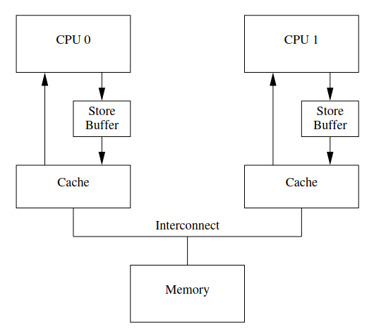
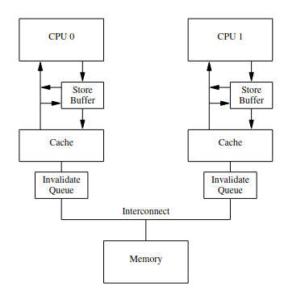

# 缓存一致性 屏障 内存模型重新理解

主要是看了文章[^1]，来重新谈谈对缓存一致性，屏障，内存模型的理解，这篇文章中讲述的模型能加深对后续的理解。

## cpu

把 cpu 试作无情的执行指令的机器，对 cpu 的想法要有所改观，从多核的角度来看，编程的一大幻觉就是在执行到某条指令的时候，老是误以为某条指令还没执行、内存还没被读取，实际上读取到的是旧的状态或者是已经被更改过的状态。因此很多时候都需要多考虑几种情况，这些情况应该是同时结合缓存一致性、内存模型来考虑的。

## 一致性

对一致性很大的误解是，总是觉得是多核带来了一致性的问题，多核确实带来了一致性的问题，但却不是全部，即使在单核单处理器的情况下也会存在一致性的问题。首先应该从一致性的由来开始理解.

### 一致性的由来

首先就不应该把一致性直接和多核挂钩起来，单核而言也是有一致性的。和多核情况很像的是，一致性来源于一个东西的值可能存在于多个地方，比较典型的是在单核多核情况下，一个 cache 中的值可能在其他核的 cache 中被使用，一个唯一的值在多个地方有副本的存储，带来了一致性的问题。所以引起一致性问题的实质是一个值在多处存在副本，副本之间的值需要保持一致。

这样了解了一致性问题的由来，我们就能尝试发现一致性出现在哪些情况下。在计算机系统中，出现一个值多处存储的地方往往都是有类似 cache 的结构，因为往往是为了平衡速度的差异，才引入一个中间层，让这个更快速的 cache 中间层来存储一个可供快速查找的副本。而这个值本身被更新的时候，副本也需要被更新；同理，副本被更新的时候，本身的值最终也需要被更新。这就是一致性。

在单核的情况下，类似于 cache 的结构我们还能找出好多。首先单核内部的 cache 本身就分为了好几层，对于写 cache，l2 cache 这些课读写的 cache 本身就是有一致性问题的。但是为什么我们讨论的时候没有讨论过单核 cache 一致性的问题呢，因为单核内部 cache 的一致性问题早就被单核内部 cache 的写回策略、还有包含性非包含性的策略给解决了，导致我们使用单核 cache 的时候默认就是一致的了。另外的一点就是，单核内部的一致性方案肯定没有多核的一致性方案那么的多样，因此讨论的就比较少。

前面只是谈到了数据 cache，还没有谈到其中的指令 cache，指令 cache 的一致性策略并非与上面的数据 cache 相同。指令 cache 是一个只读的 cache，它的状态是基本不变的，如果还是和数据 cache 一样，老是通过检查其是否被写并采用和数据 cache 相同的策略来维护一致性是不符合其特性的，因此指令 cache 的一致性维护是不同于数据 cache 的。取决于指令 cache 的特性，他本身就是只读的，同时 cpu 在执行的过程中动态的改变内存的某个位置的指令是不常见的，因此指令 cache 的一致性往往不是在硬件层面实现的，硬件层面往往就是默认指令 cache 的内容一直是一致的，是一直不变的。维护指令 cache 的一致性是软件实现的，像 risc-v 中就提供了 `fence.i` 指令来强制刷新指令 cache，来维护指令 cache 的一致性。什么情况下指令的动态执行会改变自身呢？比如说考虑 jit 这种动态编译技术，在运行时候编译出更加优化的本地代码，可能就会对某个地址上的指令进行更改，于是就是要刷新指令 cache。

和指令 cache 很像的是 tlb 的一致性维护，因为 tlb 是页表的 cache，也是用于大量读的场合，因此其策略是和指令 cache 很像的。当进程切换的时候 tlb 中的内容就过时了，或者是操作系统更改了页表，或者更广泛的说某些情况下的虚拟内存的地址映射发生了改变，我们也都需要手动的刷新 tlb。在 risc-v 中，提供了 `sfence.vma` 来刷新 tlb。

由此我们认清了一致性的由来，同时值得警醒的是，在屏蔽速度差异的场合我们在设计的时候往往会引入一个中间层，引入中间层就引入了一个副本，引入了副本就带来了一致性的问题，因此在出现这种中间层的场合，往往就是要考虑一致性。

## 缓存一致性 屏障

接下来就是缓存一致性，这里的缓存一致性是多核时候的一致性。这里并不探讨一致性的协议，就假设协议是 MESI，这类带无效包的协议，同时考虑广播实现，而不是目录实现。在单个核上的写会触发一致性协议，根据一致性协议，核会在片上网络上发出写无效的报文，来告知其他处理器当前的处理器要进行独占的写操作，等待其他的核回应完这个写操作之后，这个 store 才算完成。

一个写操作的原理如此，在核上的实现显然不会这么简单，这个过程中存在速度过慢的问题一定会有相关的解决。首先第一个要解决的慢速问题是 store 时候的 cache 缺失问题，在 store 的时候假如 store 的东西在 cache 上，这个 store 的速度还是很快的，但是情况不一定如此，假如 store 时候的 cache 缺失，就会导致这个 store 的时间非常长，这个 store 可能还会被堵在这个 ROB 的头部导致整个处理器阻塞。为了平衡这个时候的速度差距，处理器的设计一般会设计一个 store buffer，形成类似于如下图的结构：



对于 store 的操作，cpu 直接把 store 的值写入 store buffer 中，同时发出一个写无效的请求，就继续往下了。相当于 store buffer 再在适当的实际将其中的条目更新到 cache 中，实际上屏蔽了 store 操作带来的延迟。这样的情况下，原本在 cache 中的值就存在了一个副本，因此现在就要开始注意其中的一致性了。由于这个架构的设计是单向的，只有 store buffer 会向 cache 中写值，但是 cache 不会向 store buffer 中写值，因此需要维护的是从 cache 到 stoore buffer 中的一致性。另外还需要注意的点就是，由此可以看到 cpu 就是一个无情的执行指令的机器，他尽可能的想避免一切的延时，在引入了 buffer 之后，cpu 直接就不管写入的延时、也不管一致性的维护，直接就往下走了。

首先关注的是单个核内部的一致性，这无非就是要用到这个 store 的值得时候该从哪边拿的问题，比如这个 store 可能会影响到 load，因此 load 读取数值的时候要确定从哪边读取，现在的超标量处理器往往有前递的机制，在 store 进入到 store buffer 中的时候，他就会把值向前面的 load 进行前递，保证 load 读到的值是正确的。因此单处理器内部的一致性是很好维护的。

那剩下的就是处理器间的一致性问题。处理器间的一致性问题在哪里，从 cache 一致性的角度来看，这种独占的写一定是发出了无效请求的，对于收到和这个请求的其他核，自然就不会有不一致的情况出现。但是这个无效请求的传播需要时间，在这个无效请求还没传播到的时候，可能其他处理器就已经把写的这个值访问了，就是这个时间差造成了不一致。由此看来，在引入了 store buffer 之后，处理器之间的不一致不是由 store buffer 造成的，而是由一致性协议的传播时间造成的。这种不一致性是协议本身的传播造成的，显然不能从协议本身进行解决，即使能够通过协议本身去解决，那也是难上加难的。因此需要手动的解决这些问题，也就是通过 isa 的屏障来解决这样的一致性问题。risc-v 中提供了 `fence` 指令以及其一系列的后缀来代表不同的屏障。在这种情况下，我们需要一个 store 屏障，store 屏障所做的事是保证当前屏障前的所有 store 都必须对其他处理器可见，后续的内存操作才能执行。

使用 store 屏障会造成什么影响？对于 store 让所有处理器可见代表着所有的其他核都要收到无效信号，且当前核收到其他核对于这个无效的回应（不然当前核不知道其他已经收到了），因此使用一个 store 屏障的时间至少都是一次发出一致性请求加上一次收到回应的时间，这是非常大的时间开销，同时由于 store buffer 的存在，store buffer 中的所有 load 都要进行清空，这是更大的一笔开销。总结这次 store 屏障带来的影响，他使 store buffer 清空，导致后续流水线上的 store 无法提交，一定程度上造成了性能的开销，虽然没有影响到乱序引擎中其他指令的执行，但是由于其堵在 ROB 的头部，可能会导致后续后续流水线的停滞。同时 store 屏障导致了后续的 store 无法进入 store buffer，后续的 load 无法得到前面 store 的前递值。

一种可能的想法和指令执行序列如下：

```
store1
store2
store fence
store3
```

照正常的情况来说，store buffer 会清空其中的 stroe1 和 store2 之后才允许 store3 进入。可能想象到的一种错误情况是，允许 store3 进入，但是只清空 store1 和 store2。这样看起来十分合理，好像看起来 store1 和 store2 在 store3 之前完成了，但是实际不然，store3 在进入到 buffer 之后会直接发出无效信号，这个无效信号的到达速度可能是先于 store1 和 store2 的，因此在别的核的眼里，这个 store3 是先于其他两个 store 完成的。这不符合 store 屏障的语义。在这里我们还需要注意到的是，缓存一致性传播是无序的，他只是维护了一致性，但是一致性之间的先后顺序并没有特别的要求，就像上面的情况一样，哪个无效信号先发出根本就是不一定的。

引入了 store buffer 之后，单核内部解决了 store 速度慢的问题，store 的操作现在几乎委托给 store buffer 处理。这时候就要开始考虑别的核的 store 对本核造成的影响，别的核的 store 要是发来了无效信号，那当前核应该如何处理。在接收到无效的信号的时候，当前核很有可能是在做其他事的，如果马上停下来去处理器无效信号，可能会导致流水线的停顿。不止如此，在其他核的无效信号到来的时候，假设其他核访问了地址 x，加入当前核中还有对于 x 的 store 操作在 store buffer 中，则还需要把这个 store buffer 中的数据同步到 cache 中，避免写入的数据丢失。这样看来，处理一个 invalid 的信号还是需要使用许多时间的。

为了消除这段时间，自然由引入了另一个 buffer，称之为 invalid queue，专门用来存储来自其他核的 invalid 信号。



加上 invalid 之后的架构如图。invalid queue 实际上由带来了一致性的问题，invalid 信号本身是用来保证一致性的，队列的引入反而将 invalid 信号延后了，load 的值现在可以来自自己的 cache，也能来自其他改动的值，这时候 load 甚至还不知道还能有来自其他核的值。因此可能会造成不一致。这种一致性一定要立刻维护吗？不一定，缓存一致性只保证结果是一致的，并不保证这个一致的状态马上出现。

要想要获得一致性的结果，就必须要查看 invalid queue，要提前处理 invalid queue，就需要用到另外的屏障，也就是 load barrier，load 屏障做的一个使就是保证当前屏障前的 load 都要在屏障后的 load 之前完成，另一层语义是清空 invalid queue，保证其他处理器的修改对本处理器是立刻可见的。

## 内存模型

内存模型有强弱之分，现代的 risc 体系结构大多采用的都是弱的内存模型，因此需要大量的进行手动的 barrier，来进行对其他核上的变量提早可见。如何理解强的内存模型，可以简单的理解就是通过硬件上的机制和一些规定好的策略来使可见性达成一定的顺序，等于说更强的内存序能够自动的在某些操作面前插入 barrier，这样的理解可能更加恰当。

对于系统软件的编程者而言，内存序是需要关心的，毕竟很有可能直接编写汇编代码。但是对于高级语言的使用者而言，只需要遵循高级语言的内存序就行了，编译器会将自身的内存序转成体系结构内存序。

## 锁和无锁编程

很多情况下都提倡无锁编程，也说不出太多为什么。浅谈一下理解：

### 硬件锁

硬件锁是硬件层面支持的锁，在执行锁命令的时候会进行总线锁定，很显然的会造成效率的低下。

### 无锁编程

用 cas/ lr/sc 代替锁。无锁变成更加灵活，锁编程可能会带来自旋等问题。

[^1]: McKenney, Paul E. "Memory barriers: a hardware view for software hackers." Linux Technology Center, IBM Beaverton (2010).
