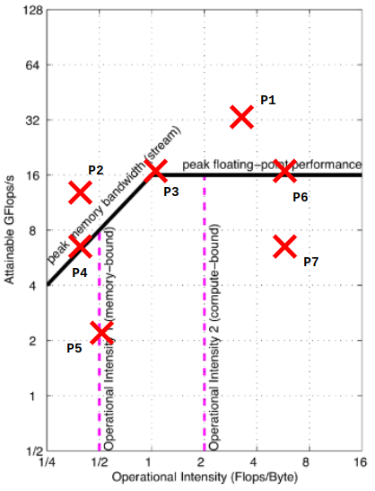
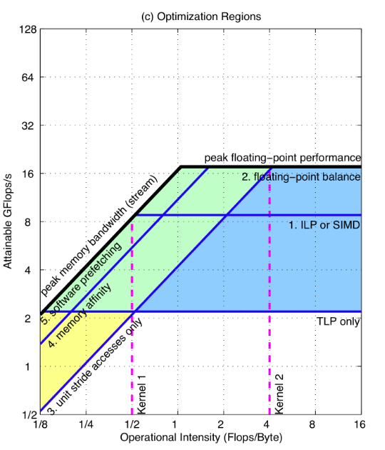

# roofline model

文章信息：来自伯克利，[原文地址点这](https://doi.org/10.1145/1498765.1498785)

## 做了什么

提出了 Roofline 性能模型，能够正确的洞察到程序在给定机器上的性能瓶颈，并根据程序在模型上所处的位置指定了优化的方向。

## 简介，为什么提出 roofline

传统的计算机体系结构是单核的，设计是较为固定的，一般都采用了超标量等技术，只不过不同的技术在不同的实现细节上有所不同。但是体系结构从单核过渡到多核的时候，设计就变得多种多样，多种多样的原因是因为对 cache 的策略和多线程的策略导致的。并且每个处理器芯片上的核数会根据不同的消费市场场景进行调整，这就导致了多核体系结构的多样。在这样的场景下，一个易于理解并且能够提供性能指导的模型就尤为重要。

基于此本文提出了 Roofline，一个简单且准确的提供性能调优指导的模型，它企图同 3C 模型之于缓存一样普遍。Roofline model并不去预测性能，而是去表示性能。

## Roofline model

本文相信在当前以及不远的未来，多核计算机仍然受限于内存带宽，于是提出的 roofline 想要建立性能与带宽之间的联系。

首先先定义了一个概念运算强度：
$$
operational \, intensity = \frac{arithmetic \, operators}{byte \, of \, DRAM \,traffic}
$$

简单的理解就是每个字节平均被用于计算的次数。这里的 DRAM traffic 是指除了对 Cache 访问之外的 DRAM 流量，也就是说统计的流量是 Cache 和 DRAM 之间产生的流量，是真正的内存流量。

计算强度这个指标数值较大意味着：

1. 总计算量大：即分子比较大
2. 总访存流量小：即分母比较小

计算强度这个指标数值较小表示：

1. 总计算量比较小
2. 访问内存的流量比较大

所提出的 roofline model 将浮点性能(纵坐标)、运算强度(横坐标)和内存性能(斜率，纵坐标横坐标比值)以二维图形的形式联系在一起。**整个 roofline model的最外轮廓都是用 benchmark 建立起来的，对于峰值计算性能和最大的带宽都是能用 benchmark 测量得到的。** 需要注意的是这里的峰值带宽是用 benchmark 测量得到的，而不是内存厂商提供的峰值带宽。在得到了峰值计算性能和峰值带宽的数据之后，roofline 可以通过以下的公示建立起来：

$$
\begin{align*}
    Attainable \: GFlops/sec = \min(&Peak \: Floating \: Point \: Performance, \\
     &Peak \: Memory \: Bandwidth \times \: Operational \: Intensity)
\end{align*}
$$

我认为这个可以这两理解，在计算强度很大的时候，计算强度早就将计算单元耗尽，因此不能再有计算强度乘以峰值带宽的无限增长，所获得的计算性能就是峰值计算性能，因为已经把所有的性能全用起来了，这时候称之为计算受限的。在计算量比较小的时候，计算需求不是很大，如果在这样的情况下，如果带宽能大点，同一时间内就能提供更多的数据给计算单元，就有更多的计算单元被利用了，因此称这个时候的为带宽受限的。

::: details roofline model 中第一段线为什么是 45 度的斜线？
首先需要明确的是那一段表示的是一个简单的线性函数，可以简单的理解成 $y = ax$，其中 $a$ 为峰值带宽，是一个常数，$x$ 代表着计算强度，这种线性关系在 log-log 图上的表示就是 45 度的斜线，这是 log-log 图的特性。
:::

上面的图中显示了 roofline 的基本结构以及一段程序在 roofline 中可能出现的 7 种情况。首先 P1 和 P2 的情况是不可能出现的，他们超越了峰值计算性能和峰值带宽，这些情况是不可能出现的。P3 是可能出现的最佳情况点，也是我们的优化目标，其充分利用了带宽和计算单元。P4 是典型的带宽受限的场景，由于在固定的计算强度下，他已经达到了 roofline 的顶端，因此对于当前的计算强度已经没有了优化的空间，只能对软件进行一些改变，增加运算强度来创造出优化空间。P5 仍未达到天花板，因此还能够进行优化使其达到天花板，但是即使这么做，优化到最顶也是带宽受限的，还有的优化方法就是和 P5 一样提高强度了。P6 是典型的计算受限场景，可以看到他已经充分利用了计算单元，但是其对带宽还是没有全部利用，下一步的优化方向就是如何将这个点向左移动（降低计算强度，在计算量不变的情况下就要对内存访问进行优化，即增大分母）。P7 的优化方向是将其向顶端优化以及采取和 P6 一样的优化手段。

roofline 的好处就是对于一台物理计算机只需要建模一次，因为对于不同的程序而言，峰值计算性能和峰值带宽是固定的，是不会随便变动的。模型中拐点的信息对判断优化的难度十分重要，拐点越靠左，就代表程序越容易得到最佳的计算性能。拐点越靠右则反之，当然，这个拐点是硬件决定的。并不能改变。

## 优化顺序的决定

roofline 决定了程序优化之后能达到的最大上限。但是现在的问题是，在当前程序的情况下应该采取哪些优化的方法才能够使其达到顶部，在仅仅给出 roofline 这个外轮廓的情况下，很难决定优化手段和优化得到的收益（即使我想到了优化的方法，但是我在这个优化上消耗了大量的时间，得到的收益还不大，这是得不偿失的）。因此需要给roofline上再加几个轮廓来方便优化。

把 roofline 设想成所有情况都达到最优的时候所能得到的最佳性能，那我们可以一同样的绘制方法绘制这样一个 “ceiling”，其不采取任何的优化手段，这样所有程序取得的性能点都在其之间。设不采取任何优化绘制出的 roofline 线为 $O_0$，我们可以对程序的内存访问进行优化（这是对带宽的优化利用），比如我们能够采取规则的地址访问、流式访问（在规则地址访问的基础上，这个挑选优化方案的过程是增量的）等手段以同样的方式绘制曲线，得到的曲线为 $O_{m1}$、$O_{m2}$。同样的，我们能够通过不同方式对计算也进行优化，如使用 SIMD、浮点乘加平衡等方式进行优化得到的曲线为 $O_{c1}$、$O_{c2}$。将所有的曲线都合在一起，就得到了一个能够指名优化方向的 roofline。

图中展示了所有优化的混合情况，并使用两个 kernel 揭示了优化方法。对于一个 kernel，首先需要计算其运算强度，然后根据其运算强度向上得到一条垂直线，程序运行得到的点肯定都位于这条线上。对于 kernel2 而言，其全部落在蓝色区域之内，对于其建议是指优化计算。为什么不建议对内存带宽进行优化？因为 kernel2 即使优化到最顶上，其对带宽的要求也只有最低的要求，你即使优化了带宽，随着对于计算的优化，这么多带宽实际上也用不到，等于白白优化。而对于 kernel1 而言，其落在黄色和蓝色的交叉区域内，代表其需要从两方面进行优化，因为达到峰值性能不仅需要计算能力的提升也需要带宽的支持。

比较好的消息是，这些优化方法的天花板同正常的 roofline 一样，对于一个机器只需要测定一次，这是十分方便的。