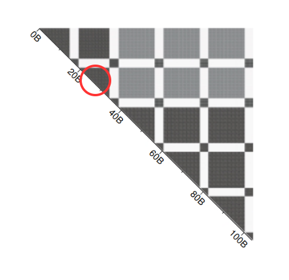

# simpoint

提出了一种精确采样加速仿真的方法，设计出 simpoint[^1] 工具，非常的牛逼，基本在传统体系结构论文中广泛使用。

现代体系结构的研究需要仿真速度的加快，完整的一段程序在仿真器上实现显得速度非常慢。选出大程序中的几个小段程序代表大程序是符合直觉的，但是如何精确选出几个小段的程序还没有特别好的方法。这篇文章就基于 bbv（基本块向量）提出了自己的程序片段采样方法，能够选出典型的片段程序，代表一整个大程序，从而加速仿真。

## 基本概念

这个工具定义和使用了几个基本的概念。

### bbv

基本快向量，simpoint 以一个 interval 记录基本快向量，一个 interval 可能有 10000000 条指令，在这个 interval 中，假设程序进入了基本块 n 一次则 ```bbv[n] += 1```，由此统计出的基本块向量就代表了程序特征。由于不同基本块的大小带来公平程度不同，因此在计算出 bbv 之后会进行归一化。

### bbv距离

bbv 向量的距离代表了两个片段之间的相似程度，这个就很简单，两个程序段进入的基本块片段越是差不多，自然就越是相似。定义向量举例的方法文中介绍了曼哈顿和欧几里得距离。由于最后 bbv 会被降维到 15 维，因此最后选择的举例表示方式是 15 维情况下更能表示举例的方式。

## 程序片段之间的相似性



如图展示的是各个 bbv 之间的举例，颜色越深代表举例越近，也就是程序片段的差异越小。可以看到红圈的中心这个片段到红圈的周围颜色都很深，说明他们之间都很接近，就能用红圈中心的点代表红圈附近的程序，这就是基本原理。在、后续作者也给出了图显示，确实表现的差不多。

图中显然还有好几个类似的区域可以用这种方法，因此找到多个点就是这个工具的任务，同时这个找到多个相似的点的过程又很像聚类，于是后面就用聚类实现。

## 聚类找程序片段

首先跑出 bbv，然后把 bbv 降到 15 维，设置 k（聚类的种类）从 1 到 10,从中选择得分最高的。计算出每个 simpoint 的时候还会附带权重，权重越大的代表这个点代表的相似片段越多，在最后的程序结果中算分的占比也比较大。

## 1 simpoint vs k simpoints

1 simpoint 的 bbv 是和整体程序的行为最像的，但是缺少了程序中的特征片段。k simpoints 相当于补充了这一部分。

[^1] Sherwood, Timothy, et al. "Automatically characterizing large scale program behavior." ACM SIGPLAN Notices 37.10 (2002): 45-57.
