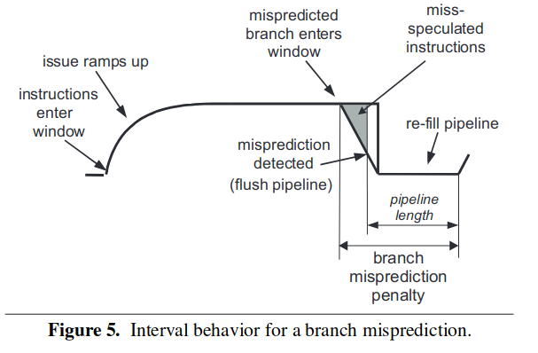
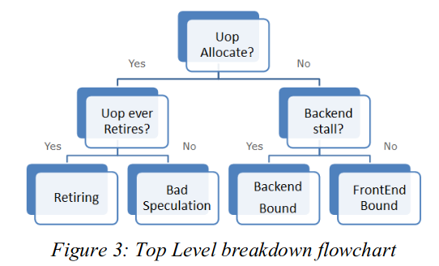
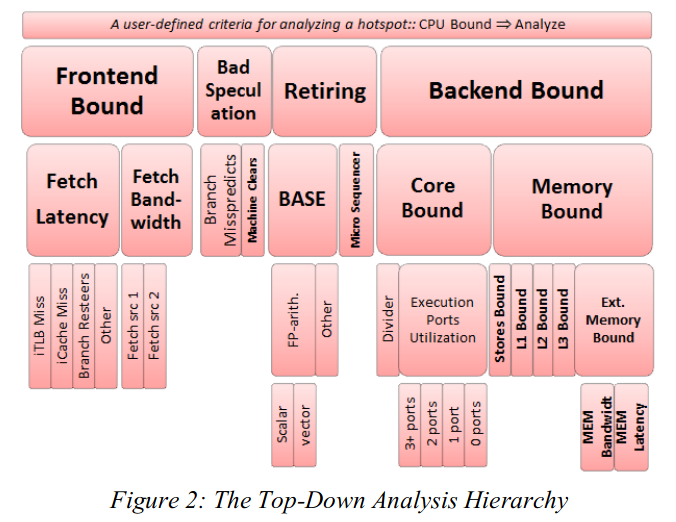

# top-down 性能分析

主要记录的两篇文章是 Lieven[^1] 和 Yasin[^2] 从不同角度的 top-down 分析。前者基于超标量处理器进行分析并提出了一种 pmu 的架构，后者基于讲述了英特尔 vtune 工具的性能分析方法以及其 pmu 相关的支持。两篇文章都提出了自己的自顶向下方法，同时也提出了对性能计数的 pmu 架构的实现。就现实的 cpu 设计而言，pmu 的设计是巧妙的，他既要保证硬件的开销足够小，同时也要保证相关的计数在有限的硬件里面能够被记录。由此看来 pmu 的设计应该是处理器设计中的一个难点，但是如果使用模拟器，pmu 完全只是软件模拟的实现，因此不侧重于硬件架构如何巧妙的实现，而更加侧重于如何准确的性能计数，如何正确的利用性能计数。这是利用模拟器进行性能分析的时候的关键点。

## Lieven's top-down

这篇文章的主要侧重点是对 cpi 堆栈的分析，对于处理器性能而言，第一点想到的关注总是 cpi，但是正常的肉眼观察只能盯出 cpi 的大还是小，只能有一个直观的感觉，只能说大了就是性能差，要将他优化小，至于看到数值之后的下一步，是很难用直觉发现的。实际上大量的 pmu 计数能够被用来分析，但是面对大量的统计计数，却难以找到优化的方向。这篇文章想解决的就是这个问题，实际上就是用 top-down 的视角看 pmu，将各类 pmu 数值归类到对程序性能有影响的事件中，从而结构 cpi 的数值堆栈。解构后的数值堆栈能够显示各个事件对 cpi 的影响，从而指导软件和微体系结构的优化。cpi 计算可以表示成：

$$
CPI = BaseCPI + \sum MissEventCPIDelay
$$

本文的目的就是想要通过 pmu 的计数来将 cpi 解构，得到类似于下图的效果:

解构得到的结果是一个指令的执行时间到底被分成了哪几个部分。这个结果 cpi 是 cycles / instructions，因此对 cpi 的分析结构实际上等同于对整个执行时间的解构，将整个执行时间解构成基本的执行时间和用在缺失上的执行时间。

在超标量上执行分析的难度在于，多个事件的时间会产生重叠，如果没有妥善处理，可能会造成错误的分析，典型的比如分支预测后的 l1 cache miss，这部分时间其实已经产生了重叠。本文在提出自己的方法之前列举出了先前的几种方法：

1. naive:计算机体系结构课使用的方法，计算出 miss 率，然后用 basecpi + (miss率 * miss 惩罚) 进行计算。简单无脑，会产生重叠，错误路径上的结果也会计算在内。
2. naive_non_spec:基本方法同上，但是只记录正确路径的。
3. power5: 主要基于 rob 的状态进行分析，以 rob 的硬件资源利用作为切入点。这种方法的问题是有时候会丢失一些时间。

本文提出了自己的方法是一种基于间隔的分析法(interval)，实际上理解起来很简单。分析 cpi 实际上等于分析 ipc，什么时候 ipc 减小了，cpi 就会变大，把使 ipc 减小的原因找出来，就找到了 cpi 变大的原因。

典型的 ipc 图如图所示，可以看到是各类的 miss 导致 ipc 的减小。只要把各个 miss 到底产生多大的影响到底导致了间隔停滞了多久分析出来就行了，在分析处各个独自的影响之后还要考虑各个影响之间的交互，探讨在多个影响产生重叠的时候间隔的停滞应该如何取值。

### 前端的 miss 事件

#### i-cache miss

显然需要计算的时间是 B + C 这一段。即指令的窗口排空到指令窗口开始重新填满指令为止。这里的指令窗口是指 dispatch 阶段能够塞到 rob 中的指令数，或者说是前端递交到后端的指令数。**这类文章非常奇怪的一点是经常不分前后端的用“指令窗口”等词语代表dispatch阶段或者rob中的空位，需要注意区分。** B 这一段的排空是指即使指令已经断流了，仍然还有前几个阶段的指令用于 dispatch，因此可以看到呈现的是坡度下降的趋势，而不是直接直角下降为 0 的趋势，在前面几个阶段的指令用完之后，彻底断流，直接在 0 点等待重新填充。C 段描述的则是流水线重新填充指令的过程，填充指令并不是一蹴而就的过程，在进入到 dispatch 之前，还是要经过前端的流水线阶段，因此从 C 段的开始流水线已经开始恢复取指，直到 C 段的结束指令填充重新完成，这段时间等于流水线前端的周期数。

实际上是为了 pmu 计数的设计，由于 A 段的时间近似于 C 段（真的吗？），因此可以直接用 A + B 代替 B + C。这样只需要记录 cache miss 到 miss 解决取指的时间就行了。

对于这种情况，作者将这种计数方法和其他方法进行了对比：

这个方法和 naive 的方法得到的结果差不多，因为计算的都是 A + B。power5 方法得到的计数偏低是因为在断流的时候后端的 ROB 并不一定为空，ROB 尚未排空的时候这个时间就不会被算进去，因此会出现偏低的情况。

#### branch miss predict

同样的还是计算从下降到重新回升的延迟。由于分支预测失效之后的指令等于全部没有执行，相当于指令断流了，即进入到 dispatch 阶段的那一刻起，指令就开始断流了，显而易见的对于本方法而言，只需要 pmu 记录从错误的分支指令进入到 dispatch 阶段到分支预测失败之后指令窗口重新出现指令为止。同时本文还列举了其他两种方法的不足之处，对于 naive 而言，其直接将流水线前端的长度作为了惩罚周期，显然是太有爱简单太短了；而 power5 的方案还是和上面一样的原因，其还是要等到 ROB 清空的时候才开始计数，漏记了很多。

> [!TIP]
> 直觉而言，用 rob 这种后端的东西计数前端是糟糕的。

### 后端的 miss 事件 和资源阻塞

后端主要的事件是资源阻塞和 cache miss，资源阻塞即指令长时间的功能单元占用，导致自身无法退役，时间一长 rob 满，前端开始阻塞；剩下的就是 cache miss，cache miss 即 data cache 的 miss，这里分为短 cache miss(L1),长 cache miss(更低层级)。短 cache miss 在这里被归类到等同于长延时，这是为了节省 pmu 硬件的设计。

> [!TIP]
> 直觉而言，l1 data cache miss 的计算方法应该和 l1 instruction cache miss 的计算方法一样。实际不然，因为 i-cache 是阻塞访问的，发起访问必然得到结果，而 l1 d-cache 是非阻塞的，在访问未果的情况下是会出现 cancel-replay 的，时间应该长于 l1 i-cache。至于将其归类到长延时的计算，这可能是基于实验得出的，有待考证。

#### long dcache miss

long cache miss 是指对 l2 以及一下存储层次进行访问的时候的计数。dcache 的非阻塞访问代表着在计数的时候无需关注其 miss 发生的时刻，因为发生的时候这个 load 可能会被 cancel 掉，等到后续在做发射，而在他 cancel 的时候，硬件资源是可以被让出来给别的指令用的，因此这段时间并不将其计算在内。

通过这个图很明显的看到，直到这个 long cache miss load 到达头部的时候，前端才开始收到阻塞，因而计数器开始计数。naive 方案直接把 miss latency 当做开销，显然是不准确的。而 power5 的方案应该和本方法很接近，因为 power5 也是等指令到达 rob 头部的时候开始计数。

本方法还有的优点是，其能在一定情况下覆盖掉多个 cache miss 带来的开销。

只有以下两种情况发生的时候，这种情况才是能够被本方法正确计数的：

1. 两条指令距离不超过 rob 窗口大小。
2. cache-miss 处理的时间差不多相似。

其实简单的来想就是两个指令在并行的 miss，当其中一条处理完了之后，指令发射开始恢复，当另一个即将因为 miss 被阻塞的时候，其刚好也处理完了，等于说是指令的发射在千钧一发之际没有停，而

可以看到，由于不会处理重叠，naive 方案明显偏高，power5 和本方法的处理类似，所以差不多。

#### 长延时计算

长延时的计算等同于 l1-cache 的时间计算，只不过归为不同的类。从脑子想象的图看，他们很可能和上面一样，不过指令不会衰减到底，或者衰减到底之后等待的时间不会那么长。因此计算方法等同于上面，但是这两个东西可能公用 1 个 pmu。

### 重叠问题

多个计数之间的重叠应该分为前端事件和前端事件的重叠、后端事件和后端事件的重叠、前端事件和后端事件之间的重叠。

后端事件和后端事件的重叠是最简单的，后端的事件都是堵在 rob 的头部不同，因此事件之间是互斥的，不会同时发生的，他们之间不会产生重叠。

前端和前端事件之间的重叠分为 2 种：

1. 先发生 i-cache-miss，后预测错误：由于前端是完全顺序的，分支错误必然在 i-cache 处理完之后，因此 i-cache miss 先发生的时候，预测错误是在其后面串行的，这两者没有重叠的可能。
2. 先分支错误，后 i-cache-miss：i-cache miss 是分支错误之后带来的，这是有可能的，但是先前在介绍分支预测错误的时候的计算方法的时候，我们认为分支预测错误之后相当于指令流消失，因此这个 i-cache miss 是不存在的，是不需要计数的。

前端和后端之间的事件，感觉这个考虑起来很复杂，作者一句产生重叠的比例很低就解释过去了，这是基于实验结果认证的，在现代超标量处理器上，这样的比例还是否存在？这是不得而知的。（感觉还需要验证）

### 总结

以上就是这篇文章提出的方法，非常的厉害，从 ipc 的角度进行思考，在现代的超标量处理器上，新的事件可能会更多，要针对情况进行分析。同时这个角度给我们的启示是，对于前端，我们主要抓指令的 dispatch，对于后端我们主要抓指令的 rob commit。

## Yasin's top-down

这是 Intel VTun 系列工具中采用的 top-down 方法，具体的思想和 Lieven 的 top-down 很像。但是从个人的视角来看，这套方法是在解构程序运行时候的资源利用，来显示出程序运行时候的瓶颈所在，进而为软件的优化或者微体系结构的研究提供指导。

所谓的硬件资源的利用是在 issue-select 的时候，计算指令发射槽的利用。简单的来讲，对于发射宽度为 6 的机器，在单个时钟周期内就有 6 个发射槽能够使用，而发射槽不一定会被填满，可能会有一些原因导致发射槽不能充分利用，分析发射槽的使用率：如果使用了，用到了哪里？如果没使用，是什么原因导致的没使用？利用 pmu 的计数器计数并计算出相关的原因，构成了 top-down 对于瓶颈的分析。对于现代的超标量处理器而言，假设程序的运行时间为为 $n$ 时钟周期，发射宽度为 $m$，则总共产生的资源数为 $n \times m$。

### top-down 的 top layer

从资源利用率入手，top-down 架构的顶层计数到底该如何实现？上面的图中就讲述了顶层架构的实现。最简单的，就是对于一段程序，最直观的展现在面前的 4 个大类。对于这 4 个大类，都是紧紧抓住资源的分配利用做分析。

#### 资源成功分配

对于资源的成功分配，很自然的想法就是前端成功供应指令、后端成功消耗指令，这在 top-layer 中被归类成 retireing，即正确退役的情况。然后就是图中的另一种情况，应该把他理解成“虚假的成功分配”，即由于预测错误处在的清空阶段，前端后端都还在清空状态，没有正常工作，这种时间内浪费的资源被归类到 bad speculation 中。

#### 资源没有成功分配

资源没有成功分配，很显然的存在着两种情况，前端没有提供指令到发射槽，还是后端没有将指令处理完，这很显然的又分成了两类。由此，形成了 4 类的 top 分分类。

### top-down 的细分

在往下进行 top-down 的细分，top-down 就像一棵树一样展开，直到展开到最底层的架构，最底层架构的数据还是来自于 pmu 的。架构如何展开，无非是对于硬件资源去向的进一步发问，如预测错误这一类别，又可以因为预测错误的原因分成分支错误还是其他的错误，然后可以根据两者的 pmu 计数统计两者的比例。因此很自然的可以得出结论，同一级的原因之间是可以进行比较的。这样的 top-down 结构很好的一点就是，可以从顶层中先发现问题所在，选择一个占比大的区域，然后下降到下一层，根据下一层中的占比情况，选择一个比较高的，再往下下降，直到分析出具体的瓶颈为止。此外，还能得出的一点结论就是，不同层级之间的比较，不同类别之间的比较是没有意义的。

下面对各个层级谈谈自己的理解：

- Frontend Bound：指令供给不上去。
  - Fetch Latency:延迟导致的指令供给不上去。
    - iTLB Miss：iTLB miss 导致的延迟等待。
    - icache Miss：同上。
    - other
  - Fetch BandWidth:译码带宽导致的指令供给不上去，即单位时钟周期内提供的译码数目太少了。
    - Fetch Src1：来自译码器1.
    - Fetch Src2：来自译码器2.
- Bad Speculation:错误的预测。
  - branch missprediction: 分支指令预测错误导致的清空。
  - machine clean:其他指令如访存违反导致的内存清空。
- Retiring:正常退役的指令。
  - Base：基本指令。
    - FP-arith:浮点指令
      - Scalar：标量
      - Vector：向量
    - Other：其他指令：整数类型的可以包括在这一类里
- Backend Bound：指令消耗不掉
  - Core Bound:计算单元的计算性能受限
    - Divider: 除法（长延时操作）
    - Execution Port Utilzation: 计算单元的利用率。(和上面有时候会产生重叠，情况比较难分析)
      - 1 port
      - 2 port
      - 3 port
      - 4 port
  - Memory Bound:存储上的性能受限
    - store bounds
    - L1 bounds
    - L2 bounds
    - L3 bounds
    - Memory bounds
      - Memory Latency: 数据供给太慢
      - Memory Bandwidth: 数据供给太少

这里需要注意的有两点：

1. 无论如何都要首先降低 bad speculation 的比例。在本统计方法中，由于预测错误导致的错误路径上的统计数据还是会被记录的，因此，错误的路径太多会导致整体的计数不准，因此首先必须降低 bad speculation 来降低其他统计的不准确性。
2. Retiring 这个大类记录的是所有正常退役的指令，它给我们的启示是正常退役的指令的数目，可以考虑向量化来降低指令的数目。

具体 pmu 的架构等之后有时间在看吧。

[^1]: Eyerman, Stijn, et al. "A performance counter architecture for computing accurate CPI components." ACM SIGPLAN Notices 41.11 (2006): 175-184.
[^2]: Yasin, Ahmad. "A top-down method for performance analysis and counters architecture." 2014 IEEE International Symposium on Performance Analysis of Systems and Software (ISPASS). IEEE, 2014.
