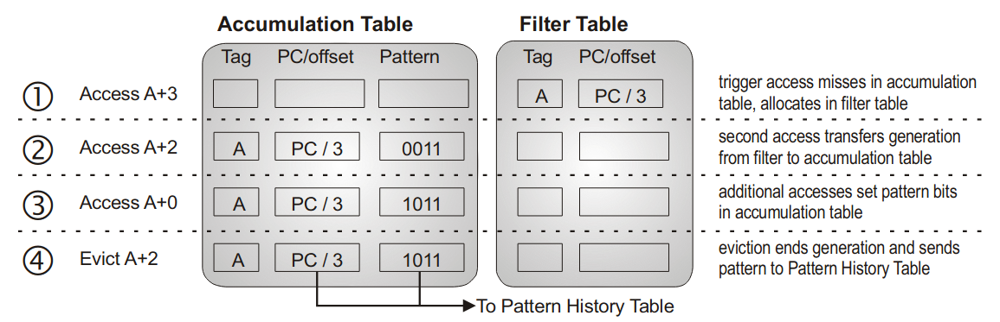
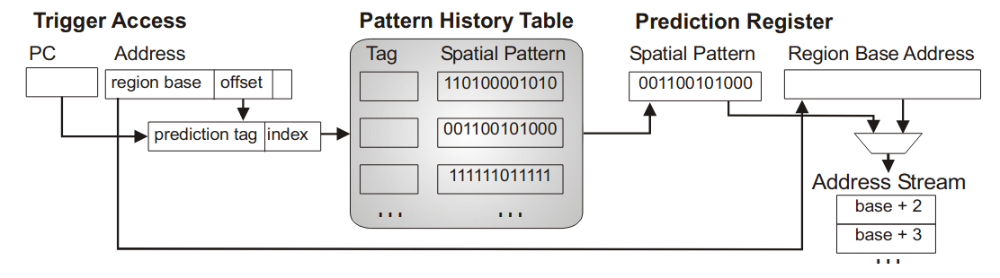
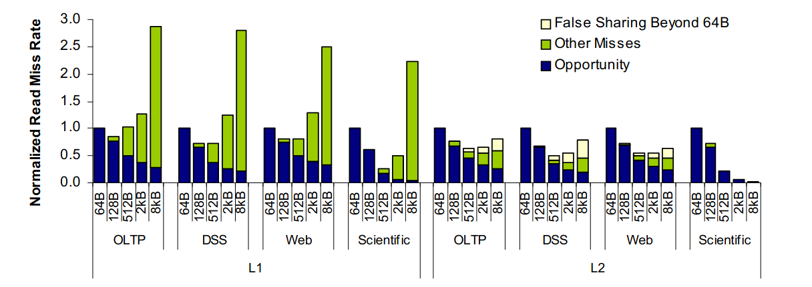
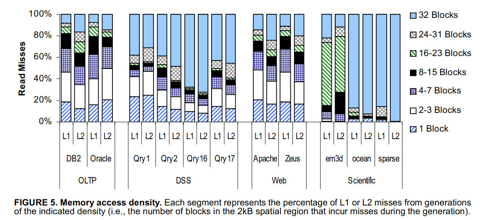
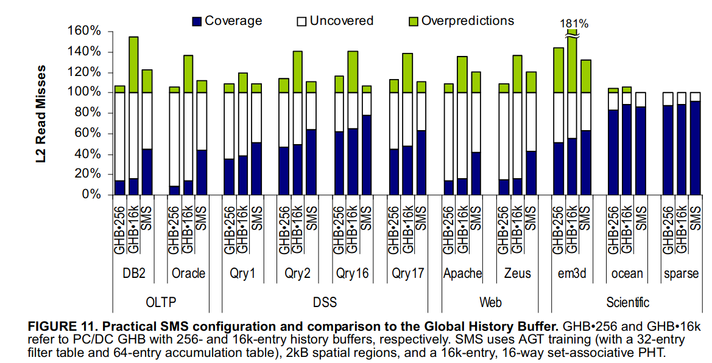
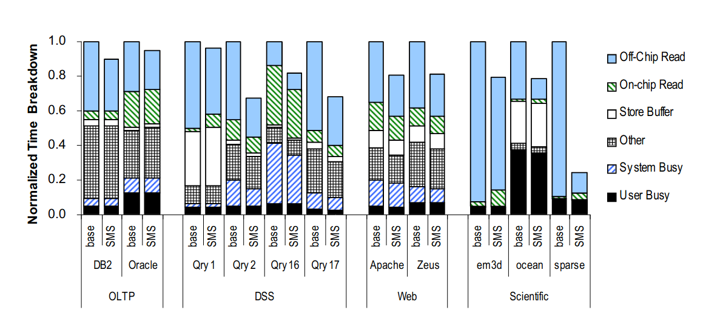

# Spatial Memory Streaming

为科学计算的特征设计了 sms 预取器，并且取得了不错的成效。主要就是对一定范围之内的访问足迹进行预测，实现往 L1 Cache 的预取，实验过程非常严谨，同时涉及到的概念计较多，可以在研究 cache 相关的时候参考概念和这里的指标。

## 为什么不设计更大的cache块大小

提升 cache 块大小可以提升对空间局部性的利用，对于密集型的数据肯定很好用。但是对于稀疏的数据就不是很好，加载的数据中可能有一部分没访问，带宽会亏掉，另外可能导致的是伪共享cache的问题，因此盲目扩大 cache 的 size 是不对的。多种多样的应用有不同的地址访问形式，因此不能限定死一个最优的大小来解决这个问题。因此需要采取一个更灵活的方式，预取就是这种很好的方式。

## sms 预取器

### 概念

下面给出相关的概念：

1. spatial region: 记录足迹的区域，对这个区域内的足迹进行利用。
2. regin generation: region 中记录的一个足迹。
3. trigger access: 触发足迹记录的第一个 cache miss.
4. spatial pattern: 记录的足迹模式。

文中提到的一点很重要，在讲到这里的时候他还提到了预取器的一些特性，就是在预取的这个东西进入到cache之后，在使用之前不能把原先的东西失效掉或者替换掉（因此一定要训练的足够好才开始进行预测），另外也不能把自己预测的东西的给牺牲掉或者无效掉（浪费带宽），因此控制这个 generation 的大小很重要。文中的定义为从第一次 trigger 开始到本 region 中出现一次牺牲或者失效为止。

在存储模式的时候使用的 tag 定位方式是 pc + region offset 的方式，这样能有以下的好处：

1. 避免大量的空间浪费。如果按每个字节地址记录的话，地址模式会有很多冗余空间的记录，会产生大量的空间浪费。
2. 预测从未访问过的数据，这里从未访问过的数据是指他们原先处在同一个cache块内，别的人已经同一个方法处理过这个一次，他也能学习到。

### 设计

AGT 设计，就是学习这个模式的硬件的设计：

trigger 的 miss 先打到 filter 上，如果在本次 region 内还有对其的访问，就记录。没有的话就放在 filter 上，省的浪费空间。当一次牺牲或者invalid 之后，一个 generation 生成完成，直接移到 PHT 中等待之后去查。

直接对 pc + offset 进行寻址。得到历史记录产生预取，如果有多个历史记录需要预取，那么会一个个轮流来。、

## 结果

结果部分主要关注别人实验是怎么做的。

### 证明盲目的提升Cache块大小不行

对于 l1 而言，大小的增大 cache miss 增加，对于 l2 的 cache 而言， false share 增加。但是对于预取而言，region 的增加反而使性能进一步提升。

访问的密度表明，没有一个固定的 cache 块大小能适应这些访问的密度。

### 不同预取器之间的对比

不同预取器之间的性能对比：

1. Coverage：原先本来要miss的，现在提前预取了。
2. uncovered：原先本来要 miss 的，现在还是 miss。
3. overpredictions：过度预取的，就是取到了没用，浪费了带宽。

### 最终性能对比

1. off-chip read: 访存停顿
2. on-chip read：内部低cache层级的停顿
3. store buffer：满停顿
4. system/user:正常情况下不同态的指令执行
5. other:分支预测错误等等