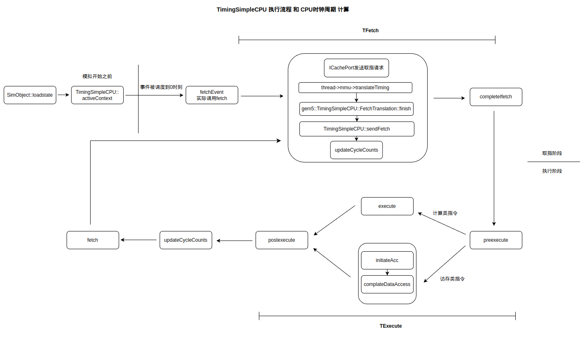

# gem5 cpu 模型

主要介绍 gem5 中的 cpu 模型。

## BaseCPU

几乎处于 cpu 继承树的顶层，BaseCPU 是所有后续 cpu 的父类，它抽象出了一个非常简单的 cpu 模型，把后续所有 cpu 需要用到的公共功能封装到了这个 BaseCPU 中，这个 cpu 并不具备执行指令的能力。

BaseCPU 封装了如下的功能：

1. 统计数据。抽象出一些公共的统计数据组，如 `GlobalStats`（ipc 就在这个统计数据组中计算）、`FetchCPUStats` （取值相关的统计信息）、`ExecuteCPUStats` 和 `CommitCPUStats`。
2. 中端控制器相关的成员。为 BaseCPU 中运行的每个线程设置中断处理器，并且提供发送中断的接口。
3. cpu 切换。BaseCPU 中包含了 cpu 切换、或者从其他 cpu 中恢复、清除 TLB 等函数。
4. 获取端口。BaseCPU 中定义了从指令接收端口和数据接收端口获取端口的方法，子类中必须实现这些方法。也即子类中必须也得提供这几个端口。
5. Thread 相关。

## TimingSimpleCPU

主要解释 TimingSimpleCPU 的指令执行流程和 TimingSimpleCPU 中运行时钟周期的计算方法。

TimingSimpleCPU 的指令执行流程由下图给出：

TimingSimpleCPU 的指令执行流程直接可以简单的分为取指和执行两个阶段，TimingSimpleCPU 周而复始的执行这两个阶段，顺序且无流水线。

下主要分析 TimingSimpleCPU 的时钟周期数的计算过程：设 TimingSimpleCPU 总共消耗的时钟周期为 $numCycles$，整个过程中执行的指令为 $numInst$ 条，取值阶段的消耗时间为 $TFetch$，执行阶段的消耗事件为 $TExecute$，则有时间计算公式：
$$ numCycles = numInst * \left( TFetch + TExecute \right) $$

其中
$$ TFetch = \left\{ \begin{array}{ll} CacheAccessTime & \text{if in cache} , \\ MemAccessTime & \text{otherwise}. \end{array} \right. $$

$$ TExecute = \left\{ \begin{array}{ll} 0 & \text{if exe inst} , \\ CacheAccessTime & \text{if mem inst and in cache} , \\MemAccessTime & \text{if mem inst and not in cache}. \end{array} \right. $$

需要注意的是 $TExecute$ 在指令为计算型指令的时候为 $0$，这是因为 TimingSimpleCPU 设计时候不考虑计算指令执行的时间，默认 CPU 微架构中的计算资源无限。

## AtomicSimpleCPU

AtomicSimpleCPU 一般是用来进行验证功能或者加速全系统仿真用的，所以考虑其 cpu 相关的统计数据是没有意义的，只需要对这个东西的大致执行流程有所了解就行了。AtomicSimpleCPU 支持指令发射宽度的设置，但是不认为这种宽度会加速模拟，我认为甚至可能减慢。

对于执行的流程直接参考官网的图片：

对这个模型没什么好说的。

## MinorCPU
