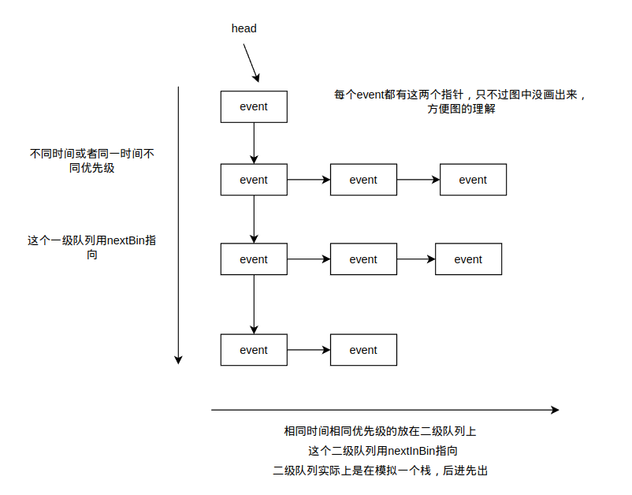

# gem5 event-driven programming

在此简单介绍下 gem5 事件机制， gem5 事件机制的实现主要实现在 `eventq.hh` `event.cc` 两个文件中，当然肯定还有相关的文件做配合，这部分等待后续的更新。当前主要解释 `eventq.hh` `event.cc` 这两个文件中包含的 api 和相关的机制原理，这篇笔记主要先记录相关的 api 和常量的定义，后详细分析 `eventq.hh` `event.cc` 中的源代码。

## 常量定义和 api 简记

### `EventBase` 中的标记

`EventBase` 中的标记主要记录一个 event 的状态，这些标记具有不同的含义，会在不同的函数中被设置或者清除。

| 标记          | 含义                   |
|:-----------:|:--------------------:|
| `Squashed`    | 忽略一次调度               |
| `Scheduled`   | 当前事件已经插入到事件队列        |
| `Managed`     | 是否对事件进行自动内存管理        |
| `AutoDelete`  | 这个标记同上，是否对事件进行自动内存管理 |
| `Initialized` | 事件是否被初始化             |

### `EventBase` 中的优先级

对优先级不做介绍，只要知道有这个概念就行了。

### `Event` 中的各个成员

| 名称                                          | 类型   | 含义                           |
|---------------------------------------------|------|------------------------------|
| `EventQueue`                                  | 友元类  | 使EventQueue能够访问Event的各种信息和状态 |
| `nextBin`                                     | 成员变量 | 指向一级队列中的下一级（不同时间优先级）         |
| `nextInBin`                                   | 成员变量 | 指向二级队列中的下一个（同时间优先级）          |
| `insertBefore(Event *event, Event *curr)` | 静态方法 | 从队列中插入                       |
| `removeItem(Event *event, Event *last)`   | 静态方法 | 从队列中移除                       |
| `_when`                                      | 成员变量 | 当前事件的时间                      |
| `_priority`                                  | 成员变量 | 当前事件的优先级                     |
| `flags`                                       | 成员变量 | 当前事件的标记                      |
| `instanceCounter`                             | 静态变量 | 全局唯一的id生成变量，会自增              |
| `instance`                                    | 成员变量 | 当前事件的id                      |
| `queue`                                       | 成员变量 | 当前事件所处的队列                    |
| `setWhen`                                     | 成员函数 | 设置事件触发事件                     |
| `initialized`                                 | 成员函数 | 判断事件是不是已经初始化                 |
| `acquire release acquireImpl releaseImpl`     | 成员函数 | 对事件的内存管理，只有在启用事件内存管理的时候才有用   |
| `dump`                                        | 成员函数 | 打印事件的状态信息                    |
| `process`                                     | 纯虚函数 | 继承者实现，这个事件干什么                |
| `scheduled`                                   | 成员函数 | 测试schedule是否设置，即这个事件是不是在队列中了 |
| `squash`                                      | 成员函数 | 设置squash标记                   |
| `squashed`                                    | 成员函数 | squash标记是否被设置了               |

### `EventQueue` 中的各个成员

| 名称                  | 类型   | 含义                                                         |
|---------------------|------|------------------------------------------------------------|
| `objName`             | 成员变量 | 队列名称                                                       |
| `head`                | 成员变量 | 当前队列头                                                      |
| `_curTick`           | 成员变量 | 当前队列的时间                                                    |
| `async_queue_mutex` | 成员变量 | 将队列分配到多线程时候的锁，在多个队列同时执行的时候可能会有用                            |
| `async_queue`        | 成员变量 | 其他线程的队列向本队列插入事件的时候会先插入到这条队列，稍后这条队列中的事件会在安全的时候同步到当前队列       |
| `service_mutex`      | 成员变量 | 调度事件的时候需要用到的锁                                              |
| `insert`              | 成员函数 | 向队列中插入                                                     |
| `remove`              | 成员函数 | 从队列中删除                                                     |
| `asyncInsert`         | 成员函数 | 异步插入，多线程情况下使用                                              |
| `ScopedMigration`     | 内部类  | 切换当前调度队列的帮助类                                               |
| `ScopedRelease`       | 内部类  | 对队列上锁开锁的帮助类                                                |
| `schedule`            | 成员函数 | 将指定事件插入到队列中，并设置scheduled标记                                 |
| `deschedule`          | 成员函数 | 将指定事件从队列中移出，并消除Scheduled Squashed标记                        |
| `reschedule`          | 成员函数 | 更改已经在队列中的指定事件的时间或者消除其Squashed标记，使当前队列的事件在service到的时候能够被执行  |
| `serviceOne`          | 成员函数 | 选取当前的队列头，如果没有Squashed标记，执行这个事件，如果有Squashed，忽略本次执行并且将这个标记清除 |
| `serviceEvents`       | 成员函数 | 传入一个时间，传入时间之前的事件都被执行                                       |

### `EventManager` 中的各个成员

EventManager 只是包含了 EventQueue 中的各种 schedule 方法。

## 事件队列演示



## 源代码解读

### `eventq.hh` 源代码

```c++
/* @file
 * EventQueue interfaces
 */

#ifndef __SIM_EVENTQ_HH__
#define __SIM_EVENTQ_HH__

#include <algorithm>
#include <cassert>
#include <climits>
#include <functional>
#include <iosfwd>
#include <list>
#include <memory>
#include <string>

#include "base/debug.hh"
#include "base/flags.hh"
#include "base/named.hh"
#include "base/trace.hh"
#include "base/type_traits.hh"
#include "base/types.hh"
#include "base/uncontended_mutex.hh"
#include "debug/Event.hh"
#include "sim/cur_tick.hh"
#include "sim/serialize.hh"

namespace gem5
{

class EventQueue;       // forward declaration
class BaseGlobalEvent;

//! Simulation Quantum for multiple eventq simulation.
//! The quantum value is the period length after which the queues
//! synchronize themselves with each other. This means that any
//! event to scheduled on Queue A which is generated by an event on
//! Queue B should be at least simQuantum ticks away in future.
extern Tick simQuantum;

//! Current number of allocated main event queues.
// 当前分配的所有队列数量
extern uint32_t numMainEventQueues;

//! Array for main event queues.
// 所有队列的列表
extern std::vector<EventQueue *> mainEventQueue;

//! The current event queue for the running thread. Access to this queue
//! does not require any locking from the thread.

// 当前线程正在执行的事件队列
extern __thread EventQueue *_curEventQueue;

//! Current mode of execution: parallel / serial
extern bool inParallelMode;

//! Function for returning eventq queue for the provided
//! index. The function allocates a new queue in case one
//! does not exist for the index, provided that the index
//! is with in bounds.
EventQueue *getEventQueue(uint32_t index);

inline EventQueue *curEventQueue() { return _curEventQueue; }
inline void curEventQueue(EventQueue *q);

/**
 * Common base class for Event and GlobalEvent, so they can share flag
 * and priority definitions and accessor functions.  This class should
 * not be used directly.
 */
//  定义各种标记和优先级
class EventBase
{
  protected:
    typedef unsigned short FlagsType;
    typedef ::gem5::Flags<FlagsType> Flags;

    static const FlagsType PublicRead    = 0x003f; // public readable flags
    static const FlagsType PublicWrite   = 0x001d; // public writable flags
    static const FlagsType Squashed      = 0x0001; // has been squashed
    static const FlagsType Scheduled     = 0x0002; // has been scheduled
    static const FlagsType Managed       = 0x0004; // Use life cycle manager
    static const FlagsType AutoDelete    = Managed; // delete after dispatch
    /**
     * This used to be AutoSerialize. This value can't be reused
     * without changing the checkpoint version since the flag field
     * gets serialized.
     */
    static const FlagsType Reserved0     = 0x0008;
    static const FlagsType IsExitEvent   = 0x0010; // special exit event
    static const FlagsType IsMainQueue   = 0x0020; // on main event queue
    static const FlagsType Initialized   = 0x7a40; // somewhat random bits
    static const FlagsType InitMask      = 0xffc0; // mask for init bits

  public:
    /**
     * @ingroup api_eventq
     */
    typedef int8_t Priority;

    /// Event priorities, to provide tie-breakers for events scheduled
    /// at the same cycle.  Most events are scheduled at the default
    /// priority; these values are used to control events that need to
    /// be ordered within a cycle.

    /**
     * Minimum priority
     *
     * @ingroup api_eventq
     */
    static const Priority Minimum_Pri =          SCHAR_MIN;

    /**
     * If we enable tracing on a particular cycle, do that as the
     * very first thing so we don't miss any of the events on
     * that cycle (even if we enter the debugger).
     *
     * @ingroup api_eventq
     */
    static const Priority Debug_Enable_Pri =          -101;

    /**
     * Breakpoints should happen before anything else (except
     * enabling trace output), so we don't miss any action when
     * debugging.
     *
     * @ingroup api_eventq
     */
    static const Priority Debug_Break_Pri =           -100;

    /**
     * CPU switches schedule the new CPU's tick event for the
     * same cycle (after unscheduling the old CPU's tick event).
     * The switch needs to come before any tick events to make
     * sure we don't tick both CPUs in the same cycle.
     *
     * @ingroup api_eventq
     */
    static const Priority CPU_Switch_Pri =             -31;

    /**
     * For some reason "delayed" inter-cluster writebacks are
     * scheduled before regular writebacks (which have default
     * priority).  Steve?
     *
     * @ingroup api_eventq
     */
    static const Priority Delayed_Writeback_Pri =       -1;

    /**
     * Default is zero for historical reasons.
     *
     * @ingroup api_eventq
     */
    static const Priority Default_Pri =                  0;

    /**
     * DVFS update event leads to stats dump therefore given a lower priority
     * to ensure all relevant states have been updated
     *
     * @ingroup api_eventq
     */
    static const Priority DVFS_Update_Pri =             31;

    /**
     * Serailization needs to occur before tick events also, so
     * that a serialize/unserialize is identical to an on-line
     * CPU switch.
     *
     * @ingroup api_eventq
     */
    static const Priority Serialize_Pri =               32;

    /**
     * CPU ticks must come after other associated CPU events
     * (such as writebacks).
     *
     * @ingroup api_eventq
     */
    static const Priority CPU_Tick_Pri =                50;

    /**
     * If we want to exit a thread in a CPU, it comes after CPU_Tick_Pri
     *
     * @ingroup api_eventq
     */
    static const Priority CPU_Exit_Pri =                64;

    /**
     * Statistics events (dump, reset, etc.) come after
     * everything else, but before exit.
     *
     * @ingroup api_eventq
     */
    static const Priority Stat_Event_Pri =              90;

    /**
     * Progress events come at the end.
     *
     * @ingroup api_eventq
     */
    static const Priority Progress_Event_Pri =          95;

    /**
     * If we want to exit on this cycle, it's the very last thing
     * we do.
     *
     * @ingroup api_eventq
     */
    static const Priority Sim_Exit_Pri =               100;

    /**
     * Maximum priority
     *
     * @ingroup api_eventq
     */
    static const Priority Maximum_Pri =          SCHAR_MAX;
};

/*
 * An item on an event queue.  The action caused by a given
 * event is specified by deriving a subclass and overriding the
 * process() member function.
 *
 * Caution, the order of members is chosen to maximize data packing.
 */
class Event : public EventBase, public Serializable
{
    friend class EventQueue;

  private:
    // The event queue is now a linked list of linked lists.  The
    // 'nextBin' pointer is to find the bin, where a bin is defined as
    // when+priority.  All events in the same bin will be stored in a
    // second linked list (a stack) maintained by the 'nextInBin'
    // pointer.  The list will be accessed in LIFO order.  The end
    // result is that the insert/removal in 'nextBin' is
    // linear/constant, and the lookup/removal in 'nextInBin' is
    // constant/constant.  Hopefully this is a significant improvement
    // over the current fully linear insertion.
    Event *nextBin;
    Event *nextInBin;

    // 这两个函数不过多解释含义，需要的时候画图理解
    // 总之全局的事件队列维护的是一个二级的队列就对了
    static Event *insertBefore(Event *event, Event *curr);
    static Event *removeItem(Event *event, Event *last);

    Tick _when;         //!< timestamp when event should be processed
    Priority _priority; //!< event priority
    Flags flags;

#ifndef NDEBUG
    /// Global counter to generate unique IDs for Event instances
    static Counter instanceCounter;

    /// This event's unique ID.  We can also use pointer values for
    /// this but they're not consistent across runs making debugging
    /// more difficult.  Thus we use a global counter value when
    /// debugging.
    Counter instance;

    /// queue to which this event belongs (though it may or may not be
    /// scheduled on this queue yet)
    EventQueue *queue;
#endif

#ifdef EVENTQ_DEBUG
    Tick whenCreated;   //!< time created
    Tick whenScheduled; //!< time scheduled
#endif

    void
    setWhen(Tick when, EventQueue *q)
    {
        _when = when;
#ifndef NDEBUG
        queue = q;
#endif
#ifdef EVENTQ_DEBUG
        whenScheduled = curTick();
#endif
    }

    bool
    initialized() const
    {
        return (flags & InitMask) == Initialized;
    }

  protected:
    Flags
    getFlags() const
    {
        return flags & PublicRead;
    }

    bool
    isFlagSet(Flags _flags) const
    {
        assert(_flags.noneSet(~PublicRead));
        return flags.isSet(_flags);
    }

    void
    setFlags(Flags _flags)
    {
        assert(_flags.noneSet(~PublicWrite));
        flags.set(_flags);
    }

    void
    clearFlags(Flags _flags)
    {
        assert(_flags.noneSet(~PublicWrite));
        flags.clear(_flags);
    }

    void
    clearFlags()
    {
        flags.clear(PublicWrite);
    }

    /**
     * This function isn't really useful if TRACING_ON is not defined
     *
     * @ingroup api_eventq
     */
    virtual void trace(const char *action);     //!< trace event activity

    /// Return the instance number as a string.
    const std::string instanceString() const;

  protected: /* Memory management */
    /**
     * @{
     * Memory management hooks for events that have the Managed flag set
     *
     * Events can use automatic memory management by setting the
     * Managed flag. The default implementation automatically deletes
     * events once they have been removed from the event queue. This
     * typically happens when events are descheduled or have been
     * triggered and not rescheduled.
     *
     * The methods below may be overridden by events that need custom
     * memory management. For example, events exported to Python need
     * to impement reference counting to ensure that the Python
     * implementation of the event is kept alive while it lives in the
     * event queue.
     *
     * @note Memory managers are responsible for implementing
     * reference counting (by overriding both acquireImpl() and
     * releaseImpl()) or checking if an event is no longer scheduled
     * in releaseImpl() before deallocating it.
     */

    // 以下这四个函数主要是内存管理相关的
    // 主要管理事件对象什么时候在内存中分配和释放
    /**
     * Managed event scheduled and being held in the event queue.
     */
    void acquire();

    /**
     * Managed event removed from the event queue.
     */
    void release();

    virtual void acquireImpl();

    virtual void releaseImpl();

    /** @} */

  public:

    /*
     * Event constructor
     * @param queue that the event gets scheduled on
     *
     * @ingroup api_eventq
     */
    Event(Priority p = Default_Pri, Flags f = 0)
        : nextBin(nullptr), nextInBin(nullptr), _when(0), _priority(p),
          flags(Initialized | f)
    {
        assert(f.noneSet(~PublicWrite));
#ifndef NDEBUG
        instance = ++instanceCounter;
        queue = NULL;
#endif
#ifdef EVENTQ_DEBUG
        whenCreated = curTick();
        whenScheduled = 0;
#endif
    }

    /**
     * @ingroup api_eventq
     * @{
     */
    virtual ~Event();
    virtual const std::string name() const;

    /// Return a C string describing the event.  This string should
    /// *not* be dynamically allocated; just a const char array
    /// describing the event class.
    virtual const char *description() const;

    /// Dump the current event data
    void dump() const;
    /** @}*/ //end of api group

  public:
    /*
     * This member function is invoked when the event is processed
     * (occurs).  There is no default implementation; each subclass
     * must provide its own implementation.  The event is not
     * automatically deleted after it is processed (to allow for
     * statically allocated event objects).
     *
     * If the AutoDestroy flag is set, the object is deleted once it
     * is processed.
     *
     * @ingroup api_eventq
     */
    virtual void process() = 0;

    /**
     * Determine if the current event is scheduled
     *
     * @ingroup api_eventq
     */
    bool scheduled() const { return flags.isSet(Scheduled); }

    /**
     * Squash the current event
     *
     * @ingroup api_eventq
     */
    void squash() { flags.set(Squashed); }

    /**
     * Check whether the event is squashed
     *
     * @ingroup api_eventq
     */
    bool squashed() const { return flags.isSet(Squashed); }

    /**
     * See if this is a SimExitEvent (without resorting to RTTI)
     *
     * @ingroup api_eventq
     */
    bool isExitEvent() const { return flags.isSet(IsExitEvent); }

    /**
     * Check whether this event will auto-delete
     *
     * @ingroup api_eventq
     */
    bool isManaged() const { return flags.isSet(Managed); }

    /**
     * The function returns true if the object is automatically
     * deleted after the event is processed.
     *
     * @ingroup api_eventq
     */
    bool isAutoDelete() const { return isManaged(); }

    /**
     * Get the time that the event is scheduled
     *
     * @ingroup api_eventq
     */
    Tick when() const { return _when; }

    /**
     * Get the event priority
     *
     * @ingroup api_eventq
     */
    Priority priority() const { return _priority; }

    //! If this is part of a GlobalEvent, return the pointer to the
    //! Global Event.  By default, there is no GlobalEvent, so return
    //! NULL.  (Overridden in GlobalEvent::BarrierEvent.)
    virtual BaseGlobalEvent *globalEvent() { return NULL; }

    void serialize(CheckpointOut &cp) const override;
    void unserialize(CheckpointIn &cp) override;
};

// 重载运算符用于比较
/**
 * @ingroup api_eventq
 */
inline bool
operator<(const Event &l, const Event &r)
{
    return l.when() < r.when() ||
        (l.when() == r.when() && l.priority() < r.priority());
}

/**
 * @ingroup api_eventq
 */
inline bool
operator>(const Event &l, const Event &r)
{
    return l.when() > r.when() ||
        (l.when() == r.when() && l.priority() > r.priority());
}

/**
 * @ingroup api_eventq
 */
inline bool
operator<=(const Event &l, const Event &r)
{
    return l.when() < r.when() ||
        (l.when() == r.when() && l.priority() <= r.priority());
}

/**
 * @ingroup api_eventq
 */
inline bool
operator>=(const Event &l, const Event &r)
{
    return l.when() > r.when() ||
        (l.when() == r.when() && l.priority() >= r.priority());
}

/**
 * @ingroup api_eventq
 */
inline bool
operator==(const Event &l, const Event &r)
{
    return l.when() == r.when() && l.priority() == r.priority();
}

/**
 * @ingroup api_eventq
 */
inline bool
operator!=(const Event &l, const Event &r)
{
    return l.when() != r.when() || l.priority() != r.priority();
}

/**
 * Queue of events sorted in time order
 *
 * Events are scheduled (inserted into the event queue) using the
 * schedule() method. This method either inserts a <i>synchronous</i>
 * or <i>asynchronous</i> event.
 *
 * Synchronous events are scheduled using schedule() method with the
 * argument 'global' set to false (default). This should only be done
 * from a thread holding the event queue lock
 * (EventQueue::service_mutex). The lock is always held when an event
 * handler is called, it can therefore always insert events into its
 * own event queue unless it voluntarily releases the lock.
 *
 * Events can be scheduled across thread (and event queue borders) by
 * either scheduling asynchronous events or taking the target event
 * queue's lock. However, the lock should <i>never</i> be taken
 * directly since this is likely to cause deadlocks. Instead, code
 * that needs to schedule events in other event queues should
 * temporarily release its own queue and lock the new queue. This
 * prevents deadlocks since a single thread never owns more than one
 * event queue lock. This functionality is provided by the
 * ScopedMigration helper class. Note that temporarily migrating
 * between event queues can make the simulation non-deterministic, it
 * should therefore be limited to cases where that can be tolerated
 * (e.g., handling asynchronous IO or fast-forwarding in KVM).
 *
 * Asynchronous events can also be scheduled using the normal
 * schedule() method with the 'global' parameter set to true. Unlike
 * the previous queue migration strategy, this strategy is fully
 * deterministic. This causes the event to be inserted in a separate
 * queue of asynchronous events (async_queue), which is merged main
 * event queue at the end of each simulation quantum (by calling the
 * handleAsyncInsertions() method). Note that this implies that such
 * events must happen at least one simulation quantum into the future,
 * otherwise they risk being scheduled in the past by
 * handleAsyncInsertions().
 */
class EventQueue
{
  private:
    friend void curEventQueue(EventQueue *);

    std::string objName;
    Event *head;
    Tick _curTick;

    //! Mutex to protect async queue.
    UncontendedMutex async_queue_mutex;

    //! List of events added by other threads to this event queue.
    std::list<Event*> async_queue;

    /**
     * Lock protecting event handling.
     *
     * This lock is always taken when servicing events. It is assumed
     * that the thread scheduling new events (not asynchronous events
     * though) have taken this lock. This is normally done by
     * serviceOne() since new events are typically scheduled as a
     * response to an earlier event.
     *
     * This lock is intended to be used to temporarily steal an event
     * queue to support inter-thread communication when some
     * deterministic timing can be sacrificed for speed. For example,
     * the KVM CPU can use this support to access devices running in a
     * different thread.
     *
     * @see EventQueue::ScopedMigration.
     * @see EventQueue::ScopedRelease
     * @see EventQueue::lock()
     * @see EventQueue::unlock()
     */
    UncontendedMutex service_mutex;

    //! Insert / remove event from the queue. Should only be called
    //! by thread operating this queue.
    void insert(Event *event);
    void remove(Event *event);

    //! Function for adding events to the async queue. The added events
    //! are added to main event queue later. Threads, other than the
    //! owning thread, should call this function instead of insert().
    void asyncInsert(Event *event);

    EventQueue(const EventQueue &);

  public:
    class ScopedMigration
    {
      public:
         /**
         * Temporarily migrate execution to a different event queue.
         *
         * An instance of this class temporarily migrates execution to
         * different event queue by releasing the current queue, locking
         * the new queue, and updating curEventQueue(). This can, for
         * example, be useful when performing IO across thread event
         * queues when timing is not crucial (e.g., during fast
         * forwarding).
         *
         * ScopedMigration does nothing if both eqs are the same
         *
         * @ingroup api_eventq
         */
        ScopedMigration(EventQueue *_new_eq, bool _doMigrate = true)
            :new_eq(*_new_eq), old_eq(*curEventQueue()),
             doMigrate((&new_eq != &old_eq)&&_doMigrate)
        {
            if (doMigrate){
                old_eq.unlock();
                new_eq.lock();
                curEventQueue(&new_eq);
            }
        }

        ~ScopedMigration()
        {
            if (doMigrate){
                new_eq.unlock();
                old_eq.lock();
                curEventQueue(&old_eq);
            }
        }

      private:
        EventQueue &new_eq;
        EventQueue &old_eq;
        bool doMigrate;
    };


    class ScopedRelease
    {
      public:
        /**
         * Temporarily release the event queue service lock.
         *
         * There are cases where it is desirable to temporarily release
         * the event queue lock to prevent deadlocks. For example, when
         * waiting on the global barrier, we need to release the lock to
         * prevent deadlocks from happening when another thread tries to
         * temporarily take over the event queue waiting on the barrier.
         *
         * @group api_eventq
         */
        ScopedRelease(EventQueue *_eq)
            :  eq(*_eq)
        {
            eq.unlock();
        }

        ~ScopedRelease()
        {
            eq.lock();
        }

      private:
        EventQueue &eq;
    };

    /**
     * @ingroup api_eventq
     */
    EventQueue(const std::string &n);

    /**
     * @ingroup api_eventq
     * @{
     */
    virtual const std::string name() const { return objName; }
    void name(const std::string &st) { objName = st; }
    /** @}*/ //end of api_eventq group

    /**
     * Schedule the given event on this queue. Safe to call from any thread.
     *
     * @ingroup api_eventq
     */
    void
    schedule(Event *event, Tick when, bool global=false)
    {
        assert(when >= getCurTick());
        assert(!event->scheduled());
        assert(event->initialized());

        event->setWhen(when, this);

        // The check below is to make sure of two things
        // a. A thread schedules local events on other queues through the
        //    asyncq.
        // b. A thread schedules global events on the asyncq, whether or not
        //    this event belongs to this eventq. This is required to maintain
        //    a total order amongst the global events. See global_event.{cc,hh}
        //    for more explanation.
        if (inParallelMode && (this != curEventQueue() || global)) {
            asyncInsert(event);
        } else {
            insert(event);
        }
        event->flags.set(Event::Scheduled);
        event->acquire();

        if (debug::Event)
            event->trace("scheduled");
    }

    /**
     * Deschedule the specified event. Should be called only from the owning
     * thread.
     * @ingroup api_eventq
     */
    void
    deschedule(Event *event)
    {
        assert(event->scheduled());
        assert(event->initialized());
        assert(!inParallelMode || this == curEventQueue());

        remove(event);

        event->flags.clear(Event::Squashed);
        event->flags.clear(Event::Scheduled);

        if (debug::Event)
            event->trace("descheduled");

        event->release();
    }

    /**
     * Reschedule the specified event. Should be called only from the owning
     * thread.
     *
     * @ingroup api_eventq
     */
    void
    reschedule(Event *event, Tick when, bool always=false)
    {
        assert(when >= getCurTick());
        assert(always || event->scheduled());
        assert(event->initialized());
        assert(!inParallelMode || this == curEventQueue());

        if (event->scheduled()) {
            remove(event);
        } else {
            event->acquire();
        }

        event->setWhen(when, this);
        insert(event);
        event->flags.clear(Event::Squashed);
        event->flags.set(Event::Scheduled);

        if (debug::Event)
            event->trace("rescheduled");
    }

    Tick nextTick() const { return head->when(); }
    void setCurTick(Tick newVal) { _curTick = newVal; }

    /**
     * While curTick() is useful for any object assigned to this event queue,
     * if an object that is assigned to another event queue (or a non-event
     * object) need to access the current tick of this event queue, this
     * function is used.
     *
     * Tick is the unit of time used in gem5.
     *
     * @return Tick The current tick of this event queue.
     * @ingroup api_eventq
     */
    Tick getCurTick() const { return _curTick; }
    Event *getHead() const { return head; }

    Event *serviceOne();

    /**
     * process all events up to the given timestamp.  we inline a quick test
     * to see if there are any events to process; if so, call the internal
     * out-of-line version to process them all.
     *
     * Notes:
     *  - This is only used for "instruction" event queues. Instead of counting
     *    ticks, this is actually counting instructions.
     *  - This updates the current tick value to the value of the entry at the
     *    head of the queue.
     *
     * @ingroup api_eventq
     */
    void
    serviceEvents(Tick when)
    {
        while (!empty()) {
            if (nextTick() > when)
                break;

            /**
             * @todo this assert is a good bug catcher.  I need to
             * make it true again.
             */
            //assert(head->when() >= when && "event scheduled in the past");
            serviceOne();
        }

        setCurTick(when);
    }

    /**
     * Returns true if no events are queued
     *
     * @ingroup api_eventq
     */
    bool empty() const { return head == NULL; }

    /**
     * This is a debugging function which will print everything on the event
     * queue.
     *
     * @ingroup api_eventq
     */
    void dump() const;

    bool debugVerify() const;

    /**
     * Function for moving events from the async_queue to the main queue.
     */
    void handleAsyncInsertions();

    /**
     *  Function to signal that the event loop should be woken up because
     *  an event has been scheduled by an agent outside the gem5 event
     *  loop(s) whose event insertion may not have been noticed by gem5.
     *  This function isn't needed by the usual gem5 event loop but may
     *  be necessary in derived EventQueues which host gem5 onto other
     *  schedulers.
     *
     *  @param when Time of a delayed wakeup (if known). This parameter
     *  can be used by an implementation to schedule a wakeup in the
     *  future if it is sure it will remain active until then.
     *  Or it can be ignored and the event queue can be woken up now.
     *
     *  @ingroup api_eventq
     */
    virtual void wakeup(Tick when = (Tick)-1) { }

    /**
     *  function for replacing the head of the event queue, so that a
     *  different set of events can run without disturbing events that have
     *  already been scheduled. Already scheduled events can be processed
     *  by replacing the original head back.
     *  USING THIS FUNCTION CAN BE DANGEROUS TO THE HEALTH OF THE SIMULATOR.
     *  NOT RECOMMENDED FOR USE.
     */
    Event* replaceHead(Event* s);

    /**@{*/
    /**
     * Provide an interface for locking/unlocking the event queue.
     *
     * @warn Do NOT use these methods directly unless you really know
     * what you are doing. Incorrect use can easily lead to simulator
     * deadlocks.
     *
     * @see EventQueue::ScopedMigration.
     * @see EventQueue::ScopedRelease
     * @see EventQueue
     */
    void lock() { service_mutex.lock(); }
    void unlock() { service_mutex.unlock(); }
    /**@}*/

    /**
     * Reschedule an event after a checkpoint.
     *
     * Since events don't know which event queue they belong to,
     * parent objects need to reschedule events themselves. This
     * method conditionally schedules an event that has the Scheduled
     * flag set. It should be called by parent objects after
     * unserializing an object.
     *
     * @warn Only use this method after unserializing an Event.
     */
    void checkpointReschedule(Event *event);

    virtual ~EventQueue()
    {
        while (!empty())
            deschedule(getHead());
    }
};

inline void
curEventQueue(EventQueue *q)
{
    _curEventQueue = q;
    Gem5Internal::_curTickPtr = (q == nullptr) ? nullptr : &q->_curTick;
}

void dumpMainQueue();

class EventManager
{
  protected:
    /** A pointer to this object's event queue */
    EventQueue *eventq;

  public:
    /**
     * Event manger manages events in the event queue. Where
     * you can schedule and deschedule different events.
     *
     * @ingroup api_eventq
     * @{
     */
    EventManager(EventManager &em) : eventq(em.eventq) {}
    EventManager(EventManager *em) : eventq(em->eventq) {}
    EventManager(EventQueue *eq) : eventq(eq) {}
    /** @}*/ //end of api_eventq group

    /**
     * @ingroup api_eventq
     */
    EventQueue *
    eventQueue() const
    {
        return eventq;
    }

    /**
     * @ingroup api_eventq
     */
    void
    schedule(Event &event, Tick when)
    {
        eventq->schedule(&event, when);
    }

    /**
     * @ingroup api_eventq
     */
    void
    deschedule(Event &event)
    {
        eventq->deschedule(&event);
    }

    /**
     * @ingroup api_eventq
     */
    void
    reschedule(Event &event, Tick when, bool always = false)
    {
        eventq->reschedule(&event, when, always);
    }

    /**
     * @ingroup api_eventq
     */
    void
    schedule(Event *event, Tick when)
    {
        eventq->schedule(event, when);
    }

    /**
     * @ingroup api_eventq
     */
    void
    deschedule(Event *event)
    {
        eventq->deschedule(event);
    }

    /**
     * @ingroup api_eventq
     */
    void
    reschedule(Event *event, Tick when, bool always = false)
    {
        eventq->reschedule(event, when, always);
    }

    /**
     * This function is not needed by the usual gem5 event loop
     * but may be necessary in derived EventQueues which host gem5
     * on other schedulers.
     * @ingroup api_eventq
     */
    void wakeupEventQueue(Tick when = (Tick)-1)
    {
        eventq->wakeup(when);
    }

    void setCurTick(Tick newVal) { eventq->setCurTick(newVal); }
};

/**
 * @brief Wrap a member function inside MemberEventWrapper to use it as an
 * event callback. This wrapper should be prefered over EventFunctionWrapper
 * for better performance and type safety.
 *
 * Wrapping a function *process* member of a class *klass* can be done by
 * adding a member variable of the following type:
 * MemberEventWrapper<&klass::process>.
 *
 * It is required that klass::process takes no explicit argument and returns no
 * value as these could not be handled by the event scheduler.
 *
 * @tparam F Pointer to the member function wrapped in this event.
 */
template <auto F>
class MemberEventWrapper final: public Event, public Named
{
    using CLASS = MemberFunctionClass_t<F>;
    static_assert(std::is_same_v<void, MemberFunctionReturn_t<F>>);
    static_assert(std::is_same_v<MemberFunctionArgsTuple_t<F>, std::tuple<>>);

public:
    [[deprecated("Use reference version of this constructor instead")]]
    MemberEventWrapper(CLASS *object,
                       bool del = false,
                       Priority p = Default_Pri):
        MemberEventWrapper{*object, del, p}
    {}

    /**
     * @brief Construct a new MemberEventWrapper object
     *
     * @param object instance of the object to call the wrapped member func on
     * @param del if true, flag this event as AutoDelete
     * @param p priority of this event
     */
    MemberEventWrapper(CLASS &object,
                       bool del = false,
                       Priority p = Default_Pri):
        Event(p),
        Named(object.name() + ".wrapped_event"),
        mObject(&object)
    {
        if (del) setFlags(AutoDelete);
        gem5_assert(mObject);
    }

    void process() override {
        (mObject->*F)();
    }

    const char *description() const override { return "EventWrapped"; }
private:
    CLASS *mObject;
};

template <class T, void (T::* F)()>
using EventWrapper [[deprecated("Use MemberEventWrapper instead")]]
    = MemberEventWrapper<F>;

class EventFunctionWrapper : public Event
{
  private:
      std::function<void(void)> callback;
      std::string _name;

  public:
    /**
     * This function wraps a function into an event, to be
     * executed later.
     *
     * @ingroup api_eventq
     */
    EventFunctionWrapper(const std::function<void(void)> &callback,
                         const std::string &name,
                         bool del = false,
                         Priority p = Default_Pri)
        : Event(p), callback(callback), _name(name)
    {
        if (del)
            setFlags(AutoDelete);
    }

   /**
    * @ingroup api_eventq
    */
    void process() { callback(); }

    /**
     * @ingroup api_eventq
     */
    const std::string
    name() const
    {
        return _name + ".wrapped_function_event";
    }

    /**
     * @ingroup api_eventq
     */
    const char *description() const { return "EventFunctionWrapped"; }
};

/**
 * \def SERIALIZE_EVENT(event)
 *
 * @ingroup api_serialize
 */
#define SERIALIZE_EVENT(event) event.serializeSection(cp, #event);

/**
 * \def UNSERIALIZE_EVENT(event)
 *
 * @ingroup api_serialize
 */
#define UNSERIALIZE_EVENT(event)                        \
    do {                                                \
        event.unserializeSection(cp, #event);           \
        eventQueue()->checkpointReschedule(&event);     \
    } while (0)

} // namespace gem5

#endif // __SIM_EVENTQ_HH__


```
