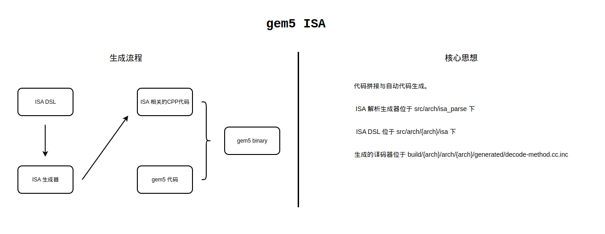

# gem5 中的 ISA 独立性

这篇文章主要解析 gem5 中的 ISA 独立性，并解析从 ISA 中定义的机器指令到能够被 gem5 能够使用的指令的过程。

## ISA 独立性的必然性和 gem5 ISA生成过程图

在 gem5 中，ISA 独立是必然的，gem5 的 cpu 模型需要支持多种的 ISA，面对多种不同的 ISA，必须统一出一种调用机器指令的接口，隐藏不同 ISA 定于的机器指令的区别，这样才能方便 cpu 模型部分的代码编写。这就是所谓的 ISA 独立性，gem5 定义了 `StaticInst` 类来作为 gem5 执行机器指令的统一接口，`StaticInst` 类中定义了一些核心的虚方法（如`execute`等）来供各种ISA进行指令功能的实现，各种不同的 ISA 必须提供自己的译码器，将自己定义的 ISA 解析成 `StaticInst` 并为 gem5 所用。

下图简单的代表 gem5 ISA 生成的过程：



## gem5 ISA 生成过程详解

首先需要明确几个相关文件的位置，在这里都以 ARM 体系结构为例：

1. 最终生成的文件如下：
   - `build/ARM/arch/arm/generated/decode-method.cc.inc`：这是解析完成之后最终生成的译码器文件，cpu中的译码器实际上是调用这个译码器获得指令。
   - `build/ARM/arch/arm/generated/decoder-ns.hh.inc`：这是自动生成的包含 `StaticInst` 的文件，`decode-method.cc.inc` 返回的就是这个文件中定义的类的对象。
   - `build/ARM/arch/arm/generated/decoder-ns.cc.inc`：这是自动生成的文件，其中包含了 `build/ARM/arch/arm/generated/decoder-ns.hh.inc` 中各个类除了 `execute` 核心方法的以外的其他方法的实现。
   - `build/ARM/arch/arm/generated/exec-ns.cc.inc`：这个自动生成的文件中包含了 `build/ARM/arch/arm/generated/decoder-ns.hh.inc` 中类的核心方法如 `execute` 方法的实现。
2. ISA 解析器生成器的路径为 `src/arch/isa_parser/isa_parser.py`。
3. `src/arch/arm/isa` 下存放了对 ARM ISA 的实现，其中：
   - `src/arch/arm/isa/main.isa` 是最主要的被解析的文件，解析器对于 ISA 的解析就从这个文件开始。
   - `src/arch/arm/isa/bitfields.isa` 对位域进行了定义，每种指令的编码中，一定的位域可能会有特别的含义，比如某条指令的 `[31:27]` 位代表一个操作数，以此类推。
   - `src/arch/arm/isa/operands.isa` 操作数的类型进行了定义，并给常见的操作数类型取了别名。
   - `src/arch/arm/isa/decoder` 中包含了对译码器的定义。
   - `src/arch/arm/isa/formats` 包含了对不同样式指令的不同返回结果，本质上来说是对译码器定义的一种补充。
   - `src/arch/arm/isa/templates` 包含了不同的模板，这些模板是最后生成的指令类代码的雏形。
   - `src/arch/arm/isa/insts` 包含了各个指令的具体实现，在实现指令的同时，完成对于各个 `StaticInst` 的生成（是由模板加自定义的信息得到的）。

ISA 解析生成器的代码非常长且复杂，除非是增加对于新的体系结构的支持，这部分的代码应该不会主动阅读了，更多的应该是去看。因此，推断整个 ISA 解析的过程不能够靠阅读源代码，而是简单的通过生成的文件和输入的文件进行对比来推断生成的结果。分析的过程应该从 `src/arch/arm/isa/main.isa` 开始。

`src/arch/arm/isa/main.isa` 中最开始包含了 `##include "arminstobjparams.isa"`，这个类不过多分析，应该是一个帮助类。随后包含了 `##include "bitfields.isa"` 进行了对位域的定义，先将位域定义出来，方便后面的译码器能够解析这些位域。之后包含了 `##include "operands.isa"` 进行了对操作数的定义，指令中的操作数都被抽象成 python 类，对操作数定义之后，能够在后续的 `src/arch/arm/isa/insts` 指令实现中包含这些操作数，由于这些预定义的操作数的类中包含了一些属性、记录了一些信息，这些也能被用于后续的代码生成之中。

随后包含了 `src/arch/arm/isa/templates` 和 `src/arch/arm/isa/insts`，首先对指令进行了具体的实现。在 `src/arch/arm/isa/templates` 中的代码大多如下所示（来自 `src/arch/arm/isa/templates/data64.isa`）：

```cpp
def template DataXImmDeclare {{
class %(class_name)s : public %(base_class)s
{
  private:
    %(reg_idx_arr_decl)s;

  public:
    // Constructor
    %(class_name)s(ExtMachInst machInst, RegIndex _dest,
                   RegIndex _op1, uint64_t _imm);
    Fault execute(ExecContext *, trace::InstRecord *) const override;
};
}};

def template DataXImmConstructor {{
    %(class_name)s::%(class_name)s(ExtMachInst machInst,
                                   RegIndex _dest, RegIndex _op1,
                                   uint64_t _imm) :
        %(base_class)s("%(mnemonic)s", machInst, %(op_class)s,
                       _dest, _op1, _imm)
    {
        %(set_reg_idx_arr)s;
        %(constructor)s;
    }
}};

```

这一看就是包含了对 `StaticInst` 的定义，这些模板中的那些占位符会在 `src/arch/arm/isa/insts` 的文件中被去掉，并生成最终的类定义。`src/arch/arm/isa/insts` 中首先包含了几种利用模板生成代码的方法，随后调用这些方法进行对模板的填充，生成最终的代码。在 `src/arch/arm/isa/insts` 中首先定义了三个变量：

```python
    header_output = ""
    decoder_output = ""
    exec_output = ""
```

后续 `src/arch/arm/isa/insts` 文件中自动生成的代码都会保存在这里，这些变量会被 ISA 解析器解析以生成最后的代码。

`src/arch/arm/isa/insts` 中的一段典型的代码如下（来自 `src/arch/arm/isa/insts/data.isa`）：

```python
def buildImmDataInst(mnem, code, flagType = "logic", suffix = "Imm", \
                         buildCc = True, buildNonCc = True, isBranch = "0", \
                         instFlags = []):
        cCode = carryCode[flagType]
        vCode = overflowCode[flagType]
        negBit = 31
        if flagType == "llbit":
            negBit = 63
        if flagType == "saturate":
            immCcCode = calcQCode
        elif flagType == "ge":
            immCcCode = calcGECode
        else:
            immCcCode = createCcCode(negBit, secondOpRe.sub(immOp2, cCode[0]),
                                     secondOpRe.sub(immOp2, vCode))

        immCode = secondOpRe.sub(immOp2, code)
        immIop = ArmInstObjParams(mnem, mnem.capitalize() + suffix,
                       "DataImmOp",
                       {"code" : immCode,
                        "is_branch" : isBranch,
                        "predicate_test": pickPredicate(immCode)}, instFlags)
        immIopCc = ArmInstObjParams(mnem + "s",
             mnem.capitalize() + suffix + "Cc",
             "DataImmOp",
             {"code" : immCode + immCcCode,
              "is_branch" : isBranch,
              "predicate_test": pickPredicate(immCode + immCcCode)}, instFlags)

        def subst(iop):
            global header_output, decoder_output, exec_output
            header_output += DataImmDeclare.subst(iop)
            decoder_output += DataImmConstructor.subst(iop)
            exec_output += PredOpExecute.subst(iop)

        if buildNonCc:
            subst(immIop)
        if buildCc:
            subst(immIopCc)
```

从这段代码中可以看到对上文提到的 `exec_output` 这些变量进行了更改，表示其生成了一些代码。从代码中 `createCcCode` 可以看出，对其他代码也进行了一些的生成。根据上面的代码我们可以看到是 `subst` 中进行了一些代码生成的操作，而 `subst` 中有调用了其他类的 `subst` 方法，但是开启全局搜索发现，`DataImmDeclare` 和 `DataImmConstructor` 等类只有 cpp 的类定义，没有 python 的类定义，更没有 `subst` 方法。我推测这个 `subst` 方法是在后来 ISA 解析器进行处理的时候进行动态生成的。在 `src/arch/isa_parser/isa_parser.py` ISA 解析器中，有一个 `Template` 类：

```python
class Template:
    def __init__(self, parser, t):
        self.parser = parser
        self.template = t

    def subst(self, d):
        myDict = None

        # Protect non-Python-dict substitutions (e.g. if there's a printf
        # in the templated C++ code)
        template = protectNonSubstPercents(self.template)

        # Build a dict ('myDict') to use for the template substitution.
        # Start with the template namespace.  Make a copy since we're
        # going to modify it.
        myDict = self.parser.templateMap.copy()

        if isinstance(d, InstObjParams):
            # If we're dealing with an InstObjParams object, we need
            # to be a little more sophisticated.  The instruction-wide
            # parameters are already formed, but the parameters which
            # are only function wide still need to be generated.
            compositeCode = ""

            myDict.update(d.__dict__)
            # The "operands" and "snippets" attributes of the InstObjParams
            # objects are for internal use and not substitution.
            del myDict["operands"]
            del myDict["snippets"]

            snippetLabels = [
                l for l in labelRE.findall(template) if l in d.snippets
            ]

            snippets = {
                s: self.parser.mungeSnippet(d.snippets[s])
                for s in snippetLabels
            }

            myDict.update(snippets)

            compositeCode = " ".join(list(map(str, snippets.values())))

            # Add in template itself in case it references any
            # operands explicitly (like Mem)
            compositeCode += " " + template

            operands = SubOperandList(self.parser, compositeCode, d.operands)

            myDict[
                "reg_idx_arr_decl"
            ] = "RegId srcRegIdxArr[%d]; RegId destRegIdxArr[%d]" % (
                d.operands.numSrcRegs + d.srcRegIdxPadding,
                d.operands.numDestRegs + d.destRegIdxPadding,
            )

            # The reinterpret casts are largely because an array with a known
            # size cannot be passed as an argument which is an array with an
            # unknown size in C++.
            myDict[
                "set_reg_idx_arr"
            ] = """
    setRegIdxArrays(
        reinterpret_cast<RegIdArrayPtr>(
            &std::remove_pointer_t<decltype(this)>::srcRegIdxArr),
        reinterpret_cast<RegIdArrayPtr>(
            &std::remove_pointer_t<decltype(this)>::destRegIdxArr));
            """

            pcstate_decl = (
                f"{self.parser.namespace}::PCState __parserAutoPCState;\n"
            )
            myDict["op_decl"] = operands.concatAttrStrings("op_decl")
            if operands.readPC or operands.setPC:
                myDict["op_decl"] += pcstate_decl

            is_src = lambda op: op.is_src
            is_dest = lambda op: op.is_dest

            myDict["op_src_decl"] = operands.concatSomeAttrStrings(
                is_src, "op_src_decl"
            )
            myDict["op_dest_decl"] = operands.concatSomeAttrStrings(
                is_dest, "op_dest_decl"
            )
            if operands.readPC:
                myDict["op_src_decl"] += pcstate_decl
            if operands.setPC:
                myDict["op_dest_decl"] += pcstate_decl

            myDict["op_rd"] = operands.concatAttrStrings("op_rd")
            if operands.readPC:
                myDict["op_rd"] = (
                    "set(__parserAutoPCState, xc->pcState());\n"
                    + myDict["op_rd"]
                )

            # Compose the op_wb string. If we're going to write back the
            # PC state because we changed some of its elements, we'll need to
            # do that as early as possible. That allows later uncoordinated
            # modifications to the PC to layer appropriately.
            reordered = list(operands.items)
            reordered.reverse()
            op_wb_str = ""
            pcWbStr = "xc->pcState(__parserAutoPCState);\n"
            for op_desc in reordered:
                if op_desc.isPCPart() and op_desc.is_dest:
                    op_wb_str = op_desc.op_wb + pcWbStr + op_wb_str
                    pcWbStr = ""
                else:
                    op_wb_str = op_desc.op_wb + op_wb_str
            myDict["op_wb"] = op_wb_str

        elif isinstance(d, dict):
            # if the argument is a dictionary, we just use it.
            myDict.update(d)
        elif hasattr(d, "__dict__"):
            # if the argument is an object, we use its attribute map.
            myDict.update(d.__dict__)
        else:
            raise TypeError("Template.subst() arg must be or have dictionary")
        return template % myDict

    # Convert to string.
    def __str__(self):
        return self.template
```

其中定义了一个 `stbst` 方法，可以看到这个方法的作用是根据传入参数的类型对 `template` 进行补全，补全的应该就是 `template` 中的那些带有百分号的占位符。由此推测先前的那些 `header_output += DataImmDeclare.subst(iop)` 实际上就是解析占位符并进行代码的生成，但是详细的过程不得而知。

继续分析 `src/arch/arm/isa/insts` 下的文件，在 `src/arch/arm/isa/insts/data.isa` 中，后续进行了如 `buildDataInst("and", "Dest = resTemp = Op1 & secondOp;")` 这样的调用，调用之前定义的方法来生成代码，其中`"Dest = resTemp = Op1 & secondOp;"` 便是这条指令的具体实现方式。

在历经 `src/arch/arm/isa/templates` 和 `src/arch/arm/isa/insts` 两步之后，所有的 ARM ISA 都已经被转化成了 gem5 中 `StaticInst` 的子类，接下来要解决的就是译码问题，也就是说，在遇到某一条机器指令的时候，应该返回给 gem5 的是哪个具体的 `StaticInst` 类。实现这个译码过程的是 `src/arch/arm/isa/decoder` 和 `src/arch/arm/isa/formats` 两个部分，`src/arch/arm/isa/decoder` 属于更高层次的译码，其中会调用 `src/arch/arm/isa/formats` 中定义的方法，两部分相互配合完成译码的过程。

`src/arch/arm/isa/decoder` 用的是很像 `switch ... case ...` 的一种语言来进行译码过程的定义，事实也是如此，这部分在后来确实转换成 cpp 实现中的`switch ... case ...` 语句。在 `src/arch/arm/isa/decoder` 中会调用 `src/arch/arm/isa/formats` 文件中的方法，这些方法被嵌入在译码器中，实际上提供了返回相应 `StaticInst` 的正确实现。以 `src/arch/arm/isa/decoder/arm.isa` 中出现的 `0: ArmDataProcReg::armDataProcReg();` 为例，在 `src/arch/arm/isa/formats/data.isa` 中定义了这个 `ArmDataProcReg` 类，其代码如下：

```python
def format ArmDataProcReg() {{
    pclr = '''
                    if (%(dest)s == int_reg::Pc) {
                        return new %(className)ssRegPclr(machInst, %(dest)s,
                                                         %(op1)s, rm, imm5,
                                                         type);
                    } else
    '''
    instDecode = '''
          case %(opcode)#x:
            if (immShift) {
                if (setCc) {
                    %(pclr)s {
                        return new %(className)sRegCc(machInst, %(dest)s,
                                                      %(op1)s, rm, imm5, type);
                    }
                } else {
                    return new %(className)sReg(machInst, %(dest)s, %(op1)s,
                                                 rm, imm5, type);
                }
            } else {
                if (setCc) {
                    return new %(className)sRegRegCc(machInst, %(dest)s,
                                                      %(op1)s, rm, rs, type);
                } else {
                    return new %(className)sRegReg(machInst, %(dest)s,
                                                    %(op1)s, rm, rs, type);
                }
            }
            break;
    '''

    def instCode(opcode, mnem, useDest = True, useOp1 = True):
        global pclr
        if useDest:
            dest = "rd"
        else:
            dest = "int_reg::Zero"
        if useOp1:
            op1 = "rn"
        else:
            op1 = "int_reg::Zero"
        global instDecode, pclrCode
        substDict = { "className": mnem.capitalize(),
                      "opcode": opcode,
                      "dest": dest,
                      "op1": op1 }
        if useDest:
            substDict["pclr"] = pclr % substDict
        else:
            substDict["pclr"] = ""
        return instDecode % substDict

    decode_block = '''
    {
        const bool immShift = (bits(machInst, 4) == 0);
        const bool setCc = (bits(machInst, 20) == 1);
        const uint32_t imm5 = bits(machInst, 11, 7);
        const ArmShiftType type = (ArmShiftType)(uint32_t)bits(machInst, 6, 5);
        const RegIndex rd = (RegIndex)(uint32_t)RD;
        const RegIndex rn = (RegIndex)(uint32_t)RN;
        const RegIndex rm = (RegIndex)(uint32_t)RM;
        const RegIndex rs = (RegIndex)(uint32_t)RS;
        switch (OPCODE) {
    '''
    decode_block += instCode(0x0, "and")
    decode_block += instCode(0x1, "eor")
    decode_block += instCode(0x2, "sub")
    decode_block += instCode(0x3, "rsb")
    decode_block += instCode(0x4, "add")
    decode_block += instCode(0x5, "adc")
    decode_block += instCode(0x6, "sbc")
    decode_block += instCode(0x7, "rsc")
    decode_block += instCode(0x8, "tst", useDest = False)
    decode_block += instCode(0x9, "teq", useDest = False)
    decode_block += instCode(0xa, "cmp", useDest = False)
    decode_block += instCode(0xb, "cmn", useDest = False)
    decode_block += instCode(0xc, "orr")
    decode_block += instCode(0xd, "mov", useOp1 = False)
    decode_block += instCode(0xe, "bic")
    decode_block += instCode(0xf, "mvn", useOp1 = False)
    decode_block += '''
          default:
            return new Unknown(machInst);
        }
    }
    '''
}};
```

其定义了很多的多行字符串，一看就是用来进行代码生成的，不过这里的代码生成是用于译码，放在 `src/arch/arm/isa/decoder/arm.isa` 这个译码器中的。可以看到其中生成的代码都被放入到 `decode_block` 中，ISA 解析生成器后面应该会把这部分代码拿过来用，生成具体的译码器代码。这个类中定义的核心译码代码生成方法就是 `instCode` 方法，可以看到这个方法是根据传入的参数对先前定义的 `instDecode` 进行占位符的填充，而传入的参数包括具体的指令名称和操作码的相关信息，最后生成的 `build/ARM/arch/arm/generated/decode-method.cc.inc` 中就明显包含了这些代码。

至此，整个解析过程就完成了。

## 访存类指令的 ISA DSL 实现

在查看 AtomicSimpleCPU 的时候，发现 AtomicSimpleCPU 的执行并不需要对指令类型进行判断，不管什么指令直接 `execute`，这令人非常的疑惑。于是对各种访存类指令的 `execute` 实现进行查看之后发现访存指令实现的不只是 `initiateAcc` 和 `completeAcc` 这两种方法，其 `execute` 也有实现，并且 `execute` 是特别针对 Atomic 模式实现的，为的就是在 AtomicSimpleCPU 中不需要进行指令类型的判断。