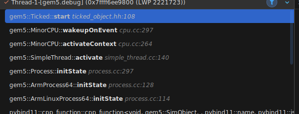

# minor cpu model

基于:[官方文档](https://www.gem5.org/documentation/general_docs/cpu_models/minor_cpu)中对于 minor 的描述

与这个主题相关的文章还有:

- [minor 中各类 buffer 实现](../gem5src/cpu/minor/buffer_hh.md)
- [timebuffer 实现原理](../gem5src/cpu/timebuf_hh.md)
- [核心流水线实现原理](../gem5src/cpu/minor/pipeline.md)

## minor cpu 运行原理

minor 的运行是高度依靠其中的流水线的，说 minor 在运行其实差不多就是说流水线在运行，所以这个流水线是怎么驱动的就很重要。下面分析这个驱动的过程。Process 在[启动](first_inst_runse.md)的时候会调用 minor 的 `MinorCPU::activateContext` 方法，在这个方法中不管怎么样都会调用 `pipeline->wakeupFetch(thread_id);`，在往下看会发现这个方法调用的实际是 `fetch1.wakeupFetch(tid);`，再往下看会发现实际调用的是 `cpu.wakeupOnEvent(Pipeline::Fetch1StageId);`，这里的 cpu 指向的是 minor，于是实际调用的是 `MinorCPU::wakeupOnEvent`，这个方法如下：

```cpp
void
MinorCPU::wakeupOnEvent(unsigned int stage_id)
{
    DPRINTF(Quiesce, "Event wakeup from stage %d\n", stage_id);

    /* Mark that some activity has taken place and start the pipeline */
    activityRecorder->activateStage(stage_id);
    pipeline->start();
}
```

可以看到这个方法中记录了 `activityRecorder` 中对取指阶段的激活，同时调用了 `pipeline->start()`。这个 `start` 实际调用的是 `Ticked::start`（Ticked 是 pipeline 的基类） 方法如下：

```cpp
void
start()
{
    if (!running) {
        if (!event.scheduled())
            object.schedule(event, object.clockEdge(Cycles(1)));
        running = true;
        numCycles += cyclesSinceLastStopped();
        countCycles(cyclesSinceLastStopped());
    }
}
```

可以看到这之中设置了一个 `running` 变量来表示当前的对象是不是在运行，如果不再运行会在下个时钟周期调度一个事件，并将状态设置为运行。

到此为止函数的调用栈为:



`start` 函数中调度的事件是 `Ticked` 类的成员，这个调度的时间的回调函数是 `Ticked::processClockEvent()`，这个函数的实现如下：

```cpp
void
Ticked::processClockEvent() {
    ++tickCycles;
    ++numCycles;
    countCycles(Cycles(1));
    evaluate();
    if (running)
        object.schedule(event, object.clockEdge(Cycles(1)));
}
```

可以看到除了记录相关的时间信息之外，还调用了 `evaluate` 方法，这个方法调用的是 pipeline 的`evaluate`方法，也就是说，就是从这里开始，流水线被驱动工作。

从这个方法中还能看到，其最后还进行了一个判断，如果当前流水线正在运行，那就在下个周期继续调度这个事件，这样往下想的话，如果运行中的程序如果不对 `running` 这个变量的值进行改变，流水线就会一直执行下去。`running` 这个变量是 `Ticked` 的保护变量，等于说想要改变这个变量的值，只能在 pipeline 中改变或者通过公有的方法进行改变，最后发现，通过 `Ticked::stop` 方法能够将这个变量设置为 false：

```cpp
void
stop()
{
    if (running) {
        if (event.scheduled())
            object.deschedule(event);
        running = false;
        resetLastStopped();
    }
}
```

现在非常明确，在需要流水线工作的时候调用 start，在不需要流水线工作或者工作结束的时候调用 stop。

## minor cpu 计时原理

时间的计算方法和之前的有点像，还是利用差值去记录时间。时间的计算在 `Pipeline::evaluate()` 中，调用了 `cpu.tick();` 进行了计算，其实这就是在全局时间上加上了两次调用这个时间的差值，由于这个计时是在 `Pipeline::evaluate()` 中进行的，等于说只要流水线执行一次这个方法就统计一次，也就是说 minor 最后的时间计算方法就是整个程序在流水线上消耗的阶段数乘以时钟周期，就计算得到了结果。
