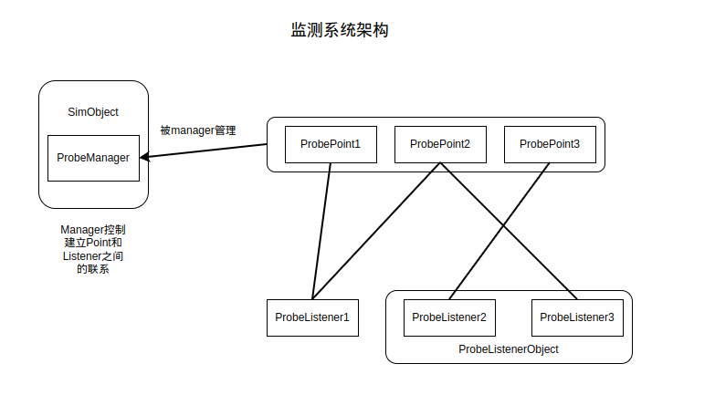

# Probe system in gem5 (Simpoint example)

本节介绍 gem5 中的 Probe System，也就是监测系统，这个监测系统是用来监测 SimObject 的，也就是说在 SimObject 满足某些条件的情况下，会除法监测系统进行工作。

## 关键概念和架构图

有关监测系统的基本定义全部定义在了 `src/sim/probe/probe.hh` 下，这之中有几个最基本的概念，以及针对这些概念衍生出的定义。

监测系统的基本概念如下：

1. ProbePoint：即探测点，探测点依附在探测的对象中。探测对象在某些条件满足的时候会通知探测点，进而探测点通知监听器进行函数回调
   - `ProbePoint`：给出了最基本的探测点的定义。将 `addListener` 和 `removeListener` 作为纯虚函数供子类去做实现。
   - `ProbePointArg`：给出了最基本的探测点的实现。传入的模板参数 `Arg`，同样被用作后续监听器的模板参数。
2. ProbeListener：即监听器，监听器主要用来监听探测点，在某些探测点被触发的时候，监听器中的回调函数被调用。监听器和探测点之间是多对多的关系，一个监听器能够用到多个探测点上，一个探测点也能够触发多个监听器。它们之间的关系是靠探测点的 `name` 变量来维护的，在添加监听的时候要指定探测点的 `name` 才能建立监听。
   - `ProbeListener`：给出了最基本的监听器的实现。
   - `ProbeListenerArgBase`：拓展了 `ProbeListener`，接收模板参数 `Arg`，是后续回调函数接受的参数类型。
   - `ProbeListenerArg`：进一步拓展了 `ProbeListenerArgBase`，对回调函数进行了通用的实现。
   - `ProbeListenerArgFunc`：和 `ProbeListenerArg` 原理类似，只是可以通过 lambda 的方式轻松创建监听器。
   - `ProbeListenerObject`：可以简单的理解成他维护了一堆 `ProbeListener`，同时它本身也是一个 Simobject。
3. ProbeManager：即管理器，实际上用来维护多个探测点和监听器，方便探测点和监听器之间建立联系，同时解耦探测点和监听器。
   - `ProbeManager`：管理器实现。

通过以上的基本概念，可以得到监测系统的架构图：



## 以 SimPoint 为例

已经了解了整体架构之后，这整个过程是怎么建立的又是一个关键的问题。以下以 SimPoint 为例讲述建立的过程，SimPoint 是一个加快仿真速度的工具，其就是通过监测系统进行 cpu 相关的检测，获取相关的信息，最后导出 SimPoint 需要的 BB 格式的信息。

在 gem5 中 SimPoint 只支持 AtomicSimpleCPU，在 python 脚本中，为了在一次执行的过程中导出 BB 格式分析文件，AtomicSimpleCPU 需要调用其方法 `addSimPointProbe`(`src/cpu/simple/BaseAtomicSimpleCPU.py`)：

```python
def addSimPointProbe(self, interval):
    simpoint = SimPoint()
    simpoint.interval = interval
    self.probeListener = simpoint
```

这个方法很简单，重点关注其中的 `simpoint = SimPoint()`，进入到 `SimPoint`(`src/cpu/simple/probes/SimPoint.py`) 的定义中，我们能够发现：

```python
class SimPoint(ProbeListenerObject):
    """Probe for collecting SimPoint Basic Block Vectors (BBVs)."""

    type = "SimPoint"
    cxx_header = "cpu/simple/probes/simpoint.hh"
    cxx_class = "gem5::SimPoint"

    interval = Param.UInt64(100000000, "Interval Size (insts)")
    profile_file = Param.String("simpoint.bb.gz", "BBV (output) file")
```

这个类定义平平无奇，重点在于其继承自 `ProbeListenerObject`，查看其源码 `src/sim/probe/Probe.py`：

```python
class ProbeListenerObject(SimObject):
    type = "ProbeListenerObject"
    cxx_header = "sim/probe/probe.hh"
    cxx_class = "gem5::ProbeListenerObject"

    manager = Param.SimObject(Parent.any, "ProbeManager")
```

可以看到 `manager` 指向了当前对象的父对象，也就是说，只要调用了 `addSimPointProbe` 方法，SimPoint 作为一个 `ProbeListenerObject` 会在后续与 manager 建立联系。

### instantiate阶段

在 `instantiate`(`src/python/m5/simulate.py`)方法中，Simobject对象创建和监测系统创建顺序如下：

```python
# Create the C++ sim objects and connect ports
for obj in root.descendants():
    obj.createCCObject()
for obj in root.descendants():
    obj.connectPorts()

# Do a second pass to finish initializing the sim objects
# ...

# Do a third pass to initialize statistics
# ...

# Do a fourth pass to initialize probe points
for obj in root.descendants():
    obj.regProbePoints()

# Do a fifth pass to connect probe listeners
for obj in root.descendants():
    obj.regProbeListeners()

```

可以看到顺序先进行 SimObject 的 cpp 对象的创建，然后再进行监测系统相关的对象的创建。在 SimObject 的源代码(`src/sim/sim_object.cc`)中我们可以看到：

```cpp
SimObject::SimObject(const Params &p)
    : EventManager(getEventQueue(p.eventq_index)),
      statistics::Group(nullptr), Named(p.name),
      _params(p)
{
    simObjectList.push_back(this);
    probeManager = new ProbeManager(this);
}
```

可以看到每个 SimObject 的内部都隐含了一个 `ProbeManager`，从抽象意义上说，每个 SimObject 我们认为其都具有管理监控点和监听器的能力。

重新回到 AtomicSimpleCPU 和 SimPoint，这之中 AtomicSimpleCPU 应该担任监控点的角色，在合适的时机通知监听器 SimPoint 进行相关的回调操作。可以大胆的猜测 AtomicSimpleCPU 在 `regProbePoints` 要有所作为，而 SimPoint 要在 regProbeListeners 中有所作为。

不出所料：

在 AtomicSimpleCPU(`src/cpu/simple/atomic.cc`) 中

```cpp
void
AtomicSimpleCPU::regProbePoints()
{
    BaseCPU::regProbePoints();

    ppCommit = new ProbePointArg<std::pair<SimpleThread*, const StaticInstPtr>>
                                (getProbeManager(), "Commit");
}
```

在 SimPoint(`src/cpu/simple/probes/simpoint.cc`) 中

```cpp
void
SimPoint::regProbeListeners()
{
    typedef ProbeListenerArg<SimPoint, std::pair<SimpleThread*,StaticInstPtr>>
        SimPointListener;
    listeners.push_back(new SimPointListener(this, "Commit",
                                             &SimPoint::profile));
}
```

两者很巧妙的建立了联系。更多有关 gem5 中的 SimPoint 支持可以查看[这篇文章](./simpoint_gem5.md)。

---

以上就是监测系统建立的过程。
