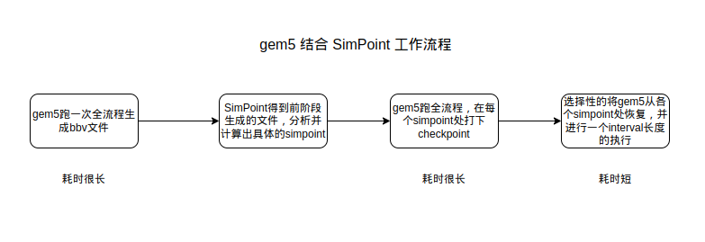

# Weak simpoint support in gem5

本文主要讲解 gem5 中对 simpoibt 的支持。gem5 中能够使用 simpoint，但是只能在运行 AtomicSimpleCPU 时候才能进行对 simpoint 的数据采集，根据 simpoint 的理论，对于 AtomicSimpleCPU 采集的信息严格上来说并不能用于其他类型的 cpu，而对于 AtomicSimpleCPU 的探索往往又是很有限的，因此称这种 simpoint的支持为薄弱的支持。

这里简单的解析下 gem5 中生成 simpoint 所需的基本块(bb)信息的原理。

## 基于 gem5 的 simpoint 加速模拟过程

基于 gem5 的 simpoint 加速分析过程如下图所示：



从图中可以看到，整个流程中对于 gem5 全流程的运行至少需要两次，这对于简单的 AtomicSimpleCPU 来说可能都需要耗费十几个小时以上的时间，假如其支持了乱序，这个时间更可能是用天来计算了。这可能也是 gem5 并不支持乱序的 cpu simpoint的原因，一是信息的采集可能本身就比较难，而是即使采集到了信息，还要跑一次全流程的模拟打下 simpoint，耗时非常的久，所以干脆就不支持了。

## 基于 gem5 的 simpoint 的 bb 信息采集原理

### bb format

采集到的 bb 信息是要拿给 SimPoint 做分析的，SimPoint 自然有它接受的 bbv 的格式，这里首先介绍这种块的格式。

典型的格式为：

```bash
T:45:1024 :189:99343
T:11:78573 :15:1353  :56:1
T:18:45 :12:135353 :56:78 314:4324263
```

即以 `T` 开头，后续向量中的所有表示为`:id:time`，其中id是可以区别各个 bb 的 id，具体怎么取由 bbv 的生成者决定；`time` 即是在这个基本块中消耗的时间。整个 bbv 中各个 `:id:time` 之间使用空格做分隔。这就是 bbv 的格式。

### 采集流程

生成 bbv 的过程需要获取到 cpu 中的信息，这依靠 gem5 的检测系统，有关监测系统的介绍在[监测系统文章](./probesys.md)中有过详细的介绍。下面直接将 simpoint 的监听回调函数(`SimPoint::profile`)是怎么实现的。

首先需要知道的是这个回调在什么时候被调用：

```cpp
fault = curStaticInst->execute(&t_info, traceData);

// keep an instruction count
if (fault == NoFault) {
    countInst();
    ppCommit->notify(std::make_pair(thread, curStaticInst));
} else if (traceData) {
    traceFault();
}
```

这段代码是在 `AtomicSimpleCPU::tick()`中的，也就是说只要指令执行成功，probepoint 就会通知监听器触发回调函数。

以下解释回调函数：

```cpp
SimpleThread* thread = p.first;
const StaticInstPtr &inst = p.second;

if (inst->isMicroop() && !inst->isLastMicroop())
    return;

if (!currentBBVInstCount)
    currentBBV.first = thread->pcState().instAddr();

++intervalCount;
++currentBBVInstCount;
```

第一个 if 的判断是对当前指令是否是微指令的判断，如果当前的指令是微指令就不做记录，也就是说对于 CISC 而言，对待其和 RISC 没什么区别。随后进行的是 `currentBBVInstCount` 是否为 0 的判断， 这个数值为 0 代表了一个新的基本块的开始。随后对 `intervalCount` 进行自增，这是因为在 AtomicSimpleCPU 不管什么指令的执行都只需要一个时钟周期，因此没执行一套指令时钟间隔书加1。currentBBVInstCount自增的意义就不必多说了。

```cpp
if (inst->isControl()) {
    currentBBV.second = thread->pcState().instAddr();

    auto map_itr = bbMap.find(currentBBV);
    if (map_itr == bbMap.end()){
        BBInfo info;
        info.id = bbMap.size() + 1;
        info.insts = currentBBVInstCount;
        info.count = currentBBVInstCount;
        bbMap.insert(std::make_pair(currentBBV, info));
    } else {
        BBInfo& info = map_itr->second;
        info.count += currentBBVInstCount;
    }
    currentBBVInstCount = 0;

    if (intervalCount + intervalDrift >= intervalSize) {
        // ...
    }
}
```

随后对指令的类型进行判断，如果当前的指令是控制指令，则代表一个基本块的结束，需要创建或者更新基本块的信息，并判断时间间隔是不是已经达到了预先设定的时间间隔，如果达到了时间间隔，则需要将基本块的信息导出到 bbv 中。

进入这个判断语句的开始就是将 `currentBBV.second` 设置成当前指令的地址，这样 currentBBV 这个结构就构成了 (begin_pc, end_pc)，代表了一个基本块爱的范围，随后将这个基本块的信息作为 key 在 map 中进行搜索。如果先前已经记录过这个基本块了，直接更新基本块的相关性信息就行了；如果之前没记录过这个基本块，就要创建这个基本块的信息并插入到 map 中。后续将 `currentBBVInstCount` 清 0，代表一个新的基本快的开始。

```cpp
if (inst->isControl()) {
    // ...

    if (intervalCount + intervalDrift >= intervalSize) {
        // summarize interval and display BBV info
        std::vector<std::pair<uint64_t, uint64_t> > counts;
        for (auto map_itr = bbMap.begin(); map_itr != bbMap.end();
                ++map_itr) {
            BBInfo& info = map_itr->second;
            if (info.count != 0) {
                counts.push_back(std::make_pair(info.id, info.count));
                info.count = 0;
            }
        }
        std::sort(counts.begin(), counts.end());

        // Print output BBV info
        *simpointStream->stream() << "T";
        for (auto cnt_itr = counts.begin(); cnt_itr != counts.end();
                ++cnt_itr) {
            *simpointStream->stream() << ":" << cnt_itr->first
                            << ":" << cnt_itr->second << " ";
        }
        *simpointStream->stream() << "\n";

        intervalDrift = (intervalCount + intervalDrift) - intervalSize;
        intervalCount = 0;
    }
}
```

随后的判断 `intervalCount + intervalDrift >= intervalSize` 是在进行时间是否到达 interval 的判断。这里第一眼非常奇怪的可能是 `intervalDrift` 这个变量，考虑这样的场景，在最初的执行中，当前 `intervalCount` 的大小已经达到 `intervalSize - 2`,`intervalDrift`还是 0，在这一轮中显然还不满足这个判断条件，由于不满足条件，马上就进入到了第二个基本块中，假设第二个基本块消耗了 40 个 interval，显然，再进入到这个 if 判断的时候条件已经满足了，但是还超出了 38 个事件间隔，这 38 个时间间隔需要被记录下来，不能白白浪费掉不做记录，于是这部分超出的就被记录到 `intervalDrift` 中。

随后这个 if 中的操作就比较简单了，即从 map 中取出所有基本块信息，记录完成之后将这一轮基本快的信息清 0,将信息输出到文件，重置 `intervalCount` 和计算 `intervalDrift`。

以上就是生成 bbv 的过程了。

## gem5 中 simpoint 的缺陷

1. 如上文所说。
2. `intervalSize` 参数不能设置的太小，不然一个基本块运行的时间大小很可能是好几个 `intervalSize`，会漏记录一些信息。
3. 某种程度上的信息不准确。考虑这种情况，考虑 `intervalSize` 为 1000，而第一个基本快的大小达到 999，同时第二个基本块的大小达到999,这样两个基本块的信息都被记录到生成的 bbv 中，随后 map 被清空，假设再来一个大小为 2 的基本快，它生成 bbv 的时候 map 中几乎是没有信息的，这是因为他的有一部分信息实际上被前面的基本块抢走了。
