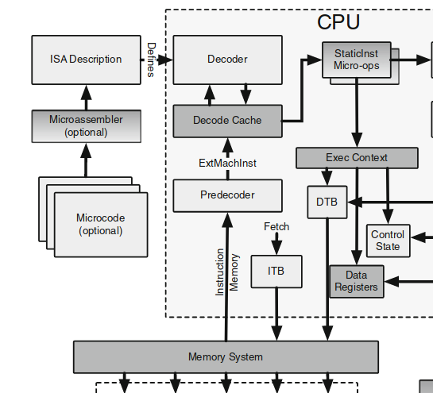

# decoder & decode cache 解析

先给出这部分的架构图：

这张图很清楚的解释了 cpu 译码部分的架构，由 decoder 从内存中获取指令数据，并把指令数据保存在自己的缓冲区中，decoder cache会在必要的时候调用 decoder 的 decode 方法，通过 decoder 进行译码，然后将译码的结果存储在 decoder cache中。cpu 获取的志指令应该是从 decoder cache 中获取的。下详细解释这些组件。

## decoder

decode 定义在 `src/arch/generic/decoder.hh` 中，这是一个抽象类，提供了译码的接口，将由各个体系结构吧自己去实现这个接口。这里主要有几个比较重要的接口：

- `instReady`：表示当前 decoder 是否准备就绪，即是不是已经取到足够多的数据放在缓存中。
- `needMoreBytes`：返回一个 bool 值，表示当前解码器需不需要获取到新的数据填充到自己的缓冲区。
- `moreBytes`：从内存中读取足够多的指令到自己的缓冲区中。
- `decode`：核心的解码方法，由各个 ISA 提供者来具体实现，解码后返回 `StaticInstPtr`，即一个独立于 ISA 的指令形式。

## decoder cache

gem5 先在 `src/cpu/decode_cache.hh` 下实现了 `AddrMap` 作为 decoder cache 的基本组件，后在 `src/arch/generic/decoder.hh` 真正的实现 decoder cache 模板。

### `src/cpu/decode_cache.hh`

```cpp
/// Hash for decoded instructions.
template <typename EMI>
using InstMap = std::unordered_map<EMI, StaticInstPtr>;

/// A sparse map from an Addr to a Value, stored in page chunks.
template<class Value, Addr CacheChunkShift = 12>
class AddrMap
{
  protected:
    static constexpr Addr CacheChunkBytes = 1ULL << CacheChunkShift;

    static constexpr Addr
    chunkOffset(Addr addr)
    {
        return addr & (CacheChunkBytes - 1);
    }

    static constexpr Addr
    chunkStart(Addr addr)
    {
        return addr & ~(CacheChunkBytes - 1);
    }

    // A chunk of cache entries.
    struct CacheChunk
    {
        Value items[CacheChunkBytes];
    };
    // A map of cache chunks which allows a sparse mapping.
    typedef typename std::unordered_map<Addr, CacheChunk *> ChunkMap;
    typedef typename ChunkMap::iterator ChunkIt;
    // Mini cache of recent lookups.
    ChunkIt recent[2];
    ChunkMap chunkMap;

    /// Update the mini cache of recent lookups.
    /// @param recentest The most recent result;
    void
    update(ChunkIt recentest)
    {
        recent[1] = recent[0];
        recent[0] = recentest;
    }

    /// Attempt to find the CacheChunk which goes with a particular
    /// address. First check the small cache of recent results, then
    /// actually look in the hash map.
    /// @param addr The address to look up.
    CacheChunk *
    getChunk(Addr addr)
    {
        Addr chunk_addr = chunkStart(addr);

        // Check against recent lookups.
        if (recent[0] != chunkMap.end()) {
            if (recent[0]->first == chunk_addr)
                return recent[0]->second;
            if (recent[1] != chunkMap.end() &&
                    recent[1]->first == chunk_addr) {
                update(recent[1]);
                // recent[1] has just become recent[0].
                return recent[0]->second;
            }
        }

        // Actually look in the hash_map.
        ChunkIt it = chunkMap.find(chunk_addr);
        if (it != chunkMap.end()) {
            update(it);
            return it->second;
        }

        // Didn't find an existing chunk, so add a new one.
        CacheChunk *newChunk = new CacheChunk;
        typename ChunkMap::value_type to_insert(chunk_addr, newChunk);
        update(chunkMap.insert(to_insert).first);
        return newChunk;
    }

  public:
    /// Constructor
    AddrMap()
    {
        recent[0] = recent[1] = chunkMap.end();
    }

    Value &
    lookup(Addr addr)
    {
        CacheChunk *chunk = getChunk(addr);
        return chunk->items[chunkOffset(addr)];
    }
};
```

这个文件中首先声明了一个 `InstMap` 类型，这是一个从具体的机器指令到 gem5 中指令的 map，后续会有所使用。

对于 `AddrMap` 类，首先给出三个静态变量。随后定义 `CacheChunk` 即一个缓存块，一个缓存块可以包含多个 Value 数值。定义 `recent` 迭代器缓存用于加快查找，`chunkMap` 用来定义全局的 chunk 存储。`update` 方法用来更新迭代器缓存。`getChunk` 对于给定的地址返回缓存块。`lookup` 对于给定的地址返回其中缓存块的条目。

## `src/arch/generic/decoder.hh`

```cpp
template <typename Decoder, typename EMI>
class BasicDecodeCache
{
  private:
    decode_cache::InstMap<EMI> instMap;
    struct AddrMapEntry
    {
        StaticInstPtr inst;
        EMI machInst;
    };
    decode_cache::AddrMap<AddrMapEntry> decodePages;

  public:
    /// Decode a machine instruction.
    /// @param mach_inst The binary instruction to decode.
    /// @retval A pointer to the corresponding StaticInst object.
    StaticInstPtr
    decode(Decoder *const decoder, EMI mach_inst, Addr addr)
    {
        auto &entry = decodePages.lookup(addr);
        if (entry.inst && (entry.machInst == mach_inst))
            return entry.inst;

        entry.machInst = mach_inst;

        auto iter = instMap.find(mach_inst);
        if (iter != instMap.end()) {
            entry.inst = iter->second;
            return entry.inst;
        }

        entry.inst = decoder->decodeInst(mach_inst);
        instMap[mach_inst] = entry.inst;
        return entry.inst;
    }
};
```

可以看到这个基本的缓存块实现中使用了 `instMap` 来加速译码过程，同时刚刚存储在缓存块中的 Value 类型为 `AddrMapEntry`。`decode` 实现核心的译码过程，并将 `StaticInstPtr` 返回给 cpu。这个方法的核心就是调用译码器进行译码，并更新相关的数值。
