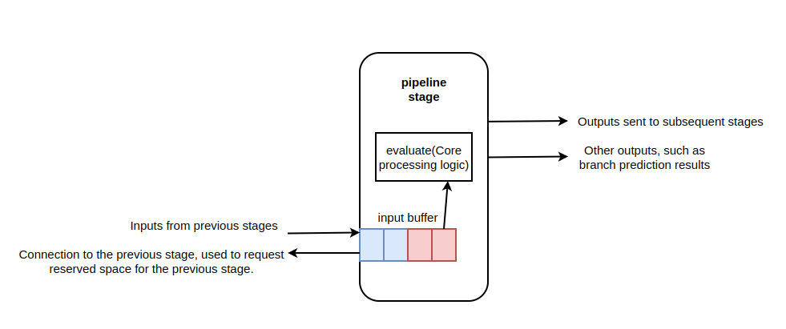
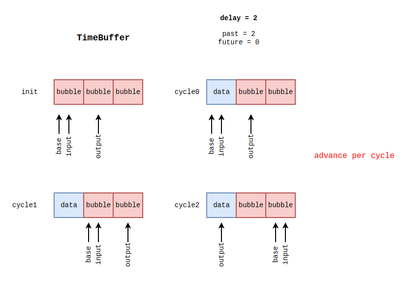

# minor pipeline

pipeline 是 minor 中的核心部件，minor 实际上就是在依靠 pipeline 在执行。查看 `src/cpu/minor/pipeline.hh` 可以看到核心的成员如下：

```cpp
class Pipeline : public Ticked
{
  protected:
    MinorCPU &cpu;

    /** Allow cycles to be skipped when the pipeline is idle */
    bool allow_idling;

    Latch<ForwardLineData> f1ToF2;
    Latch<BranchData> f2ToF1;
    Latch<ForwardInstData> f2ToD;
    Latch<ForwardInstData> dToE;
    Latch<BranchData> eToF1;

    Execute execute;
    Decode decode;
    Fetch2 fetch2;
    Fetch1 fetch1;


    MinorActivityRecorder activityRecorder;

    // ...
}
```

其中设置的 `allow_idling` 主要和 cpu 空闲时间的计时有关。可以从命名看到流水线中建模了四个流水线阶段，同时用 `Latch` 来表示各个阶段之间的锁存器数据通路。设置了 `MinorActivityRecorder` 来记录每个周期流水线阶段是否产生输出，能够产生输出的流水线阶段被称为是活跃的，程序就通过 `MinorActivityRecorder` 中是否有阶段活跃来判断流水线是否结束工作。

流水线中的核心函数是 `evaluate` 函数：

```cpp
void
Pipeline::evaluate()
{
    /** We tick the CPU to update the BaseCPU cycle counters */
    cpu.tick();

    /* Note that it's important to evaluate the stages in order to allow
     *  'immediate', 0-time-offset TimeBuffer activity to be visible from
     *  later stages to earlier ones in the same cycle */
    execute.evaluate();
    decode.evaluate();
    fetch2.evaluate();
    fetch1.evaluate();

    if (debug::MinorTrace)
        minorTrace();

    /* Update the time buffers after the stages */
    f1ToF2.evaluate();
    f2ToF1.evaluate();
    f2ToD.evaluate();
    dToE.evaluate();
    eToF1.evaluate();

    /* The activity recorder must be be called after all the stages and
     *  before the idler (which acts on the advice of the activity recorder */
    activityRecorder.evaluate();

    if (allow_idling) {
        /* Become idle if we can but are not draining */
        if (!activityRecorder.active() && !needToSignalDrained) {
            DPRINTF(Quiesce, "Suspending as the processor is idle\n");
            stop();
        }

        /* Deactivate all stages.  Note that the stages *could*
         *  activate and deactivate themselves but that's fraught
         *  with additional difficulty.
         *  As organised herre */
        activityRecorder.deactivateStage(Pipeline::CPUStageId);
        activityRecorder.deactivateStage(Pipeline::Fetch1StageId);
        activityRecorder.deactivateStage(Pipeline::Fetch2StageId);
        activityRecorder.deactivateStage(Pipeline::DecodeStageId);
        activityRecorder.deactivateStage(Pipeline::ExecuteStageId);
    }

    if (needToSignalDrained) /* Must be draining */
    {
        DPRINTF(Drain, "Still draining\n");
        if (isDrained()) {
            DPRINTF(Drain, "Signalling end of draining\n");
            cpu.signalDrainDone();
            needToSignalDrained = false;
            stop();
        }
    }
}
```

::: details evaluate 中函数调用顺序问题

在 evaluate 中的函数调用顺序很有学问，会引出以下两个问题：

1. 流水线各个阶段的处理为什么是从 execute 开始而不是从 fetch1 开始？
2. 流水线各个阶段的处理为什么先于流水线寄存器的处理？

对于第一个问题，先从 execute 开始的好处是，在流水线靠后阶段产生的结果能够前递，毕竟前面的阶段还没开始，这就是顺序从后开始的原因，如果硬是要变换顺序也行，就是后阶段产生的结果需要通过一定延迟的向前传递，等到后续几个周期才能够处理，而不是能够直接无延迟的前递。

第二个问题比较无所谓，感觉谁先都行，因为流水线开始都是空的，谁先都无所谓。寄存器先就是，更新本阶段的数据，本阶段执行。流水线阶段先就是，执行本阶段的操作，为下个寄存器阶段更新数据。

:::

首先调用 cpu 的 tick 函数来进行时间的记录。随后按照 execute 到 fetch1 的顺序执行流水线各个阶段，随后按照 fetch 到 execute 的顺序更新流水线之间的各个寄存器，以上步骤完成之后更新 `activityRecorder`。随后判断在设置了 `allow_idling` 的情况下，如果符合条件可以停止流水线。随后判断在需要清空流水线的情况下符合条件就能停止流水线。

各个流水线阶段的结构图如下：



除了常规的流水线阶段结构之外，还加入了一些比较特别的建模设计。各个流水线处理逻辑中的数据是从 inputbuffer 中取的，inputbuffer 的设计是用来平衡各个流水线阶段之间的速度差异的，在 gem5 的 minor 配置中，可以配置各个流水线阶段的宽度，所谓宽度就是其能够在单个时钟周期内处理的数目，在各个阶段宽度设置不同的情况下。各个阶段进行处理的速度不同，有时候很可能前一阶段来的宽度大，但是本阶段的处理速度慢，于是就要将没处理完的数据先缓存起来，等到下次再进行处理。这个缓存就是 inputbuffer，在每个阶段的开始，流水线的各个阶段都会把当前阶段接收到的流水线输入放入到 inputbuffer（FIFO） 中，然后从 inputbuffer 的头部取出数据，这个数据可能是前阶段也可能是当前阶段的，对于拿到的数据进行处理，在本阶段完成之后，如果发现将前阶段的数据处理完了，九江这个数据从 inputbuffer 中移出，否则继续留在这个 buffer 中。

pipeline 的构造函数如下：

```cpp
Pipeline::Pipeline(MinorCPU &cpu_, const BaseMinorCPUParams &params) :
    Ticked(cpu_, &(cpu_.BaseCPU::baseStats.numCycles)),
    cpu(cpu_),
    allow_idling(params.enableIdling),
    f1ToF2(cpu.name() + ".f1ToF2", "lines",
        params.fetch1ToFetch2ForwardDelay),
    f2ToF1(cpu.name() + ".f2ToF1", "prediction",
        params.fetch1ToFetch2BackwardDelay, true),
    f2ToD(cpu.name() + ".f2ToD", "insts",
        params.fetch2ToDecodeForwardDelay),
    dToE(cpu.name() + ".dToE", "insts",
        params.decodeToExecuteForwardDelay),
    eToF1(cpu.name() + ".eToF1", "branch",
        params.executeBranchDelay),
    execute(cpu.name() + ".execute", cpu, params,
        dToE.output(), eToF1.input()),
    decode(cpu.name() + ".decode", cpu, params,
        f2ToD.output(), dToE.input(), execute.inputBuffer),
    fetch2(cpu.name() + ".fetch2", cpu, params,
        f1ToF2.output(), eToF1.output(), f2ToF1.input(), f2ToD.input(),
        decode.inputBuffer),
    fetch1(cpu.name() + ".fetch1", cpu, params,
        eToF1.output(), f1ToF2.input(), f2ToF1.output(), fetch2.inputBuffer),
    activityRecorder(cpu.name() + ".activity", Num_StageId,
        /* The max depth of inter-stage FIFOs */
        std::max(params.fetch1ToFetch2ForwardDelay,
        std::max(params.fetch2ToDecodeForwardDelay,
        std::max(params.decodeToExecuteForwardDelay,
        params.executeBranchDelay)))),
    needToSignalDrained(false)
{
    // ... 
}
```

pipeline 的构造函数实现的主要是对各个阶段和各个阶段之间的寄存器进行初始化。各个阶段的初始化不再多说，各个寄存器之间的初始化主要使用用户传入的延迟进行初始化， `activityRecorder` 也是。

::: details 流水线阶段寄存器的延迟实现

Latch 本质上是用timebuffer 实现的，假设延迟为 2，从下图中可以看到具体的延迟实现。



:::

## 各个流水线阶段的 evaluate 过程

各个阶段的处理裸机肯定是不同的，这里只是抽象出一个公共的处理逻辑，帮助对于源代码的理解。

从寄存器中获取输入 -> 将输入放入到 inputbuffer 中 -> 从 buffer 中取出本阶段需要处理的数据 -> 实现本阶段需要完成的逻辑，并写入到输出寄存器 -> 如果本阶段产生了输出，则用 `activityRecorder` 记录本阶段是活跃的 -> 如果本阶段使用完成了 buffer 中的数据，将数据从 bufer 中移出。

## Fetch1 阶段

Fetch1 完成的工作是取指。Fetch1 首先处理的是分支预测的相关数据，可能涉及到流的改变清空指令之类的。随后进入到正常的流程就是取指，这个阶段首先发起对 ITLB 的地址翻译请求，并将请求插入到 Request 队列中；当 ITLB 请求完成的时候，发起对于内存的取指请求，并将请求放入到 Transfer 队列中。随后从内存中得到数据之后，将数据发送给 Fetch2 阶段。

## Fetch2 阶段

这个阶段主要进行分支预测和译码。首先接受到来自 Execute 阶段的分支预测验证结果，如果之前的预测结果和验证结果出现偏差，则会对 BTB 进行更新。随后进行分支预测，并将分支预测的结果写入到 Latch 中向 Fetch1 中传递，使 Fetch1 在下个时钟周期能够获得分支预测的结果。随后进行的就是译码，根据前一阶段得到的内存数据，将指令转换成 StaticInst 的形式，并创建出 DynInst，供本阶段和后续阶段使用。

## Decode 阶段

这个阶段主要的工作是微指令的译码，对于 RISC 来说这个阶段好像没什么用。

## Execute 阶段

利用记分牌管理依赖关系，将合适的指令发送到功能单元进行执行。如果执行是分支指令，需要把结果向 Fetch1 和 Fetch2 传递。