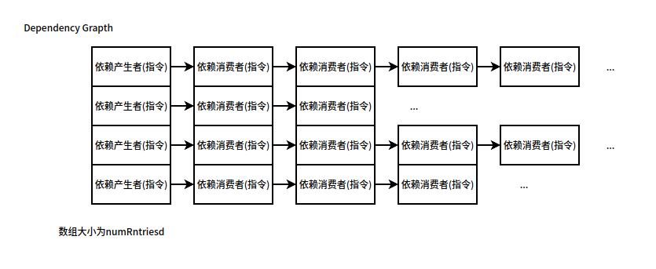

# DependencyGraph 依赖图

用简单的链表数组的形式维护依赖关系，其定义实现在 `dep_graph.hh` 中。

## 数据结构

1. DependencyEntry：链表的节点，包含一条指令和下一个节点的指针。
2. DependencyGraph：链表数据，数组中的每个节点都是链表。

## 核心api

1. resize：将数组大小重整为给定的大小。
2. reset：直接清空整个数组。
3. insert：头插法，在某个依赖生产者之后插入消费者。
4. setInst：将某个依赖生产者设置为某一条指令。
5. clearInst：将某一个依赖生产者置空。
6. remove：移除某个生产者中指定的消费者指令。
7. pop：移除生产者后面的一个消费者节点，并返回这个被移除的节点。
8. empty：接收参数时候，检测某个生产者是否有消费者，如果没有消费者返回true。不接受参数的时候检测整个数组的生产者是否有消费者。
