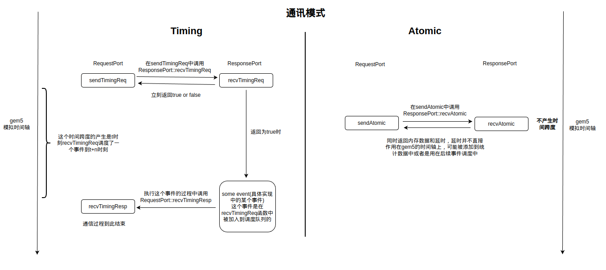

# port.hh

总共有两个 `port.hh` 文件，一个在 sim 目录下，一个在 mem 目录下，sim 目录下的只是对 `port` 的简单定义，而 mem 下的是对 `port` 的拓展。首先的拓展是为 `Packet` 定义了一个拓展类，使其能够记录 `Packet` 的传输过程。然后进行 `port` 功能的详细定义。

gem5 中主要需要去实现三种通信模式供 `port` 通信，因此 gem5 分别将这三种模式的接口拆分到 `mem/protocal` 目录下，并在 `port` 中继承这几个接口并对其做实现，但实际上这里的 `port` 也还没对这些接口实现完全。这个文件中的 `port` 更多的还是继续提供接口，具体的 `port` 实现还得到各个组件中去看，比如说 cpu 或者内存中去看。

然后就是 `RequestPort` 和 `ResponsePort` 的实现是几乎对称的，一端请求的发出会调用另一端的响应方法，以此来实现通信。以 `Timing` 模式为例，请求在发出之后会立即返回，但是响应则是需要等到几个内存读取的时间后才取得。

## Timing vs Atomic

这里主要讲解 Timing 和 Atomic 两种通信模式的原理。在上文中提到的，定义在 `src/mem/port.hh` 中的 port 只提供了最基础的实现，一般需要通过其他组件对它们需要用到的 port 做客制化的实现。下面的图中主要给出两种通讯方式的通讯图：

从上述两种调用方式中能够分析出 AtomicSimpleCPU 在 gem5 中的运行速度（指 gem5 运行脚本的速度）会快于 TimingSimpleCPU。在 AtomicSimpleCPU 中的 Atomic 通信方式下，对于内存的请求返回数据的同时也直接返回延迟，只需要一个事件调度就完成的内存访问。而 TimingSimpleCPU 工作在 Timing 的通信模式下，对于一次访问内存的请求，首先返回的是一个 bool 值，再经过一段时间之后还需要重新调度事件获得结果，平白无故的多了一次事件调度，降低了运行的速度。当然速度的不同可能是很多因素造成的，这只是其中一个因素而已。
