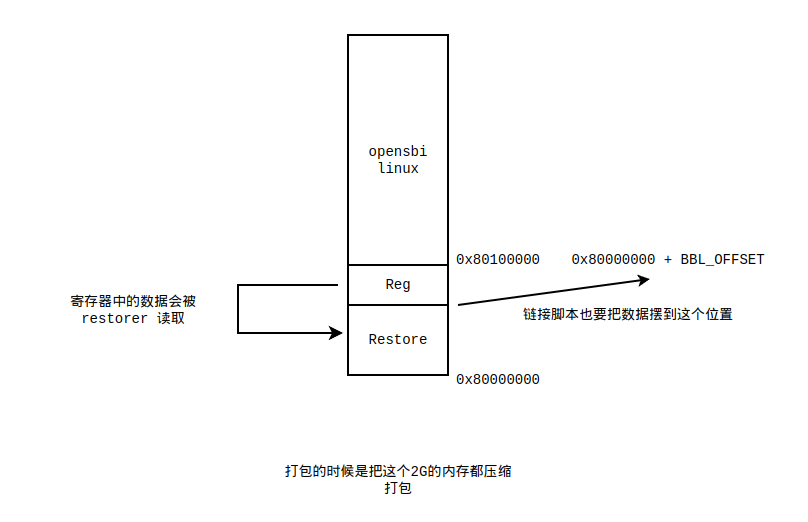

# nemu 基础与 nemu/gem5 difftest

主要是想了解 nemu 的基本原理以及和 gem5 的 difftest.

## difftest with gem5

在与 gem5 进行 difftest 的时候,nemu 会打包成共享库。gem5 会在运行的时候加载共享库，然后调用其中的函数进行 difftest.

difftest.c 中包含了 5 个头文件：

```c
#include <isa.h>                // isa 相关的信息，与 isa 相关的函数定义
#include <memory/paddr.h>       // 模拟器内存空间相关的定义
#include <memory/sparseram.h>   // sparse 内存模型的支持
#include <cpu/cpu.h>            // cpu 内部的状态，异常的支持
#include <difftest.h>           // 所用寄存器的字节计算
```

在 gem5 中使用到了几个函数.

### difftest_init

调用了 isa_init 和 mem_init。实际上就是初始化了内存状态和体系结构状态。对于内存而言，其只是调用了 `paddr.c` 中的allocate_memory_with_mmap 函数，来为单个硬件线程分配所有的物理内存空间，对于 nemu 的虚拟 cpu 这就是其物理内存，而这是通过 mmap 映射到我们本机的虚拟内存上的。

然后就是 isa_init 初始化体系结构寄存器状态。

```c
void init_isa() {
  // NEMU has some cached states and some static variables in the source code.
  // They are assumed to have initialized states every time when the dynamic lib is loaded.
  // However, if we link NEMU as a static library, we have to manually initialize them.
  // 设置第二次调用标志，第二次调用的时候不重置 csr
  static bool is_second_call = false;
  if (is_second_call) {
    memset(csr_array, 0, sizeof(csr_array));
  }
  // 这里其实就是给某类 csr 进行标记，表示当前某类 csr 寄存器是不是存在
  // 如果开启了 H 拓展，H 模式被设置为 0
  init_csr();

#ifndef CONFIG_RESET_FROM_MMIO
  cpu.pc = RESET_VECTOR;
#else
  // 在 difftest 下 pc 的恢复地址被设置成这个地址
  // 这个地址具体是什么尚不明确
  cpu.pc = CONFIG_MMIO_RESET_VECTOR;
#endif
  // lr/sc 相关的
  cpu.lr_valid = 0;

  // 0 号寄存器设置成0
  cpu.gpr[0]._64 = 0;

  // 工作在 m 态
  cpu.mode = MODE_M;
  // For RV64 systems, the SXL and UXL fields are WARL fields that
  // control the value of XLEN for S-mode and U-mode, respectively.
  // For RV64 systems, if S-mode is not supported, then SXL is hardwired to zero.
  // For RV64 systems, if U-mode is not supported, then UXL is hardwired to zero.
  // 设置 mstatus 的 val，暂时不明确含义
  mstatus->val = 0xaUL << 32;
  // initialize the value fs and vs to 0
  // 设置浮点和向量寄存器的保存状态
  mstatus->fs = 0;
  mstatus->vs = 0;
  // initialize SDT, MDT
  // m态下的可重入中断相关，需要拓展支持
  mstatus->mdt = ISDEF(CONFIG_RV_SMDBLTRP);
#ifdef CONFIG_RV_SSDBLTRP
  mstatus->sdt = 0;
  vsstatus->sdt = 0;
  menvcfg->dte = 1;
  henvcfg->dte = 1;
#endif //CONFIG_RV_SSDBLTRP
#ifdef CONFIG_RV_SMRNMI
//  mnstatus->nmie = 0;
// as opensbi and linux not support smrnmi, so we init nmie = 1 to pass ci
  mnstatus->nmie = 1;
#endif //CONFIG_RV_SMRNMI

#ifdef CONFIG_RV_SSTC
  menvcfg->stce = 1;
  stimecmp->val = 0xffffffffffffffffULL;
#ifdef CONFIG_RVH
  henvcfg->stce = 1;
  vstimecmp->val = 0xffffffffffffffffULL;
#endif
#endif

#ifdef CONFIG_RV_SVPBMT
  menvcfg->pbmte = 0;
  henvcfg->pbmte = 0;
#endif //CONFIG_RV_SVPBMT

#ifdef CONFIG_RV_CBO
  menvcfg->cbze = 1;
  menvcfg->cbcfe = 1;
  menvcfg->cbie = 3;
  senvcfg->cbze = 1;
  senvcfg->cbcfe = 1;
  senvcfg->cbie = 3;
#ifdef CONFIG_RVH
  henvcfg->cbze = 1;
  henvcfg->cbcfe = 1;
  henvcfg->cbie = 3;
#endif
#endif

#ifdef CONFIG_RV_PMP_ENTRY_16
  // 开启物理内存保护的支持
  pmpcfg0->val = 0;
  pmpcfg2->val = 0;
#endif // CONFIG_RV_PMP_ENTRY_16
#ifdef CONFIG_RV_PMP_ENTRY_64
  pmpcfg0->val = 0;
  pmpcfg2->val = 0;
  pmpcfg4->val = 0;
  pmpcfg6->val = 0;
  pmpcfg8->val = 0;
  pmpcfg10->val = 0;
  pmpcfg12->val = 0;
  pmpcfg14->val = 0;
#endif // CONFIG_RV_PMP_ENTRY_64

#define ext(e) (1 << ((e) - 'a'))
// 设置当前处理器开启了哪些拓展
  misa->extensions = ext('i') | ext('m') | ext('a') | ext('c') | ext('s') | ext('u');
#ifndef CONFIG_FPU_NONE
  misa->extensions |= ext('d') | ext('f');
#endif // CONFIG_FPU_NONE
#ifdef CONFIG_RVH
  misa->extensions |= ext('h');
  hstatus->vsxl = 2; // equal to max len (spike)
  vsstatus->val = mstatus->val & SSTATUS_RMASK;
  mideleg->val |= ((1 << 12) | (1 << 10) | (1 << 6) | (1 << 2));
#endif // CONFIG_RVH
#ifdef CONFIG_RVB
  misa->extensions |= ext('b');
#endif // CONFIG_RVB
#ifdef CONFIG_RV_IMSIC
  miselect->val = 0;
  siselect->val = 0;
  vsiselect->val = 0;
  mireg->val = 0;
  sireg->val = 0;
  vsireg->val = 0;
  mtopi->val = 0;
  stopi->val = 0;
  vstopi->val = 0;
  mvien->val = 0;
  mvip->val = 0;
  hvien->val = 0;
  hvictl->val = 0;
  hviprio1->val = 0;
  hviprio2->val = 0;
  mtopei->val = 0;
  stopei->val = 0;
  vstopei->val = 0;
#endif // CONFIG_RV_IMSIC
  // xlen 为 64
  misa->mxl = 2; // XLEN = 64

#ifdef CONFIG_RVV
  // vector
  misa->extensions |= ext('v');
  // 用于动态设置访问向量寄存器
  vl->val = 0;
  // 设置 vill
  vtype->val = (uint64_t) 1 << 63; // actually should be 1 << 63 (set vill bit to forbidd)
  // 以字节为单位表示向量的最大长度
  vlenb->val = VLEN/8;
#endif // CONFIG_RVV

  // mcycle and minstret record :
  // - the difference between the absolute number and the write value, when the bit of mcountinhibit is clear;
  // - the inhibited number, when the bit of mcountinhibit is set.
  // 机器计数器相关
  mcycle->val = 0;
  minstret->val = 0;

#ifdef CONFIG_RV_CSR_MCOUNTINHIBIT
  mcountinhibit->val = 0; 
#endif // CONFIG_RV_CSR_MCOUNTINHIBIT

  // All hpm counters are read-only zero in NEMU
  // 清空硬件性能参数相关的
  MAP(CSRS_UNPRIV_HPMCOUNTER, CSR_ZERO_INIT);
  MAP(CSRS_M_HPMCOUNTER, CSR_ZERO_INIT);
  MAP(CSRS_M_HPMEVENT, CSR_ZERO_INIT);

// 封装机器信息的 csr 的设置
// 这是 xiangshan 独有的信息设置
#ifdef CONFIG_USE_XS_ARCH_CSRS
  mvendorid->val = 0;
  marchid->val = 25;
  mimpid->val = 0;
#else
  mvendorid->val = CONFIG_MVENDORID_VALUE;
  marchid->val = CONFIG_MARCHID_VALUE;
  mimpid->val = CONFIG_MIMPID_VALUE;
#endif // CONFIG_USE_XS_ARCH_CSRS

#ifdef CONFIG_RV_SDTRIG
  init_trigger();
#endif // CONFIG_RV_SDTRIG

#define MSTATEEN0_RESET  0xdc00000000000001ULL
#define HSTATEEN0_RESET  0xdc00000000000001ULL
#define SSTATEEN0_RESET  0x0000000000000001ULL
#ifdef CONFIG_RV_SMSTATEEN
  mstateen0->val = MSTATEEN0_RESET;
  hstateen0->val = HSTATEEN0_RESET;
  sstateen0->val = SSTATEEN0_RESET;
#endif // CONFIG_RV_SMSTATEEN

#ifndef CONFIG_SHARE
  extern char *cpt_file;
  extern bool checkpoint_restoring;
  if (cpt_file == NULL && !checkpoint_restoring) {
    #ifdef CONFIG_USE_SPARSEMM
    sparse_mem_write(get_sparsemm(), RESET_VECTOR, sizeof(img), img);
    #else
    memcpy(guest_to_host(RESET_VECTOR), img, sizeof(img));
    #endif
  }
#endif

  #if defined(CONFIG_LIGHTQS) || !defined(CONFIG_SHARE)
  init_clint();
  #endif

  if (!is_second_call) {
    // 共享库情况下的第一次调用 init_device
    // 其实就是对设备的寄存器进行初始化
    IFDEF(CONFIG_SHARE, init_device());
  }

#ifndef CONFIG_SHARE
  Log("NEMU will start from pc 0x%lx", cpu.pc);
#endif
  // 将当前 csr 的状态拷贝到 cpu 这个数据结构中
  csr_prepare();

  // 表示第一次的调用已经完成，接下来的话就是第二次的调用
  is_second_call = true;
}

```

### difftest_get_backed_memory

调用这个函数能将备用的内存恢复到 nemu 中。

### difftest_memcpy

一个 difftest 的 memcpy 的封装实现，调用这个接口可以把数据往虚拟机的内存拷贝。

### difftest_regcpy

调用这个接口，可以从 gem5 把数据恢复到 nemu 的寄存器中，csr mmu 也同步更新。

### difftest_csrcpy

同样的调用这个接口数字恢复到 csr 中。

### difftest_uarchstatus_cpy

用于建立微体系结构的同步状态(LL/SC)。

### difftest_exec

调用这个接口告知 nemu 向下执行 n 条指令，在编译成动态库的情况下 n 条指令一条一条执行。

### difftest_guided_exec

执行一条指令，执行的时候附带从 gem5 传过来的中断等信息。

### update_dynamic_config

从外部传递一些信息，动态的改变配置。

### difftest_store_commit

将 nemu queue 中维护的 store queue 的头部返回。返回为 1 代表数据结构正确返回了，返回为 0 代表没有正确返回。

### difftest_raise_intr

传入一个中断号，进行中断的处理。变更 nemu 内部的一些机器状态，并把中断入口的地址传给 nemu.

### isa_reg_display

打印出 nemu 中所有的寄存器状态.

### difftest_query_ref

将内存访问的结果拷贝回给入的指针中。

## 检查点生成 

检查点生成对应于 simpoint 的 profiling/checkpoint 过程，主要使用了 zlib 来压缩机器状态。

对于给定参数的解析放在 monitor 的 parse_arg，直接对着表找参数就行了，参数的命令都比较浅显，这里我想注意的是 -r 参数，也就是 restorer 的参数，这个参数造成的影响就是把恢复程序赋值给 restorer。同时由于传入了 simpoint profiling 参数，某个变量标记当前处在 simpoint 的模式下。

```c
void init_monitor(int argc, char *argv[]) {
  /* Perform some global initialization. */

  /* Parse arguments. */
#ifdef CONFIG_MODE_USER
  int user_argidx = parse_args(argc, argv);
#else
  // 解析参数
  parse_args(argc, argv);
#endif

  /* Open the log file. */
  init_log(log_file, fast_log, small_log);

  if (warmup_interval == 0) {
    warmup_interval = checkpoint_interval;
  }

  if (map_image_as_output_cpt) {
    // 这个暂时没有设置过
    assert(!mapped_cpt_file);
    mapped_cpt_file = img_file;
    checkpoint_restoring = true;
  }

  extern void init_path_manager();
  extern void simpoint_init();
  extern void init_serializer();

  //checkpoint and profiling set output
  bool output_features_enabled = checkpoint_state != NoCheckpoint || profiling_state == SimpointProfiling;
  if (output_features_enabled) {
    // 初始化路径管理器
    init_path_manager();
    // 创建输出文件名
    simpoint_init();
    // 序列化管理者 也是checkpoint 的创造者
    init_serializer();
  }

  /* Initialize memory. */
  // 启示就是分配本机的虚拟内存空间代表虚拟机的物理内存
  init_mem();

  /* Load the image to memory. This will overwrite the built-in image. */
  // 用户态，暂时没用过
#ifdef CONFIG_MODE_USER
  int user_argc = argc - user_argidx;
  char **user_argv = argv + user_argidx;
  void init_user(char *elfpath, int argc, char *argv[]);
  init_user(img_file, user_argc, user_argv);
#else
  /* Perform ISA dependent initialization. */
  // 初始化 isa 相关的状态，注意这里初始化了刚开始的 pc
  init_isa();

  int64_t img_size = 0;

  // img_file 就是
  assert(img_file);
  // 设定 bbl_start 为 RESET_VECTOR，注意 cpu.pc 也是这个值
  // paddr.h #define RESET_VECTOR (CONFIG_MBASE + CONFIG_PC_RESET_OFFSET)
  //                               0x80000000            0(暂时设计为 0)
  uint64_t bbl_start = RESET_VECTOR;
  // 如果给出了 restorer
  if (restorer) {
    // 开始处加上这一段偏移（0x100000）
    bbl_start += CONFIG_BBL_OFFSET_WITH_CPT;
  }
  // 将传入的镜像 opensbi + linux 加载到 bbl_start 这个内存地址
  img_size = load_img(img_file, "image (checkpoint/bare metal app/bbl) form cmdline", bbl_start, 0);

  // 如果传入了 restorer
  if (restorer) {
    FILE *restore_fp = fopen(restorer, "rb");
    Assert(restore_fp, "Can not open '%s'", restorer);

    int restore_size = 0;
    int restore_jmp_inst = 0;

    int ret = fread(&restore_jmp_inst, sizeof(int), 1, restore_fp);
    assert(ret == 1);
    assert(restore_jmp_inst != 0);

    ret = fread(&restore_size, sizeof(int), 1, restore_fp);
    assert(ret == 1);
    assert(restore_size != 0);

    fclose(restore_fp);
    // 前面进行一系列的检查，保证 restore 的完好
    // 这里被加载到 reset vector
    load_img(restorer, "Gcpt restorer form cmdline", RESET_VECTOR, restore_size);
  }

  /* Initialize differential testing. */
  // 在 生成 checkpoint 的时候这个函数无效
  init_difftest(diff_so_file, img_size, difftest_port);

  /* Initialize devices. */
  // 初始化各种 外设
  init_device();

#endif

  /* Compile the regular expressions. */
  // 这是为执行引擎做的工作
  init_regex();

  /* Initialize the watchpoint pool. */
  // 这像是进行内部调试的时候有用的功能
  // 可能和 gdb 的 watch point 类似
  init_wp_pool();

  /* Enable alignment checking for in a x86 host */
  init_aligncheck();

  /* Display welcome message. */
  // 打印欢迎信息
  welcome();
}

```

这里面还涉及到两点，都是有关内存布局的，一个是客户机物理内存的分配，另一个是序列化工具的初始化。

### 内存分配

即上面看到的 initmem 函数。其实际调用的是 `allocate_memory_with_mmap`,

```c
void allocate_memory_with_mmap()
{
#ifdef CONFIG_USE_MMAP
  // Note: we are using MAP_FIXED here, in the SHARED mode, even if
  // init_mem may be called multiple times, the memory space will be
  // allocated only once at the first time called.
  // See https://man7.org/linux/man-pages/man2/mmap.2.html for details.
  void *pmem_base = (void *)(PMEMBASE + PMEM_HARTID * MEMORY_SIZE);
  void *ret = mmap(pmem_base, MEMORY_SIZE, PROT_READ | PROT_WRITE,
      MAP_ANONYMOUS | MAP_PRIVATE | MAP_FIXED | MAP_NORESERVE, -1, 0);
  if (ret != pmem_base) {
    perror("mmap");
    assert(0);
  }
  pmem = (uint8_t*)ret;
#endif // CONFIG_USE_MMAP
}
```

根据这里可以发现，客户机的内存基地址为 `PMEMBASE + PMEM_HARTID * MEMORY_SIZE`，根据设定  PMEMBASE 为 0x80000000，PMEM_HARTID 对于单个核来说为 0,MEMORY_SIZE 为 2G 大小。随后就进行了 mmap 的分配，在以 pmem_base 为开始，分配出了 2G 的内存，这个分配出的虚拟机物理内存被记录到 pmem 上。由于设置了 MAP_FIXED，这个起始地址一定会被映射到当前进程的 0x80000000 这个地址上，否则就会报错。

### 序列化初始化

序列化器的实现实现在文件 `src/checkpoints/serializer.c` 中。

序列化器的构造函数如下：

```cpp
Serializer::Serializer() :
    IntRegStartAddr(INT_REG_CPT_ADDR-BOOT_CODE),
    IntRegDoneFlag(INT_REG_DONE-BOOT_CODE),
    FloatRegStartAddr(FLOAT_REG_CPT_ADDR-BOOT_CODE),
    FloatRegDoneFlag(FLOAT_REG_DONE-BOOT_CODE),
    CSRStartAddr(CSR_REG_CPT_ADDR-BOOT_CODE),
    CSRSDoneFlag(CSR_REG_DONE-BOOT_CODE),
    VecRegStartAddr(VECTOR_REG_CPT_ADDR-BOOT_CODE),
    VecRegDoneFlag(VECTOR_REG_DONE-BOOT_CODE),
    CptFlagAddr(BOOT_FLAG_ADDR-BOOT_CODE),
    PCAddr(PC_CPT_ADDR-BOOT_CODE),
    MODEAddr(MODE_CPT_ADDR-BOOT_CODE),
    MTIMEAddr(MTIME_CPT_ADDR-BOOT_CODE),
    MTIMECMPAddr(MTIME_CMP_CPT_ADDR-BOOT_CODE),
    MISCDoneFlag(MISC_DONE_CPT_ADDR-BOOT_CODE)
{
}
```

BOOT_CODE 在宏定义中被定义为 0x80000000，为整体虚拟机物理内存的开始点。剩下的都是在计算寄存器与基地址之间的偏移。

在序列化也就是产生 checkpoint 的时候调用的是 c 接口：

```c
bool try_take_cpt(uint64_t icount) {
  if (serializer.instrsCouldTakeCpt(icount)) {
    serializer.serialize(icount);
    serializer.notify_taken(icount);
    Log("return true");
    return true;
  }
  return false;
}
```

这里面核心的是序列化函数：

```c
void Serializer::serialize(uint64_t inst_count) {

#ifdef CONFIG_MEM_COMPRESS
  serializeRegs();
  serializePMem(inst_count);
#else
  xpanic("You should enable CONFIG_MEM_COMPRESS in menuconfig");
#endif
}
```

可以看到这很像是把寄存器序列化到虚拟机的内存中，在把虚拟机内存打包序列化。

首先看 `serializeRegs`，可以看到就是对各种寄存器进行序列化:

```cpp
void Serializer::serializeRegs() {
  // 记录通用寄存器到相关的地址中
  auto *intRegCpt = (uint64_t *) (get_pmem() + IntRegStartAddr);
  for (unsigned i = 0; i < 32; i++) {
    *(intRegCpt + i) = cpu.gpr[i]._64;
  }
  Log("Writing int registers to checkpoint memory @[0x%x, 0x%x) [0x%x, 0x%x)", INT_REG_CPT_ADDR,
      INT_REG_CPT_ADDR + 32 * 8, IntRegStartAddr, IntRegStartAddr + 32 * 8);

#ifndef CONFIG_FPU_NONE
  auto *floatRegCpt = (uint64_t *)(get_pmem() + FloatRegStartAddr);
  for (unsigned i = 0; i < 32; i++) {
    *(floatRegCpt + i) = cpu.fpr[i]._64;
  }
  Log("Writing float registers to checkpoint memory @[0x%x, 0x%x) [0x%x, 0x%x)", FLOAT_REG_CPT_ADDR,
      FLOAT_REG_CPT_ADDR + 32 * 8, FloatRegStartAddr, FloatRegStartAddr + 32 * 8);
#endif  // CONFIG_FPU_NONE

#ifdef CONFIG_RVV
  auto *vectorRegCpt = (uint64_t *) (get_pmem() + VecRegStartAddr);
  for (unsigned i = 0; i < 32; i++) {
    for (unsigned j = 0; j < VENUM64; j++) {
      *(vectorRegCpt + (i * VENUM64) + j)=cpu.vr[i]._64[j];
    }
  }
  Log("Writing Vector registers to checkpoint memory @[0x%x, 0x%x) [0x%x, 0x%x)",
      FLOAT_REG_CPT_ADDR, FLOAT_REG_CPT_ADDR + 32 * 8,
      VecRegStartAddr, VecRegStartAddr + 32 * 8 * VENUM64
      );
#endif // CONFIG_RVV

  // 记录 pc 到相关的地址中
  auto *pc = (uint64_t *) (get_pmem() + PCAddr);
  *pc = cpu.pc;
  Log("Writing PC: 0x%lx at addr 0x%x", cpu.pc, PC_CPT_ADDR);


  //  csr_writeback();
  auto *csrCpt = (uint64_t *)(get_pmem() + CSRStartAddr);
  //  Log("csrCpt: %p\n",csrCpt);
  //  Log("Mstatus: 0x%x", mstatus->val);
  //  Log("CSR array mstatus: 0x%x", csr_array[0x300]);
  for (unsigned i = 0; i < 4096; i++) {
    rtlreg_t val = csr_array[i];

    if ((void *)mip == (void *)&csr_array[i]) {
      mip_t mip_tmp = *mip;
      if (mip_tmp.mtip) {
        mip_tmp.mtip = 0;
      }
      //      Log("Saving mip: 0x%x", mip_tmp.val);
      // 如果当前有计时器中断，清空掉，然后再保存
      val = mip_tmp.val;
    }

    *(csrCpt + i) = val;

    if (csr_array[i] != 0) {
      Log("CSR 0x%x: 0x%lx", i, *(csrCpt + i));
    }
  }

  //prepare mstatus
  // 单独设置机器状态
  mstatus_t *mstatus_prepare=(mstatus_t *)&csrCpt[0x300];
  mstatus_prepare->mpie=mstatus_prepare->mie;
  mstatus_prepare->mie=0;
  mstatus_prepare->mpp=cpu.mode;

#ifdef CONFIG_RVH
  // checkpoint ub: mpp = 3, mpv = 1
  mstatus_prepare->mpv=cpu.v;
#endif

  //prepare mepc
  // 单独设置异常返回地址
  mepc_t *mepc_prepare=(mepc_t*)&csrCpt[0x341];
  mepc_prepare->val=cpu.pc;

  Log("Writing CSR to checkpoint memory @[0x%x, 0x%x) [0x%x, 0x%x)",
      CSR_REG_CPT_ADDR, CSR_REG_CPT_ADDR + 4096 * 8,
      CSRStartAddr, CSRStartAddr + 4096 * 8
      );

  // 记录魔数到内存中
  auto *flag = (uint64_t *)(get_pmem() + CptFlagAddr);
  *flag = CPT_MAGIC_BUMBER;
  Log("Touching Flag: 0x%x at addr 0x%x", CPT_MAGIC_BUMBER, BOOT_FLAG_ADDR);

  // 记录当前 cpu 模式到虚拟机物理内存中
  auto *mode_flag = (uint64_t *) (get_pmem() + MODEAddr);
  *mode_flag = cpu.mode;
  Log("Record mode flag: 0x%lx at addr 0x%x", cpu.mode, MODE_CPT_ADDR);

  auto *mtime = (uint64_t *) (get_pmem() + MTIMEAddr);
  extern word_t paddr_read(paddr_t addr, int len, int type, int mode, vaddr_t vaddr);
  *mtime = ::paddr_read(CLINT_MMIO+0xBFF8, 8, MEM_TYPE_READ, MEM_TYPE_READ, MODE_M, CLINT_MMIO+0xBFF8);
  Log("Record time: 0x%lx at addr 0x%x", cpu.mode, MTIME_CPT_ADDR);

  auto *mtime_cmp = (uint64_t *) (get_pmem() + MTIMECMPAddr);
  *mtime_cmp = ::paddr_read(CLINT_MMIO+0x4000, 8, MEM_TYPE_READ, MEM_TYPE_READ, MODE_M, CLINT_MMIO+0x4000);
  Log("Record time: 0x%lx at addr 0x%x", cpu.mode, MTIME_CMP_CPT_ADDR);

  regDumped = true;
}

```

注意这些保存的位置举例物理内存开始的偏移是自己设置的。

然后调用内存序列化参数：

```c
void Serializer::serializePMem(uint64_t inst_count) {
  // We must dump registers before memory to store them in the Generic Arch CPT
  assert(regDumped);
  const size_t PMEM_SIZE = MEMORY_SIZE;
  uint8_t *pmem = get_pmem();

  if (restorer) {
  FILE *restore_fp = fopen(restorer, "rb");
  if (!restore_fp) {
    xpanic("Cannot open restorer %s\n", restorer);
  }

  uint32_t restorer_size = 0xf00;
  fseek(restore_fp, 0, SEEK_SET);
  assert(restorer_size == fread(pmem, 1, restorer_size, restore_fp));
  fclose(restore_fp);

  Log("Put gcpt restorer %s to start of pmem", restorer);
  }

  string filepath;

  if (checkpoint_state == SimpointCheckpointing) {
    filepath = pathManager.getOutputPath() + "_" + to_string(simpoint2Weights.begin()->first) + "_" +
               to_string(simpoint2Weights.begin()->second);
  } else {
    filepath = pathManager.getOutputPath() + "_" + to_string(inst_count);
  }

  if (compress_file_format == GZ_FORMAT) {
    filepath += "_.gz";
    gzFile compressed_mem = gzopen(filepath.c_str(), "wb");
    if (compressed_mem == nullptr) {
      cerr << "Failed to open " << filepath << endl;
      xpanic("Can't open physical memory checkpoint file!\n");
    } else {
      cout << "Opening " << filepath << " as checkpoint output file" << endl;
    }

    uint64_t pass_size = 0;

    for (uint64_t written = 0; written < PMEM_SIZE; written += pass_size) {
      pass_size = numeric_limits<int>::max() < ((int64_t)PMEM_SIZE - (int64_t)written)
                    ? numeric_limits<int>::max()
                    : ((int64_t)PMEM_SIZE - (int64_t)written);

      if (gzwrite(compressed_mem, pmem + written, (uint32_t)pass_size) != (int)pass_size) {
        xpanic("Write failed on physical memory checkpoint file\n");
      }
      Log("Written 0x%lx bytes\n", pass_size);
    }

    if (gzclose(compressed_mem)) {
      xpanic("Close failed on physical memory checkpoint file\n");
    }
  } else if (compress_file_format == ZSTD_FORMAT) {
    filepath += "_.zstd";
    // zstd compress
    size_t const compress_buffer_size = ZSTD_compressBound(PMEM_SIZE);
    void *const compress_buffer = malloc(compress_buffer_size);
    assert(compress_buffer);

    size_t const compress_size = ZSTD_compress(compress_buffer, compress_buffer_size, pmem, PMEM_SIZE, 1);
    assert(compress_size <= compress_buffer_size && compress_size != 0);

    FILE *compress_file = fopen(filepath.c_str(), "wb");
    size_t fw_size = fwrite(compress_buffer, 1, compress_size, compress_file);

    if (fw_size != (size_t)compress_size) {
      free(compress_buffer);
      xpanic("file write error: %s : %s \n", filepath.c_str(), strerror(errno));
    }

    if (fclose(compress_file)) {
      free(compress_buffer);
      xpanic("file close error: %s : %s \n", filepath.c_str(), strerror(errno));
    }

    free(compress_buffer);
  } else {
    xpanic("You need to specify the compress file format using: --checkpoint-format\n");
  }

  Log("Checkpoint done!\n");
  regDumped = false;
}

```

看着一大段其实很简单，直接就把内存压缩着往里面写就完成了。

这就是序列化初始化的过程，在 profiling 的过程中其实只是生成了 bbv，生成 checkpoint 还是要在 checkpoint 阶段才对。

### 内存布局



需要注意的有几点：

1. 恢复的位置都对齐到一个点：gcpt 链接脚本,nemu,gem5,设备树。
2. 注意兼容性，不同版本 nemu 的检查点可能不兼容，因为新版本可能先加了csr，但是老版本还没有，于是读到个不存在的 csr 值，造成错误。同理对应于 gem5。
3. 根据产生 difftest 产生错误的内存地址推测错误的发生。
4. 不是从检查点恢复的时候，pc 从 membase + BBL_OFFSET 开始执行。

## 从检查点加载

直接镜像读到内存里面从 restore 开始恢复就行了。gem5 也是同理的，这个镜像作为裸机程序被加载，地址设置到 restore 处，直接开始执行就行了。restore 会自动进行状态的恢复。

太累了，写不动了。