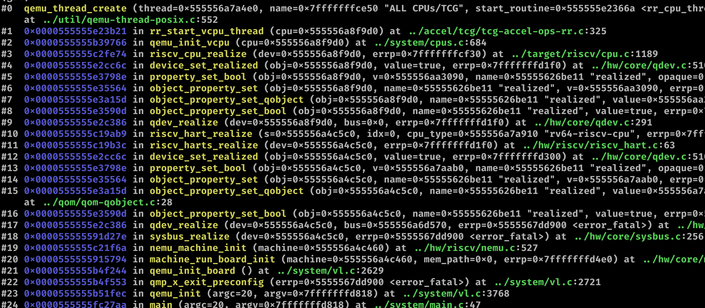

# vcpu thread 创建

过程非常复杂，层层调用。代码非常难读的原因是，qemu 里面很多事情的发生都是在回调函数里面发生，好比是设置了某个值，这个值的回调函数会进行一些设备的初始化等等。可能以后读代码的时候要注意代码中设置的回调函数调用了哪些，在设置某些值的时候直接去找回调。

图中的 vcpu 创建走了很多流程，其中很多都是在走回调函数。整体的创建过程是从 `qemu_init_board` 的时候开始的，这个 `init_board` 会对具体的 board(Machine) 进行初始化，而在 machine 中会对 system bus 进行实例化，system bus 上实际上包括了系统里的所有东西，包括 cpu 内存和挂在上面的外设等等，因此 board 的实例化会使挂在上面的东西进行实例化。它实例化的时候会访问 cpu 对象的属性等等，访问属性触发了回调函数，进入到了具体 cpu 的实例化。

具体的 cpu 类型有它自己的实例化过程，在具体的过程完了之后，他会根据 accel 设置的加速器类型由具体的 accel 来创建 vcpu 线程，在 tcg 的情况下，就由 tcg 创建，创建的这个线程里面一直在跑死循环，等于无脑跑指令，直到主线程想到办法写一个共享变量把这个线程打断或者这个线程自己退出为止。

qemu 貌似就是这样一个一主多从的模型，主来主控，从来跑 vcpu 设备等等。