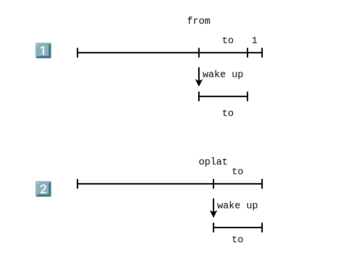

# 香山 iew 阶段

香山 gem5 建模对 gem5 的后端指令调度进行了较大规模的重写。

## 连线和各阶段之间的信息传递

我的主要关注点在 iew 和 commit 阶段的连线上。

对于 iew 阶段有：

```cpp
void
IEW::setIEWQueue(TimeBuffer<IEWStruct> *iq_ptr)
{
    iewQueue = iq_ptr;

    // Setup wire to write instructions to commit.
    toCommit = iewQueue->getWire(0);

    execBypass = iewQueue->getWire(0);
    execWB = iewQueue->getWire(-wbDelay);
}
```

对于 commit 阶段有：

```cpp
void
Commit::setIEWQueue(TimeBuffer<IEWStruct> *iq_ptr)
{
    iewQueue = iq_ptr;

    // Setup wire to get instructions from IEW.
    fromIEW = iewQueue->getWire(-iewToCommitDelay);
}
```

从 python 配置文件中已知的是 wbDelay 和 iewToCommitDelay 的值设置是相同的，默认都是为1.因此实际上 fromIEW 和 execWB 实际上都是指向buffer 中的同一个地方的，如果设置为 1，则是下一个 tick 能够访问到本周期写入的数据。相比之下 toCommit 和 execBypass 就能访问到本周期的一些信息。

## ExecuteInsts

这部分和原来的代码并没有什么不同，我比较关注的点在 instToCommit 这个函数上：

```cpp
void
IEW::instToCommit(const DynInstPtr& inst)
{
    while ((*iewQueue)[wbCycle].insts[wbNumInst]) {
        ++wbNumInst;
        if (wbNumInst == wbWidth) {
            ++wbCycle;
            wbNumInst = 0;
        }
    }

    scheduler->bypassWriteback(inst);
    inst->completionTick = curTick();

    DPRINTF(IEW, "Current wb cycle: %i, width: %i, numInst: %i\nwbActual:%i\n",
            wbCycle, wbWidth, wbNumInst, wbCycle * wbWidth + wbNumInst);
    // Add finished instruction to queue to commit.
    (*iewQueue)[wbCycle].insts[wbNumInst] = inst;
    (*iewQueue)[wbCycle].size++;
}
```

这部分代码做的很关键的事就是在 iew queue 中向 commit 传输一条已经执行完成的指令，受限于每个时钟周期 wbWidth 的影响，代码在控制每个时钟周期向 commit 阶段传送的指令宽度，一旦指令宽度超标了，就会将这个指令的提交向后推迟一个时钟周期，如此往复。对 `(*iewQueue)[wbCycle]` 的访问实际就代表着至少是接下来的 1 个时钟周期之后才能拿到这些指令。

另外一个关键点在于，这里进行了 bypassWriteback，也就是对结果进行相应的前递。

```cpp
void
Scheduler::bypassWriteback(const DynInstPtr& inst)
{
    DPRINTF(Schedule, "[sn %lu] bypass write\n", inst->seqNum);
    for (int i=0; i<inst->numDestRegs(); i++) {
        auto dst = inst->renamedDestIdx(i);
        if (dst->isFixedMapping()) {
            continue;
        }
        bypassScoreboard[dst->flatIndex()] = true;
        DPRINTF(Schedule, "p%lu in bypassNetwork ready\n", dst->flatIndex());
    }
}
```

这个函数内部并没有什么特别的地方，实际上就是修改了用于前递相关的记分牌。

## writebackInsts

```cpp
void
IEW::writebackInsts()
{
    // Loop through the head of the time buffer and wake any
    // dependents.  These instructions are about to write back.  Also
    // mark scoreboard that this instruction is finally complete.
    // Either have IEW have direct access to scoreboard, or have this
    // as part of backwards communication.

    int wb_width = wbWidth;
    int count_ = 0;
    while (execWB->insts[count_]) {
        DynInstPtr it = execWB->insts[count_];
        count_++;
        if (it->opClass() == FMAAccOp) {
            wb_width++;
        }
        if (count_ >= wbWidth ||
            wb_width >= wbWidth * 2) {
            break;
        }
    }

    // 写回的大小只是 wb_width 的大小，一个周期只处理这么多。
    for (int inst_num = 0; inst_num < wb_width &&
             execWB->insts[inst_num]; inst_num++) {
        DynInstPtr inst = execWB->insts[inst_num];
        ThreadID tid = inst->threadNumber;

        if (inst->savedRequest && inst->isLoad()) {
            inst->pf_source = inst->savedRequest->mainReq()->getPFSource();
        }

        DPRINTF(IEW, "Sending instructions to commit, [sn:%lli] PC %s.\n",
                inst->seqNum, inst->pcState());

        iewStats.instsToCommit[tid]++;
        // Notify potential listeners that execution is complete for this
        // instruction.
        ppToCommit->notify(inst);

        // Some instructions will be sent to commit without having
        // executed because they need commit to handle them.
        // E.g. Strictly ordered loads have not actually executed when they
        // are first sent to commit.  Instead commit must tell the LSQ
        // when it's ready to execute the strictly ordered load.
        if (!inst->isSquashed() && inst->isExecuted() &&
                inst->getFault() == NoFault) {

            scheduler->writebackWakeup(inst);
            int dependents = instQueue.wakeDependents(inst);

            for (int i = 0; i < inst->numDestRegs(); i++) {
                // Mark register as ready if not pinned
                if (inst->renamedDestIdx(i)->
                        getNumPinnedWritesToComplete() == 0) {
                    DPRINTF(IEW,"Setting Destination Register %i (%s)\n",
                            inst->renamedDestIdx(i)->index(),
                            inst->renamedDestIdx(i)->className());
                    scoreboard->setReg(inst->renamedDestIdx(i));
                }
            }

            if (dependents) {
                iewStats.producerInst[tid]++;
                iewStats.consumerInst[tid]+= dependents;
            }
            iewStats.writebackCount[tid]++;
        }
    }
}
```

这一步是真实的进行写回，并同时调用了 scheduler 的调度器和 instQueue 的 wakeDependents 方法。

### 调度器的 writebackWakeup

```cpp
void
Scheduler::writebackWakeup(const DynInstPtr& inst)
{
    DPRINTF(Schedule, "[sn %lu] was writeback\n", inst->seqNum);
    inst->issueQue = nullptr;// clear in issueQue
    for (int i = 0; i < inst->numDestRegs(); i++) {
        auto dst = inst->renamedDestIdx(i);
        if (dst->isFixedMapping()) {
            continue;
        }
        scoreboard[dst->flatIndex()] = true;
    }
    for (auto it : issueQues) {
        it->wakeUpDependents(inst, false);
    }
}
```

这部分主要对调度器内部的记分牌进行了设置，同时调用发射队列的唤醒。

```cpp
void
IssueQue::wakeUpDependents(const DynInstPtr& inst, bool speculative)
{
    if (speculative && inst->canceled()) {
        return;
    }
    for (int i = 0; i < inst->numDestRegs(); i++) {
        PhysRegIdPtr dst = inst->renamedDestIdx(i);
        if (dst->isFixedMapping() || dst->getNumPinnedWritesToComplete() != 1) {
            continue;;
        }

        DPRINTF(Schedule, "was %s woken by p%lu [sn %lu]\n",
            speculative ? "spec" : "wb", dst->flatIndex(), inst->seqNum);
        for (auto& it: subDepGraph[dst->flatIndex()]) {
            int srcIdx = it.first;
            auto consumer = it.second;
            if (consumer->readySrcIdx(srcIdx)) {
                continue;
            }
            consumer->markSrcRegReady(srcIdx);

            if (!speculative && consumer->srcRegIdx(srcIdx) == RiscvISA::VecRenamedVLReg) {
                consumer->checkOldVdElim();
            }

            DPRINTF(Schedule, "[sn %lu] src%d was woken\n", consumer->seqNum, srcIdx);
            addIfReady(consumer);
        }

        if (!speculative) {
            subDepGraph[dst->flatIndex()].clear();
        }
    }
}
```

可以看到这一部分和本身 gem5 代码中的写回并没有什么不同，实际上对依赖图进行了分析，确保后续准备好的指令能够被发射或者插入到发射队列。同时这一步还会把满足依赖的函数插入到 readylist 中。

### InstQueue 的 wakeDependents

这部分进行了很多和内存相关的操作，等待稍后补充。

```cpp
int
InstructionQueue::wakeDependents(const DynInstPtr &completed_inst)
{
    int dependents = 0;

    // The instruction queue here takes care of both floating and int ops
    if (completed_inst->isFloating()) {
        iqIOStats.fpInstQueueWakeupAccesses++;
    } else if (completed_inst->isVector()) {
        iqIOStats.vecInstQueueWakeupAccesses++;
    } else {
        iqIOStats.intInstQueueWakeupAccesses++;
    }

    completed_inst->lastWakeDependents = curTick();

    DPRINTF(IQ, "Waking dependents of completed instruction.\n");

    assert(!completed_inst->isSquashed());

    // Tell the memory dependence unit to wake any dependents on this
    // instruction if it is a memory instruction.  Also complete the memory
    // instruction at this point since we know it executed without issues.
    ThreadID tid = completed_inst->threadNumber;
    if (completed_inst->isMemRef()) {
        memDepUnit[tid].completeInst(completed_inst);

        DPRINTF(IQ, "Completing mem instruction PC: %s [sn:%llu]\n",
            completed_inst->pcState(), completed_inst->seqNum);

        completed_inst->memOpDone(true);
    } else if (completed_inst->isReadBarrier() ||
               completed_inst->isWriteBarrier()) {
        // Completes a non mem ref barrier
        memDepUnit[tid].completeInst(completed_inst);
    }

    for (int dest_reg_idx = 0;
         dest_reg_idx < completed_inst->numDestRegs();
         dest_reg_idx++)
    {
        PhysRegIdPtr dest_reg =
            completed_inst->renamedDestIdx(dest_reg_idx);

        // Special case of uniq or control registers.  They are not
        // handled by the IQ and thus have no dependency graph entry.
        if (dest_reg->isFixedMapping()) {
            DPRINTF(IQ, "Reg %d [%s] is part of a fix mapping, skipping\n",
                    dest_reg->index(), dest_reg->className());
            continue;
        }

        // Avoid waking up dependents if the register is pinned
        dest_reg->decrNumPinnedWritesToComplete();
        if (dest_reg->isPinned())
            completed_inst->setPinnedRegsWritten();

        if (dest_reg->getNumPinnedWritesToComplete() != 0) {
            DPRINTF(IQ, "Reg %d [%s] is pinned, skipping\n",
                    dest_reg->index(), dest_reg->className());
            continue;
        }

        DPRINTF(IQ, "Waking any dependents on register %i (%s).\n",
                dest_reg->index(),
                dest_reg->className());
    }

    return dependents;
}
```

## 从就绪到发射

香山 gem5 建模了从就绪到发射的过程，因此在依赖就绪之后，会选取 inout-port 数目条（这里这个数目能理解成发射队列一个周期能够读取的最大带宽）的指令作为等待发射的指令作为被 select 的指令，然后会对这个 select 的指令做进一步的检查，保证读取的寄存器数目在 slot-num 的数目之下，如果超过了这个数目，部分的指令会被取消，这两部分我认为做的事情都是一样的，都是在对指令发射队列的带宽进行建模。上述的这个过程在 `Scheduler::issueAndSelect` 中完成：

```cpp
void
Scheduler::issueAndSelect(){
    for (auto it : issueQues) {
        it->issueToFu();
    }
    // must wait for all insts was issued
    // 这里就是根据指令队列的 io-port 的带宽进行建模
    for (auto it : issueQues) {
        it->selectInst();
    }
    // 这里再根据 slot 的大小进一步的建模带宽
    while (slotOccupied > slotNum) {
        auto& slot = intSlot.top();
        slot.inst->setArbFailed();
        slotOccupied -= slot.resourceDemand;
        DPRINTF(Schedule, "[sn %lu] remove from slot\n", slot.inst->seqNum);
        intSlot.pop();
    }

    // reset slot status
    // 清空 intslot，intslot其实没什么用，就是在上面那步比较slot大小的时候用
    // 实际上后续用的指令就已经被保存到 selectedinst 中
    // 因为 slot 不够而被取消的指令已经打上了 setArbFailed 的标记
    slotOccupied = 0;
    intSlot.clear();
}
```

香山还建模了一个从选中到被发射到调度单元的延迟，实际上就是一个 timebuffer。但是在插入这个 timebuffer 之前，需要从 selectinsts 中把原本因为仲裁取消的指令去掉，重新插入到就绪队列中。这一部分在 scheduler 的 tick 中实现：

```cpp
void
Scheduler::tick()
{
    for (auto it : issueQues) {
        it->tick();
    }
}
```

这里实际上是调用了各个发射队列的 tick：

```cpp
void
IssueQue::tick()
{
    iqstats->insertDist[instNumInsert]++;
    instNumInsert = 0;

    scheduleInst();
    inflightIssues.advance();
}
```

这里实际上在调用 `scheduleInst`：

```cpp
void
IssueQue::scheduleInst()
{
    // here is issueStage 0
    for (auto& inst : selectedInst) {
        inst->clearInReadyQ();
        if (inst->canceled()) {
            DPRINTF(Schedule, "[sn %ld] was canceled\n", inst->seqNum);
        } else if (inst->arbFailed()) {
            DPRINTF(Schedule, "[sn %ld] arbitration failed, retry\n", inst->seqNum);
            assert(inst->readyToIssue());
            inst->setInReadyQ();
            readyInsts.push(inst);// retry
            iqstats->arbFailed++;
        } else {
            DPRINTF(Schedule, "[sn %ld] no conflict, scheduled\n", inst->seqNum);
            toIssue->push(inst);
            if (scheduler->getCorrectedOpLat(inst) <= 1) {
                scheduler->wakeUpDependents(inst, this);
            }
        }
        inst->clearArbFailed();
    }
    iqstats->issueDist[toIssue->size]++;
}
```

很显然的看到就是对选中的指令做了各种处理然后写入到 timebuffer 中，注意上面的 toIssue 就是一端到 timebuffer 的连线。

指令从上面的 timebuffer 中取出并正式发射到功能单元是在 `Scheduler::issueAndSelect` 方法的上半部分中实现的：

```cpp
void
Scheduler::issueAndSelect(){
    for (auto it : issueQues) {
        it->issueToFu();
    }
    
    // ...
}
```

实际上调用的是发射队列的 `issueToFu`:

```cpp
void
IssueQue::issueToFu()
{
    int size = toFu->size;
    for (int i=0; i<size;i++) {
        auto inst = toFu->pop();
        if (!inst) {
            continue;
        }
        checkScoreboard(inst);
        addToFu(inst);
        if (scheduler->getCorrectedOpLat(inst) > 1) {
            scheduler->wakeUpDependents(inst, this);
        }
    }
}
```

可以看到这里是从 toFu 中取出指令，toFU 实际就是上面 timebuffer 的另外一端，他在取出指令之后进行计分板依赖的再次检查，然后调用 addToFu:

```cpp
void
Scheduler::addToFU(const DynInstPtr& inst)
{
    DPRINTF(Schedule, "[sn %lu] add to FUs\n", inst->seqNum);
    instsToFu.push_back(inst);
}
```

可以看到这里就是很简单的把指令插入到 `instsToFu` 中，供后续对指令执行的建模。实际上就是在 `instQueue.scheduleReadyInsts` 中开始对执行的时序开始建模了，这里就和原本 gem5 的代码很像了。

## 指派到发射队列（保留站）

这个过程都在 dispatch 这个函数中实现。主要分两步，一个是将 dispatch queue 中的指令向保留站转移，另一部分是将从 rename 中拿到的指令送到 dispatch queue 中。

```cpp
void
IEW::dispatchInsts(ThreadID tid)
{
    dispatchInstFromDispQue(tid);
    classifyInstToDispQue(tid);
}
```

### dispatchInstFromDispQue

这个部分的代码和原来 gem5 的 dispatch 很像，对于每个 dispatch queue 都进行处理，对于其中的指令插入到不同的队列，这里先拿最简单的整数类型的指令作为最通常的指令进行举例，这部分指令实际上在委托 scheduler.insert 来完成：

```cpp
void
Scheduler::insert(const DynInstPtr& inst)
{
    inst->setInIQ();
    auto iqs = dispTable[inst->opClass()];
    assert(!iqs.empty());
    bool inserted = false;

    if (forwardDisp) {
        for (auto iq : iqs) {
            if (iq->ready()) {
                iq->insert(inst);
                inserted = true;
                break;
            }
        }
    } else {
        for (auto iq = iqs.rbegin(); iq != iqs.rend(); iq++) {
            if ((*iq)->ready()) {
                (*iq)->insert(inst);
                inserted = true;
                break;
            }
        }
    }
    assert(inserted);
    forwardDisp = !forwardDisp;
    DPRINTF(Dispatch, "[sn %lu] dispatch: %s\n", inst->seqNum, inst->staticInst->disassemble(0));
}
```

可以看到这一部分只是接近的找个随机的发射队列插了进去。

### classifyInstToDispQue

这部分就是把接受到的指令插入到 diapatch queue 中去，等待后续的处理。这个函数写的很复杂，主要做的事有这么几个，按照指令的操作类型将其插入到不同的 dispatch queue 中，在插入的时候进行各种统计变量的更新，另外就是将这个指令的目的寄存器作为生产者插入到依赖图中，然后就是更新一些统计变量。

## 时序建模

就整体的时序而言各部分应该都是各干各的，就函数的调用顺序而言总体干的是这些事。

检查选中的指令，并对发射时间进行建模 -> 处理 rename 来的指令，并将原先 dispatch queue 中的指令转移到相关的 issue -> 建模 issue queue 中已经满足发射时间的指令，对其执行进行建模 -> 进行指令的执行 -> 进行指令的写回 -> 将已经完成发射建模的指令取出来，供后续执行建模使用 -> 选中(select)发射队列中的指令。

整个过程中很多数据都是从 timebuffer 中获取的，因此顺序的先后不会产生影响，但是不从 timebuffer 中获取的顺序的先后可能会产生影响，这个要结合代码具体分析。需要注意的是 execwb 和后续 commit 阶段中使用的是一个位置，同时在整个 cpu 的执行 tick 中，iew 的 tick 在 commit 前面，因此 execwb 的修改可能是会影响到 commit 阶段的。

## 投机调度

引入投机调度的原因是因为后端的建模对发射这个过程进行了建模，从发射到指令进入到 FU 是有一个延迟时间的。这样就会产生一个问题，在指令已经执行完成能够进行 bypass 前递的时候，后续能够接收这个前递的指令还没有对发射时间完成建模，从而导致在 bypass 之后，没有指令能够受到这个 bypass 带来的好处，因为他们此时还处在 ready 队列中，还没有进行发射时序的建模，不能立即进入到 FU 中。

投机的调度实际上就是一定程度上解决这个问题，它希望达到的效果是提前从 ready 队列中抽出指令进行发射，进行发射时间的建模，即使这个时候的依赖还没有满足。这可能会带来的问题是 bypass 还没发生、依赖还没满足的时候，这个发射时间的建模就已经完成了，这样指令是不合法的，因此为了避免这个问题，指令的投机调度是需要严格控制好时间的，显然在香山 iew 的实现中对这个时间进行了控制。

投机调度的源码为：

```cpp
void
Scheduler::wakeUpDependents(const DynInstPtr& inst, IssueQue* from_issue_queue)
{
    if (inst->numDestRegs() == 0 || (inst->isVector() && inst->isLoad())) {
        // ignore if vector load
        return;
    }

    for (auto to : wakeMatrix[from_issue_queue->getId()]) {
        int wakeDelay = 0;
        int oplat = getCorrectedOpLat(inst);

        if (oplat == 1 && (from_issue_queue->getIssueStages() > to->getIssueStages())) {
            wakeDelay = from_issue_queue->getIssueStages() - to->getIssueStages();
        } else if (oplat > to->getIssueStages()) {
            wakeDelay = oplat - to->getIssueStages();
        }

        DPRINTF(Schedule, "[sn %lu] %s create wakeupEvent to %s, delay %d cycles\n",
            inst->seqNum, from_issue_queue->getName(), to->getName(), wakeDelay);
        if (wakeDelay == 0) {
            to->wakeUpDependents(inst, true);
        } else {
            auto wakeEvent = new SpecWakeupCompletion(inst, to);
            cpu->schedule(wakeEvent, cpu->clockEdge(Cycles(wakeDelay)) - 1);
        }
    }
}
```

调用这段代码的场合有两个地方：

1. IssueQue::scheduleInst 中，此时发射时间的建模还没开始，调用投机调度的条件为 scheduler->getCorrectedOpLat(inst) <= 1。
2. IssueQue::issueToFu 中，此时发射时间的建模已经完成，调用投机调度的条件为 scheduler->getCorrectedOpLat(inst) > 1。

这两种情况，第一种情况对应的上面的 if，第二种情况对应的是上面的 else if。对应的两种情况应该如下图所示：



## 函数总结

| **方法**                         | **举措**                                                                                                                                                          |
|----------------------------------|-------------------------------------------------------------------------------------------------------------------------------------------------------------------|
| **instQueue.scheduleReadyInsts** | **执行时序建模**                                                                                                                                                  |
| **executeInsts**                 | **执行指令**                                                                                                                                                      |
| **writebackInsts**               | **指令写回**                                                                                                                                                      |
| **issueAndSelect**               | **1.把发射时序建模完成的指令放到队列中，供instQueue.scheduleReadyInsts使用。 2.从保留站中选取下一波能够发射的指令，通过设置的读写端口数仲裁哪些指令到底能发射。** |
| **scheduler->tick**              | **根据仲裁的结果更新，建模发射延时**                                                                                                                              |
| **dispatch**                     | **1. 从 rename 获取指令到调度队列。 2. 调度指令到保留站。**                                                                                                       |